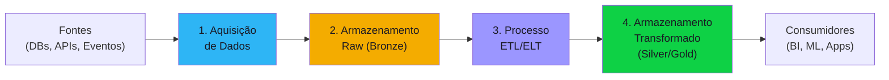

# Discovery Blueprint — Datalake Ingestion

Este blueprint organiza o discovery de um projeto de ingestão de dados em **4 componentes** que representam as partes concretas da solução. Cada componente descreve o que precisa ser descoberto, quais perguntas fazer, quais decisões tomar e como saber que o discovery está completo.

> [!info] Relação com context.md
> O `context.md` organiza concerns por **papel do agente** (PO, architect, security). Este blueprint organiza por **componente do projeto**. Ambos são complementares — o agente consulta o context.md durante cada bloco temático e usa este blueprint para entender o todo.

---

## Componente 1 — Aquisição de Dados (Data Acquisition)

A aquisição de dados é o ponto de entrada do pipeline. Define **de onde** vêm os dados, **como** são obtidos e com que **frequência**. Erros nesta camada propagam para todo o resto — uma fonte mal mapeada ou uma autenticação frágil compromete o pipeline inteiro.

### Concerns

- **Inventário de fontes** — Quais sistemas são fontes de dados? Lista exaustiva com tecnologia, responsável e criticidade de cada um
- **Método de extração** — Pull (query agendada), push (webhook/evento), CDC (Change Data Capture), file drop (SFTP/S3)?
- **Batch vs Streaming** — Cada fonte é batch (janela agendada) ou streaming (near real-time)? Qual a latência aceitável?
- **Autenticação** — Como autenticar em cada fonte? API keys, OAuth2, service accounts, certificados mTLS? Quem gerencia as credenciais?
- **Segurança de transporte** — TLS obrigatório? VPN/PrivateLink para fontes on-premises? Whitelist de IPs?
- **Disponibilidade das fontes** — SLA de cada fonte? O que acontece quando uma fonte fica indisponível? Retry? Alerta? Degradação graciosa?
- **Data contracts** — Existe contrato formal com as equipes das fontes? Quem notifica mudanças de schema? Versionamento de APIs?
- **Volume e crescimento** — Volume atual por fonte (registros/dia, GB/dia)? Taxa de crescimento esperada?

### Perguntas-chave

1. Quais são todas as fontes de dados? (listar nome, tecnologia, responsável, volume estimado)
2. Para cada fonte: como acessamos os dados? (API, query direta, CDC, file drop, evento)
3. Qual a frequência mínima aceitável de coleta? (real-time, a cada 5min, horário, diário, D+1)
4. Como funciona a autenticação em cada fonte? Quem gerencia as credenciais?
5. As fontes estão na mesma rede/cloud ou há acesso cross-network? Precisa de VPN/PrivateLink?
6. Existe contrato formal (data contract) com as equipes donas das fontes? Quem avisa sobre mudanças de schema?
7. O que acontece se uma fonte ficar indisponível por 24 horas? O pipeline inteiro para ou degrada parcialmente?
8. Alguma fonte tem dados sensíveis (PII, financeiros, saúde)? Há restrição de horário para extração?

### Decisões esperadas

| Decisão | Alternativas típicas | Critério |
|---------|---------------------|----------|
| Método de extração por fonte | Pull/Push/CDC/File drop | Latência requerida vs capacidade da fonte |
| Frequência de coleta por fonte | Real-time / Micro-batch / Batch (horário/diário) | SLA de freshness do consumidor final |
| Estratégia de autenticação | API key / OAuth2 / Service account / mTLS | Política de segurança da organização |
| Tratamento de indisponibilidade | Retry com backoff / Skip e alerta / Circuit breaker | Criticidade da fonte |
| Data contracts | Formal (schema registry) / Informal (email) / Nenhum | Maturidade da organização |

### Critérios de completude

- [ ] Todas as fontes listadas com tecnologia, responsável, volume e método de acesso
- [ ] Frequência de coleta definida para cada fonte
- [ ] Método de autenticação definido para cada fonte
- [ ] Plano de contingência para indisponibilidade documentado
- [ ] Data contracts definidos (ou risco documentado da ausência)
- [ ] Dados sensíveis identificados por fonte (alimenta componente Privacy no bloco #6)

---

## Componente 2 — Armazenamento Raw (Bronze Layer)

O armazenamento raw é a primeira camada persistente do pipeline. Recebe os dados **como vieram** da fonte, sem transformação. É a "fonte da verdade original" que permite reprocessamento e auditoria. Decisões erradas aqui (como overwrite sem versionamento) são irreversíveis.

### Concerns

- **Formato de armazenamento** — Parquet (colunar, eficiente), Delta Lake (ACID, time-travel), Iceberg (schema evolution nativa), JSON/Avro (raw preservando schema original)?
- **Estratégia de particionamento** — Por data do evento (não da ingestão), por fonte, por domínio? Tamanho ideal de partição?
- **Versionamento** — Append-only (nunca sobrescrever)? Time-travel (Delta/Iceberg)? Snapshots?
- **Retenção** — Quanto tempo manter o raw? 90 dias? 2 anos? Forever (compliance)?
- **Schema evolution** — O que acontece quando a fonte muda o schema? Schema registry? Evolução automática?
- **Criptografia** — At-rest obrigatória? Chave gerenciada pelo cloud provider ou BYOK?
- **Acesso** — Quem pode acessar o raw? Somente pipelines ou também analistas/cientistas?
- **Localização** — Qual bucket/container/path? Região? Multi-região?

### Perguntas-chave

1. Em que formato os dados devem ser armazenados na camada raw? Há preferência ou restrição?
2. A camada raw deve ser append-only (nunca sobrescrever) ou aceitam overwrite?
3. Quanto tempo os dados raw precisam ser retidos? (compliance, auditoria, reprocessamento)
4. Como particionar? Por data do evento, por fonte, por domínio?
5. O que acontece quando uma fonte muda o schema? Tem schema registry?
6. Criptografia at-rest é obrigatória? Quem gerencia as chaves?
7. Alguém além dos pipelines acessa o raw? (analistas explorando dados brutos)
8. Qual cloud/região? Há restrição de residência de dados?

### Decisões esperadas

| Decisão | Alternativas típicas | Critério |
|---------|---------------------|----------|
| Formato de armazenamento | Parquet / Delta / Iceberg / JSON | Features necessárias (time-travel, ACID, schema evolution) |
| Estratégia de versionamento | Append-only / Delta time-travel / Snapshots | Necessidade de reprocessamento e auditoria |
| Política de retenção | 90d / 1y / 2y / Forever | Compliance + custo de storage |
| Particionamento | event_date / source / domain | Volume e padrão de acesso |
| Schema evolution | Schema registry / Evolução automática / Manual | Maturidade e frequência de mudanças |

### Critérios de completude

- [ ] Formato de armazenamento definido com justificativa
- [ ] Estratégia de particionamento documentada
- [ ] Política de retenção definida (com base em compliance e custo)
- [ ] Estratégia de schema evolution definida
- [ ] Criptografia e controle de acesso documentados
- [ ] Estimativa de custo de storage (GB/mês → projeção 12 meses)

---

## Componente 3 — Processo de Transformação (ETL/ELT)

O processo de transformação converte dados brutos em dados limpos, padronizados e enriquecidos. É onde a complexidade técnica se concentra — orquestração, qualidade de dados, idempotência, tratamento de erros e mascaramento de PII. Um pipeline mal desenhado aqui gera dados inconsistentes que minam a confiança dos consumidores.

### Concerns

- **Engine de processamento** — Spark (escala massiva), dbt (SQL-first, modular), Flink (streaming nativo), SQL nativo do warehouse?
- **Orquestração** — Airflow (padrão open-source), Dagster (data-aware), Prefect (cloud-native), ADF (Azure nativo)?
- **Qualidade de dados** — Como validar? Great Expectations, Deequ, Soda, dbt tests? O que fazer quando falha? Pausar pipeline? Alertar?
- **Idempotência** — Replay do pipeline produz o mesmo resultado? Como garantir sem duplicação?
- **Late-arriving data** — Dados de ontem que chegam hoje — como tratar? Reprocessar partição? Append e reconciliar?
- **Dados corrompidos** — Dead letter queue? Skip e alerta? Quarentena?
- **Linhagem (lineage)** — Como rastrear de onde veio cada dado transformado? Atlas, Purview, OpenLineage?
- **Mascaramento de PII** — Em qual camada aplicar? Bronze raw → Silver pseudonimizado? Ou só na Gold?
- **Testes** — Unit tests nos transformations? Integration tests end-to-end? Testes de contrato?

### Perguntas-chave

1. Qual engine de processamento? Já existe preferência ou stack definido?
2. Como orquestrar os pipelines? Já usam algum orquestrador?
3. Como garantir qualidade dos dados? Há testes automatizados ou validação manual hoje?
4. O que acontece quando um pipeline falha no meio? Retry automático? Alerta? Manual?
5. Como tratar dados que chegam atrasados (late-arriving)? Reprocessar partição inteira?
6. Os pipelines são idempotentes? Rodar 2x produz o mesmo resultado?
7. Existe rastreamento de linhagem (lineage)? De onde veio cada número no dashboard?
8. Em qual camada os dados pessoais devem ser mascarados/pseudonimizados?
9. Qual a estratégia de testes? Unit tests por transformation? Integration tests end-to-end?
10. Quem é responsável por manter os pipelines? Tem on-call?

### Decisões esperadas

| Decisão | Alternativas típicas | Critério |
|---------|---------------------|----------|
| Engine de processamento | Spark / dbt / Flink / SQL nativo | Volume, complexidade, skills do time |
| Orquestrador | Airflow / Dagster / Prefect / ADF | Cloud provider, maturidade do time, features |
| Framework de qualidade | Great Expectations / dbt tests / Soda / Custom | Integração com engine, cobertura necessária |
| Tratamento de falhas | Retry + DLQ / Pause + alert / Skip + log | Criticidade do pipeline |
| Estratégia de mascaramento | Bronze raw + Silver masked / Gold only | Regulação (LGPD), acesso à Bronze |
| Lineage | Atlas / Purview / OpenLineage / Manual | Compliance, tamanho do ecossistema |

### Critérios de completude

- [ ] Engine de processamento e orquestrador definidos
- [ ] Estratégia de qualidade de dados documentada (o que testar, quando, o que fazer se falhar)
- [ ] Idempotência garantida ou risco documentado
- [ ] Tratamento de late-arriving data e dados corrompidos definido
- [ ] Ponto de mascaramento de PII definido (alimenta bloco #6)
- [ ] Estratégia de testes documentada
- [ ] Responsável por manutenção e on-call identificado

---

## Componente 4 — Armazenamento Transformado (Silver/Gold Layers)

O armazenamento transformado é onde os dados ficam prontos para consumo. A camada Silver contém dados limpos e padronizados; a Gold contém agregações, métricas e features prontas para uso. É o ponto de contato com os consumidores finais (BI, ML, aplicações) e onde governança e SLA de freshness são mais críticos.

### Concerns

- **Modelo de dados Silver** — Normalizado (3NF), flat (desnormalizado), star schema, data vault?
- **Modelo de dados Gold** — Agregações por domínio, métricas pré-calculadas, feature store para ML?
- **Governança** — Data catalog (Atlas, Purview, Collibra)? Data ownership por domínio? Processo de aprovação para mudanças na Gold?
- **Padrões de acesso** — Quem consome? BI (SQL direto), ML (feature store), Apps downstream (API), Analistas (notebooks)?
- **SLA de freshness** — Por tabela e por consumidor? Dashboard executivo = D+1? Prevenção de fraude = 5 minutos?
- **Controle de acesso** — Por camada? Por coluna (PII)? Row-level security?
- **Custos** — Storage + compute por camada? Custo por query? Budget mensal?
- **Evolução** — Como adicionar novos domínios/tabelas? Processo de onboarding de novos consumidores?

### Perguntas-chave

1. Quem são os consumidores finais dos dados? (BI, ML, aplicações, analistas)
2. Qual o modelo de dados na Silver? Normalizado, flat, star schema?
3. Quais agregações/métricas precisam estar pré-calculadas na Gold?
4. Existe data catalog? Quem é o "dono do dado" por domínio?
5. Qual o SLA de freshness por tabela crítica? (ex: dashboard executivo = D+1, alerta de fraude = 5min)
6. Quem pode acessar o quê? Analista junior vê PII? Ou só agregado?
7. Qual o budget mensal estimado para storage + compute da camada transformada?
8. Como novos domínios/tabelas são adicionados? Tem processo ou é ad-hoc?
9. Existe feature store para ML ou os cientistas consultam a Gold direto?

### Decisões esperadas

| Decisão | Alternativas típicas | Critério |
|---------|---------------------|----------|
| Modelo Silver | 3NF / Flat / Star schema / Data vault | Padrão de query dos consumidores |
| Modelo Gold | Agregações por domínio / Feature store / Métricas pré-calculadas | Tipos de consumidor (BI vs ML vs App) |
| Data catalog | Atlas / Purview / Collibra / Wiki manual | Tamanho do ecossistema, compliance |
| Controle de acesso | Por camada / Por coluna / Row-level / Sem restrição | Regulação, tipos de usuário |
| SLA de freshness | Uniforme / Por tabela / Por consumidor | Criticidade do caso de uso |

### Critérios de completude

- [ ] Consumidores finais listados com padrão de acesso (SQL, API, notebook)
- [ ] Modelo de dados Silver e Gold definidos
- [ ] Governança: catalog, ownership e processo de mudança documentados
- [ ] SLA de freshness por tabela/consumidor definido
- [ ] Controle de acesso documentado (quem vê o quê)
- [ ] Estimativa de custo (storage + compute + queries)
- [ ] Processo de onboarding de novos domínios/consumidores documentado

---

## Mapeamento para os 8 Blocos do Discovery

Esta tabela mostra como cada componente do blueprint se distribui nos 8 blocos temáticos da Fase 1:

| Componente | Bloco(s) principal(is) | Agente responsável |
|------------|----------------------|-------------------|
| **1. Aquisição de Dados** | #5 (Tecnologia e Segurança), #6 (LGPD e Privacidade) | solution-architect, cyber-security-architect |
| **2. Armazenamento Raw** | #5 (Tecnologia e Segurança), #7 (Arquitetura Macro) | solution-architect |
| **3. Processo ETL** | #5 (Tecnologia e Segurança), #7 (Arquitetura Macro), #8 (TCO) | solution-architect |
| **4. Armazenamento Transformado** | #4 (Processo e Equipe), #7 (Arquitetura Macro), #8 (TCO) | po, solution-architect |

> [!tip] Cross-cutting concerns
> Alguns temas atravessam todos os componentes:
> - **Privacidade (bloco #6)** — PII aparece na aquisição, precisa ser mascarada no ETL, e controlada na Gold
> - **Custo (bloco #8)** — Cada componente tem custo próprio (extração, storage raw, compute ETL, storage Gold)
> - **Governança (bloco #4)** — Data ownership, processos de aprovação e on-call afetam todos os componentes

---

## Documentos Relacionados

- [[context|context-templates/datalake-ingestion/context.md]] — Concerns organizados por papel do agente
- [[specialists|context-templates/datalake-ingestion/specialists.md]] — Catálogo de custom-specialists
- [[report-profile|context-templates/datalake-ingestion/report-profile.md]] — Perfil do delivery report
- `dtg-artifacts/rules/discovery/discovery.md` — Regra formal dos 8 blocos temáticos
