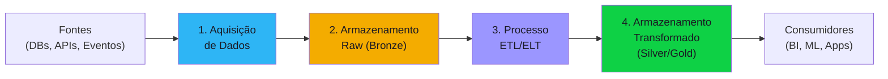

# Discovery Blueprint — Datalake Ingestion

Documento completo e auto-contido para conduzir o discovery de um projeto de ingestão de dados em datalake. Organizado em **4 componentes** que representam as partes concretas da solução, seguido de antipatterns, edge cases, especialistas disponíveis e perfil do delivery report.

Serve como guia tanto para os agentes de IA (carregado pelo orchestrator na Fase 1) quanto para o humano que acompanha o processo.

---

## Quando usar este blueprint

O orchestrator deve carregar este blueprint quando o briefing apresentar **dois ou mais** dos seguintes sinais:

- Menção a "datalake", "data warehouse", "lakehouse", "ETL", "ELT", "pipeline de dados"
- Termos: bronze/silver/gold, medallion, raw zone, refined zone, curated zone
- Stack mencionada: Spark, Databricks, Snowflake, Redshift, BigQuery, Synapse, Delta Lake, Iceberg
- Volume grande de dados (TB+, milhões de registros)
- Necessidade de processamento batch ou streaming
- Origem transacional (bancos, eventos, APIs) → destino analítico

---

## Visão geral dos componentes



| # | Componente | O que define | Blocos do discovery |
|---|-----------|-------------|-------------------|
| 1 | Aquisição de Dados | De onde vêm os dados, como são obtidos, autenticação, segurança | #5, #6 |
| 2 | Armazenamento Raw (Bronze) | Formato, particionamento, versionamento, retenção | #5, #7 |
| 3 | Processo de Transformação (ETL/ELT) | Engine, orquestração, qualidade, idempotência, mascaramento | #5, #7, #8 |
| 4 | Armazenamento Transformado (Silver/Gold) | Modelos de dados, governança, SLA, acesso, custos | #4, #7, #8 |

---

## Componente 1 — Aquisição de Dados (Data Acquisition)

A aquisição de dados é o ponto de entrada do pipeline. Define **de onde** vêm os dados, **como** são obtidos e com que **frequência**. Erros nesta camada propagam para todo o resto — uma fonte mal mapeada ou uma autenticação frágil compromete o pipeline inteiro.

### Concerns

- **Inventário de fontes** — Quais sistemas são fontes de dados? Lista exaustiva com tecnologia, responsável e criticidade de cada um
- **Método de extração** — Pull (query agendada), push (webhook/evento), CDC (Change Data Capture), file drop (SFTP/S3)?
- **Batch vs Streaming** — Cada fonte é batch (janela agendada) ou streaming (near real-time)? Qual a latência aceitável?
- **Autenticação** — Como autenticar em cada fonte? API keys, OAuth2, service accounts, certificados mTLS? Quem gerencia as credenciais?
- **Segurança de transporte** — TLS obrigatório? VPN/PrivateLink para fontes on-premises? Whitelist de IPs?
- **Disponibilidade das fontes** — SLA de cada fonte? O que acontece quando uma fonte fica indisponível? Retry? Alerta? Degradação graciosa?
- **Data contracts** — Existe contrato formal com as equipes das fontes? Quem notifica mudanças de schema? Versionamento de APIs?
- **Volume e crescimento** — Volume atual por fonte (registros/dia, GB/dia)? Taxa de crescimento esperada?
- **Dados sensíveis na origem** — Alguma fonte tem PII, dados financeiros ou de saúde? Há restrição de horário para extração?

### Perguntas-chave

1. Quais são todas as fontes de dados? (listar nome, tecnologia, responsável, volume estimado)
2. Para cada fonte: como acessamos os dados? (API, query direta, CDC, file drop, evento)
3. Qual a frequência mínima aceitável de coleta? (real-time, a cada 5min, horário, diário, D+1)
4. Como funciona a autenticação em cada fonte? Quem gerencia as credenciais?
5. As fontes estão na mesma rede/cloud ou há acesso cross-network? Precisa de VPN/PrivateLink?
6. Existe contrato formal (data contract) com as equipes donas das fontes? Quem avisa sobre mudanças de schema?
7. O que acontece se uma fonte ficar indisponível por 24 horas? O pipeline inteiro para ou degrada parcialmente?
8. Alguma fonte tem dados sensíveis (PII, financeiros, saúde)? Há restrição de horário para extração?

### Decisões esperadas

| Decisão | Alternativas típicas | Critério |
|---------|---------------------|----------|
| Método de extração por fonte | Pull / Push / CDC / File drop | Latência requerida vs capacidade da fonte |
| Frequência de coleta por fonte | Real-time / Micro-batch / Batch (horário/diário) | SLA de freshness do consumidor final |
| Estratégia de autenticação | API key / OAuth2 / Service account / mTLS | Política de segurança da organização |
| Tratamento de indisponibilidade | Retry com backoff / Skip e alerta / Circuit breaker | Criticidade da fonte |
| Data contracts | Formal (schema registry) / Informal (email) / Nenhum | Maturidade da organização |

### Critérios de completude

- [ ] Todas as fontes listadas com tecnologia, responsável, volume e método de acesso
- [ ] Frequência de coleta definida para cada fonte
- [ ] Método de autenticação definido para cada fonte
- [ ] Plano de contingência para indisponibilidade documentado
- [ ] Data contracts definidos (ou risco documentado da ausência)
- [ ] Dados sensíveis identificados por fonte

---

## Componente 2 — Armazenamento Raw (Bronze Layer)

O armazenamento raw é a primeira camada persistente do pipeline. Recebe os dados **como vieram** da fonte, sem transformação. É a "fonte da verdade original" que permite reprocessamento e auditoria. Decisões erradas aqui (como overwrite sem versionamento) são irreversíveis.

### Concerns

- **Formato de armazenamento** — Parquet (colunar, eficiente), Delta Lake (ACID, time-travel), Iceberg (schema evolution nativa), JSON/Avro (raw preservando schema original)?
- **Estratégia de particionamento** — Por data do evento (não da ingestão), por fonte, por domínio? Tamanho ideal de partição?
- **Versionamento** — Append-only (nunca sobrescrever)? Time-travel (Delta/Iceberg)? Snapshots?
- **Retenção** — Quanto tempo manter o raw? 90 dias? 2 anos? Forever (compliance)?
- **Schema evolution** — O que acontece quando a fonte muda o schema? Schema registry? Evolução automática?
- **Criptografia** — At-rest obrigatória? Chave gerenciada pelo cloud provider ou BYOK?
- **Acesso** — Quem pode acessar o raw? Somente pipelines ou também analistas/cientistas?
- **Localização** — Qual bucket/container/path? Região? Multi-região? Restrição de residência de dados?

### Perguntas-chave

1. Em que formato os dados devem ser armazenados na camada raw? Há preferência ou restrição?
2. A camada raw deve ser append-only (nunca sobrescrever) ou aceitam overwrite?
3. Quanto tempo os dados raw precisam ser retidos? (compliance, auditoria, reprocessamento)
4. Como particionar? Por data do evento, por fonte, por domínio?
5. O que acontece quando uma fonte muda o schema? Tem schema registry?
6. Criptografia at-rest é obrigatória? Quem gerencia as chaves?
7. Alguém além dos pipelines acessa o raw? (analistas explorando dados brutos)
8. Qual cloud/região? Há restrição de residência de dados?

### Decisões esperadas

| Decisão | Alternativas típicas | Critério |
|---------|---------------------|----------|
| Formato de armazenamento | Parquet / Delta / Iceberg / JSON | Features necessárias (time-travel, ACID, schema evolution) |
| Estratégia de versionamento | Append-only / Delta time-travel / Snapshots | Necessidade de reprocessamento e auditoria |
| Política de retenção | 90d / 1y / 2y / Forever | Compliance + custo de storage |
| Particionamento | event_date / source / domain | Volume e padrão de acesso |
| Schema evolution | Schema registry / Evolução automática / Manual | Maturidade e frequência de mudanças |

### Critérios de completude

- [ ] Formato de armazenamento definido com justificativa
- [ ] Estratégia de particionamento documentada
- [ ] Política de retenção definida (com base em compliance e custo)
- [ ] Estratégia de schema evolution definida
- [ ] Criptografia e controle de acesso documentados
- [ ] Estimativa de custo de storage (GB/mês → projeção 12 meses)

---

## Componente 3 — Processo de Transformação (ETL/ELT)

O processo de transformação converte dados brutos em dados limpos, padronizados e enriquecidos. É onde a complexidade técnica se concentra — orquestração, qualidade de dados, idempotência, tratamento de erros e mascaramento de PII. Um pipeline mal desenhado aqui gera dados inconsistentes que minam a confiança dos consumidores.

### Concerns

- **Engine de processamento** — Spark (escala massiva), dbt (SQL-first, modular), Flink (streaming nativo), SQL nativo do warehouse?
- **Orquestração** — Airflow (padrão open-source), Dagster (data-aware), Prefect (cloud-native), ADF (Azure nativo)?
- **Qualidade de dados** — Como validar? Great Expectations, Deequ, Soda, dbt tests? O que fazer quando falha? Pausar pipeline? Alertar?
- **Idempotência** — Replay do pipeline produz o mesmo resultado? Como garantir sem duplicação?
- **Late-arriving data** — Dados de ontem que chegam hoje — como tratar? Reprocessar partição? Append e reconciliar?
- **Dados corrompidos** — Dead letter queue? Skip e alerta? Quarentena?
- **Linhagem (lineage)** — Como rastrear de onde veio cada dado transformado? Atlas, Purview, OpenLineage?
- **Mascaramento de PII** — Em qual camada aplicar? Bronze raw → Silver pseudonimizado? Ou só na Gold?
- **Testes** — Unit tests nos transformations? Integration tests end-to-end? Testes de contrato?

### Perguntas-chave

1. Qual engine de processamento? Já existe preferência ou stack definido?
2. Como orquestrar os pipelines? Já usam algum orquestrador?
3. Como garantir qualidade dos dados? Há testes automatizados ou validação manual hoje?
4. O que acontece quando um pipeline falha no meio? Retry automático? Alerta? Manual?
5. Como tratar dados que chegam atrasados (late-arriving)? Reprocessar partição inteira?
6. Os pipelines são idempotentes? Rodar 2x produz o mesmo resultado?
7. Existe rastreamento de linhagem (lineage)? De onde veio cada número no dashboard?
8. Em qual camada os dados pessoais devem ser mascarados/pseudonimizados?
9. Qual a estratégia de testes? Unit tests por transformation? Integration tests end-to-end?
10. Quem é responsável por manter os pipelines? Tem on-call?

### Decisões esperadas

| Decisão | Alternativas típicas | Critério |
|---------|---------------------|----------|
| Engine de processamento | Spark / dbt / Flink / SQL nativo | Volume, complexidade, skills do time |
| Orquestrador | Airflow / Dagster / Prefect / ADF | Cloud provider, maturidade do time, features |
| Framework de qualidade | Great Expectations / dbt tests / Soda / Custom | Integração com engine, cobertura necessária |
| Tratamento de falhas | Retry + DLQ / Pause + alert / Skip + log | Criticidade do pipeline |
| Estratégia de mascaramento | Bronze raw + Silver masked / Gold only | Regulação (LGPD), acesso à Bronze |
| Lineage | Atlas / Purview / OpenLineage / Manual | Compliance, tamanho do ecossistema |

### Critérios de completude

- [ ] Engine de processamento e orquestrador definidos
- [ ] Estratégia de qualidade de dados documentada (o que testar, quando, o que fazer se falhar)
- [ ] Idempotência garantida ou risco documentado
- [ ] Tratamento de late-arriving data e dados corrompidos definido
- [ ] Ponto de mascaramento de PII definido
- [ ] Estratégia de testes documentada
- [ ] Responsável por manutenção e on-call identificado

---

## Componente 4 — Armazenamento Transformado (Silver/Gold Layers)

O armazenamento transformado é onde os dados ficam prontos para consumo. A camada Silver contém dados limpos e padronizados; a Gold contém agregações, métricas e features prontas para uso. É o ponto de contato com os consumidores finais (BI, ML, aplicações) e onde governança e SLA de freshness são mais críticos.

### Concerns

- **Modelo de dados Silver** — Normalizado (3NF), flat (desnormalizado), star schema, data vault?
- **Modelo de dados Gold** — Agregações por domínio, métricas pré-calculadas, feature store para ML?
- **Governança** — Data catalog (Atlas, Purview, Collibra)? Data ownership por domínio? Processo de aprovação para mudanças na Gold?
- **Padrões de acesso** — Quem consome? BI (SQL direto), ML (feature store), Apps downstream (API), Analistas (notebooks)?
- **SLA de freshness** — Por tabela e por consumidor? Dashboard executivo = D+1? Prevenção de fraude = 5 minutos?
- **Controle de acesso** — Por camada? Por coluna (PII)? Row-level security?
- **Custos** — Storage + compute por camada? Custo por query? Budget mensal?
- **Evolução** — Como adicionar novos domínios/tabelas? Processo de onboarding de novos consumidores?

### Perguntas-chave

1. Quem são os consumidores finais dos dados? (BI, ML, aplicações, analistas)
2. Qual o modelo de dados na Silver? Normalizado, flat, star schema?
3. Quais agregações/métricas precisam estar pré-calculadas na Gold?
4. Existe data catalog? Quem é o "dono do dado" por domínio?
5. Qual o SLA de freshness por tabela crítica? (ex: dashboard executivo = D+1, alerta de fraude = 5min)
6. Quem pode acessar o quê? Analista junior vê PII? Ou só agregado?
7. Qual o budget mensal estimado para storage + compute da camada transformada?
8. Como novos domínios/tabelas são adicionados? Tem processo ou é ad-hoc?
9. Existe feature store para ML ou os cientistas consultam a Gold direto?

### Decisões esperadas

| Decisão | Alternativas típicas | Critério |
|---------|---------------------|----------|
| Modelo Silver | 3NF / Flat / Star schema / Data vault | Padrão de query dos consumidores |
| Modelo Gold | Agregações por domínio / Feature store / Métricas pré-calculadas | Tipos de consumidor (BI vs ML vs App) |
| Data catalog | Atlas / Purview / Collibra / Wiki manual | Tamanho do ecossistema, compliance |
| Controle de acesso | Por camada / Por coluna / Row-level / Sem restrição | Regulação, tipos de usuário |
| SLA de freshness | Uniforme / Por tabela / Por consumidor | Criticidade do caso de uso |

### Critérios de completude

- [ ] Consumidores finais listados com padrão de acesso (SQL, API, notebook)
- [ ] Modelo de dados Silver e Gold definidos
- [ ] Governança: catalog, ownership e processo de mudança documentados
- [ ] SLA de freshness por tabela/consumidor definido
- [ ] Controle de acesso documentado (quem vê o quê)
- [ ] Estimativa de custo (storage + compute + queries)
- [ ] Processo de onboarding de novos domínios/consumidores documentado

---

## Concerns transversais — Produto e Organização

Além dos 4 componentes técnicos, o discovery precisa cobrir aspectos de produto e organização que atravessam todos os componentes. Estes são endereçados principalmente nos blocos #1 a #4 pelo **po**.

### Quem consome e por quê

- Quem consome os dados finais? (analistas, dashboards, ML, aplicações downstream)
- Quais são os top 3 casos de uso? (as 3 perguntas que os dados precisam responder)
- Qual a granularidade exigida? (linha por transação, agregada, snapshot diário)
- Quanto histórico reter? (90 dias, 2 anos, forever)

### Valor e métricas

- OKRs mensuráveis — redução de tempo de reporting, aumento de cobertura de dados, ROI esperado
- Sinais de resposta incompleta:
  - "Vamos consolidar tudo num lugar" (sem caso de uso claro)
  - "Pra todo mundo da empresa" (sem persona analítica definida)
  - "Real-time" sem definição de janela aceitável
  - "Melhorar as decisões" (OKR vago)

### Organização e governança

- Quem é o "dono do dado" (data owner) por domínio?
- Estrutura do time de dados (engineer, analyst, scientist, steward)
- Processo de aprovação de mudança na Gold
- On-call pós-MVP — quem é acionado quando pipeline falha?

---

## Concerns transversais — Privacidade (bloco #6)

O **cyber-security-architect** sempre roda este bloco. Em projetos de ingestão de datalake, o **modo profundo é quase sempre o caso** — ingestão costuma carregar PII, dados financeiros ou dados de saúde. O modo magro se aplica apenas a pipelines de dados puramente técnicos (ex: métricas de máquinas, logs de sistema sem identificação de pessoa).

### Concerns específicos de ingestão

- Mascaramento / pseudonimização / anonimização por camada (Bronze = raw, Silver = pseudonimizado, Gold = agregado?)
- Linhagem de dados pessoais (onde uma PII entra e todos os destinos que vai)
- Direito ao esquecimento em datalake append-only (como "apagar" um registro sem quebrar histórico)
- Retenção por categoria de dado
- Controle de acesso por coluna (quem pode ver PII vs quem só vê agregado)
- Transferência internacional (se data warehouse em cloud fora do Brasil)
- DPO precisa aprovar queries que cruzam PII?

---

## Antipatterns conhecidos

| # | Antipattern | Por quê é ruim |
|---|-------------|----------------|
| 1 | **Bronze sem versionamento (overwrite)** | Impossibilita reprocessamento e auditoria histórica |
| 2 | **Sem schema evolution policy** | Mudança em origem quebra pipeline em produção |
| 3 | **Pipelines não-idempotentes** | Replay duplica dados, corrompe métricas |
| 4 | **Gold sem testes de qualidade** | Dashboards mostrando dados inconsistentes ao usuário final |
| 5 | **Particionamento por timestamp ingestion (não evento)** | Late data fica em partições erradas, agregações ficam erradas |
| 6 | **Medallion sem governança** | Vira "datalake → dataswamp" em 6 meses |
| 7 | **Lambda architecture quando Kappa basta** | Duplicação de pipelines batch + streaming |
| 8 | **Sem data contracts entre origens e ingestão** | Mudanças unilaterais quebram tudo |
| 9 | **Monitoring só de erro de execução, sem freshness** | Pipeline roda OK mas dados estão atrasados |
| 10 | **PII sem mascaramento já na Bronze** | Vazamento de dados pessoais não-pseudonimizados |

---

## Edge cases para o 10th-man verificar

- O que acontece quando uma origem fica fora do ar por 24 horas?
- Como reprocessar 2 anos de histórico em uma nova lógica de negócio?
- Como lidar com schema evolution backward-incompatible numa origem crítica?
- Late-arriving data: como lidar com evento de ontem que chegou hoje?
- Duplicação por retry de pipeline: idempotência garantida em qual nível?
- Pipeline que roda de madrugada e falha — quando o usuário descobre?
- Custo explode 3x em um mês — como detectar e investigar antes do mês fechar?
- Compliance LGPD pede exclusão de pessoa específica — como remover de Bronze, Silver, Gold e backups?
- Origem mudou de timezone — como retroagir histórico?
- Dois domínios geram dados conflitantes — quem ganha?
- Pipeline crítico depende de alguém de férias — quem mantém em standby?

---

## Custom-specialists disponíveis

Quando po, solution-architect ou cyber-security-architect precisarem de profundidade em subtópico específico durante a reunião, o orchestrator pode invocar um dos specialists abaixo:

| Specialist | Domínio | Quando invocar |
|-----------|---------|----------------|
| `streaming-architect` | Streaming real-time com Kafka/Kinesis/PubSub | SLA de frescor < 1 minuto, CDC, eventos em alto volume |
| `cloud-data-platform-comparison` | Databricks vs Snowflake vs BigQuery vs Redshift | Decisão de plataforma não fechada no briefing |
| `feature-store-architect` | Feature store para ML downstream | Gold consumida por modelos de ML, feature reuse, online/offline serving |
| `data-governance` | Catálogo e governança formal | DataHub, Unity Catalog, Collibra; linhagem automatizada; data contracts |
| `data-cost-optimization` | Otimização de custo em cloud data warehouse | Custo explodindo, queries caras, storage ineficiente |
| `cdc-architect` | Change data capture de origens transacionais | Ingestão near-real-time a partir de Postgres/MySQL/Oracle com Debezium |
| `data-quality-engineer` | Testes e monitoramento de qualidade | Great Expectations, Soda, dbt tests; SLA de qualidade em Gold |
| `lakehouse-table-format` | Delta Lake vs Iceberg vs Hudi | Decisão de formato de tabela para data lakehouse |
| `regulated-data-finance` | Compliance de dados financeiros (Bacen, CVM) | Ingestão de dados transacionais financeiros sensíveis |
| `regulated-data-health` | Compliance de dados de saúde | Dados clínicos, prontuários, compliance ANS/LGPD-saúde |

> [!info] Fallback genérico
> Se o subtópico não casa com nenhum specialist acima, o orchestrator gera um specialist genérico e registra `[CUSTOM-SPECIALIST-GENERIC]` no log.

### Prompt base de invocação

```
Você é o specialist `{specialist-id}` do blueprint datalake-ingestion no Discovery Pipeline v0.5.

Domínio: {domínio da tabela}

Contexto da reunião até aqui:
{log dos blocos já cobertos}

Subtópico que pediram sua ajuda:
{descrição do ponto}

Sua missão:
1. Aprofunda o subtópico com vocabulário real do domínio
2. Sinaliza antipatterns conhecidos
3. Se o customer marcar [INFERENCE] em ponto crítico, force aprofundamento
4. Se o domínio exige especialista humano de verdade, marque [NEEDS-HUMAN-SPECIALIST]
5. Devolve controle ao especialista fixo que te invocou
```

---

## Perfil do Delivery Report

Configurações específicas que o `consolidator` aplica ao delivery report na Fase 3 para projetos deste tipo.

### Seções extras no relatório

| Seção | Posição | Conteúdo esperado |
|-------|---------|-------------------|
| **Arquitetura de Dados (Medallion)** | Entre Tecnologia e Segurança e Privacidade e Compliance | Diagrama Bronze → Silver → Gold com descrição de cada camada, transformações, retenção, particionamento |

### Métricas obrigatórias no relatório

| Métrica | Onde incluir | Descrição |
|---------|-------------|-----------|
| Volume estimado por camada | Métricas-chave + Arquitetura de Dados | GB/TB por dia esperados em Bronze, Silver, Gold |
| Freshness SLA | Métricas-chave | Tempo máximo entre dado chegar no source e estar disponível na Gold |
| Custo mensal estimado | Métricas-chave + Análise Estratégica | Compute + storage por camada |
| Tempo de reprocessamento | Métricas-chave | Tempo para reprocessar todo o histórico de uma tabela/pipeline |
| Cobertura de testes de qualidade | Métricas-chave | % de tabelas Gold com testes de qualidade automatizados |
| Cobertura de linhagem | Métricas-chave | % de tabelas com lineage rastreável end-to-end |

### Diagramas obrigatórios no relatório

| Diagrama | Obrigatório? | Seção destino |
|----------|-------------|---------------|
| Arquitetura macro | Sim (base) | Tecnologia e Segurança |
| Medallion architecture | Sim | Arquitetura de Dados |

### Ênfases por seção base

| Seção base | Ênfase para datalake |
|------------|---------------------|
| **Tecnologia e Segurança** | Stack de ingestão (Spark, Airflow, dbt, Kafka), particionamento, formato (Parquet, Delta, Iceberg) |
| **Privacidade e Compliance** | Mascaramento de PII por camada (Bronze raw → Silver mascarado), linhagem de dados pessoais, retenção por camada |
| **Análise Estratégica** | Build vs Buy para orquestração (Airflow/Prefect/Dagster), storage (S3/GCS/ADLS), processamento (Spark/dbt/Flink) |
| **Backlog Priorizado** | Por pipeline: críticos primeiro (receita/compliance), depois analíticos, depois exploratórios |
| **Matriz de Riscos** | Schema drift, dados duplicados, falha silenciosa de ingestão, custo de reprocessamento não orçado |

---

## Mapeamento para os 8 Blocos do Discovery

| Componente | Bloco(s) principal(is) | Agente responsável |
|------------|----------------------|-------------------|
| **1. Aquisição de Dados** | #5 (Tecnologia e Segurança), #6 (LGPD e Privacidade) | solution-architect, cyber-security-architect |
| **2. Armazenamento Raw** | #5 (Tecnologia e Segurança), #7 (Arquitetura Macro) | solution-architect |
| **3. Processo ETL** | #5 (Tecnologia e Segurança), #7 (Arquitetura Macro), #8 (TCO) | solution-architect |
| **4. Armazenamento Transformado** | #4 (Processo e Equipe), #7 (Arquitetura Macro), #8 (TCO) | po, solution-architect |

> [!tip] Concerns transversais
> Alguns temas atravessam todos os componentes:
> - **Privacidade (bloco #6)** — PII aparece na aquisição, precisa ser mascarada no ETL, e controlada na Gold
> - **Custo (bloco #8)** — Cada componente tem custo próprio (extração, storage raw, compute ETL, storage Gold)
> - **Governança (bloco #4)** — Data ownership, processos de aprovação e on-call afetam todos os componentes
