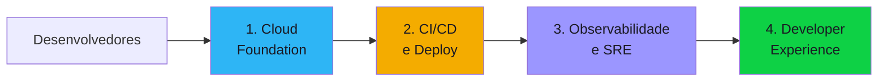

# Discovery Blueprint — Platform Engineering

Documento completo para conduzir o discovery de projetos de infraestrutura, DevOps e platform engineering. Cobre IaC, CI/CD, observabilidade, cloud landing zone e Internal Developer Platform (IDP). Organizado em **4 componentes**.

---

## Quando usar este blueprint

- Menção a "infraestrutura", "DevOps", "platform", "IDP", "landing zone", "IaC"
- Termos: Terraform, Pulumi, Kubernetes, CI/CD, GitOps, observability, SRE
- Necessidade de padronizar ambientes, automatizar deploys, melhorar observabilidade
- Projetos de "golden path", self-service para desenvolvedores, portal de desenvolvedor
- Termos: Backstage, ArgoCD, Crossplane, Datadog, Grafana, PagerDuty

---

## Visão geral dos componentes

| # | Componente | O que define | Blocos do discovery |
|---|-----------|-------------|-------------------|
| 1 | Cloud Foundation | Landing zone, IaC, networking, segurança, identidade | #5, #7 |
| 2 | CI/CD e Deploy | Pipelines, GitOps, ambientes, release strategy | #5, #7 |
| 3 | Observabilidade e SRE | Monitoring, logging, tracing, alertas, incident management | #5, #7, #8 |
| 4 | Developer Experience | IDP, golden paths, self-service, documentação, portal | #4, #7, #8 |

---

## Componente 1 — Cloud Foundation (Landing Zone)

A fundação cloud define onde e como os workloads rodam. Inclui estrutura de contas/projetos, networking, identidade, segurança baseline e IaC.

### Concerns

- **Cloud provider** — AWS, Azure, GCP? Multi-cloud? Hybrid (cloud + on-premises)?
- **Estrutura de contas/projetos** �� AWS Organizations / Azure Management Groups / GCP Folders? Separação por ambiente, por time, por produto?
- **Networking** — VPC/VNet design, peering, transit gateway, DNS, PrivateLink?
- **Identidade** — SSO corporativo, IAM, RBAC, service accounts, federação?
- **IaC** — Terraform, Pulumi, CloudFormation, Bicep? Repositório de módulos?
- **Segurança baseline** — Guardrails, SCPs (AWS), Azure Policy, compliance checks automatizados?
- **Custos** — Tagging obrigatório, budget alerts, FinOps?
- **Disaster recovery** — Multi-região? RPO/RTO? Backup strategy?

### Perguntas-chave

1. Qual cloud provider? Já existe ambiente ou é greenfield?
2. Como estruturar contas/projetos? Por ambiente, time, produto?
3. Existe networking definido? VPC, CIDR, DNS?
4. Como funciona a identidade? SSO corporativo, IAM roles?
5. Qual ferramenta de IaC? Já existe uso ou começa do zero?
6. Quais guardrails de segurança são obrigatórios? (SCPs, policies, compliance)
7. Como controlar custos? Tagging? Budget alerts? FinOps?
8. Requisitos de disaster recovery? Multi-região?

### Decisões esperadas

| Decisão | Alternativas típicas | Critério |
|---------|---------------------|----------|
| Cloud provider | AWS / Azure / GCP / Multi-cloud / Hybrid | Ecossistema, pricing, compliance |
| IaC | Terraform / Pulumi / CloudFormation / Bicep | Multi-cloud, skills, ecosystem |
| Estrutura de contas | Por ambiente / Por time / Por produto / Híbrido | Isolamento, billing, governança |
| Networking | Hub-spoke / Flat VPC / Mesh | Complexidade, segurança, custo |

### Critérios de completude

- [ ] Cloud provider selecionado
- [ ] Estrutura de contas/projetos definida
- [ ] Networking desenhado (VPCs, CIDRs, peering)
- [ ] Identidade e IAM definidos
- [ ] IaC selecionado com repositório planejado
- [ ] Guardrails de segurança definidos
- [ ] Estratégia de custos documentada

---

## Componente 2 — CI/CD e Deploy

O pipeline de entrega define como código vai do commit à produção. Inclui build, test, deploy, ambientes e release strategy.

### Concerns

- **Pipeline tool** — GitHub Actions, GitLab CI, Jenkins, CircleCI, Azure DevOps?
- **GitOps** — ArgoCD, Flux? Infra e app deployados via Git?
- **Ambientes** — Dev, staging, prod? Efêmeros (preview environments)?
- **Release strategy** — Blue-green, canary, rolling, feature flags?
- **Containerização** — Docker? Buildpacks? Container registry?
- **Orquestração** — Kubernetes (EKS/AKS/GKE), ECS, Cloud Run, Lambda?
- **Secrets** — Vault, AWS Secrets Manager, Azure Key Vault? Injeção no deploy?
- **Testes no pipeline** — Unit, integration, e2e, security scan (SAST/DAST), container scan?

### Perguntas-chave

1. Qual ferramenta de CI/CD? Já existe ou escolher?
2. GitOps ou push-based deploy?
3. Quais ambientes? Dev, staging, prod? Preview environments?
4. Qual a release strategy? (blue-green, canary, feature flags)
5. Containeriza tudo? Docker? Kubernetes?
6. Como gerenciar secrets nos pipelines?
7. Quais tipos de teste rodam no pipeline? (unit, integration, security scan)
8. Qual o tempo aceitável de pipeline? (< 5min, < 15min, < 30min)

### Decisões esperadas

| Decisão | Alternativas típicas | Critério |
|---------|---------------------|----------|
| CI/CD tool | GitHub Actions / GitLab CI / Jenkins / ArgoCD | Ecossistema Git, complexidade, skills |
| Deploy approach | GitOps (ArgoCD) / Push-based / Hybrid | Maturidade, auditabilidade |
| Container orchestration | Kubernetes / ECS / Cloud Run / Lambda | Complexidade, escala, skills |
| Release strategy | Blue-green / Canary / Rolling / Feature flags | Risco, complexidade, tráfego |

### Critérios de completude

- [ ] Ferramenta de CI/CD definida
- [ ] Abordagem de deploy documentada (GitOps vs push)
- [ ] Ambientes definidos com estratégia de promoção
- [ ] Release strategy definida
- [ ] Container strategy documentada
- [ ] Testes no pipeline planejados (tipos, coverage mínimo)
- [ ] Secrets management definido

---

## Componente 3 — Observabilidade e SRE

Não se opera o que não se observa. Define stack de monitoring, logging, tracing, alertas e práticas de SRE (SLO/SLI, error budget, incident management).

### Concerns

- **Métricas** — Prometheus, Datadog, CloudWatch, New Relic? Métricas de infra + app + negócio?
- **Logs** — ELK (Elasticsearch+Logstash+Kibana), Loki, CloudWatch Logs, Datadog Logs?
- **Tracing** — Jaeger, Zipkin, Datadog APM, X-Ray? Distributed tracing?
- **Alertas** — PagerDuty, OpsGenie, Alertmanager? Escalation policies?
- **SLO/SLI** — Service Level Objectives definidos? Error budget?
- **Incident management** — Processo de incident response? Postmortems? Runbooks?
- **Dashboards** — Quem consome? (SRE, devs, gestão) Quais dashboards são essenciais?
- **Custo de observabilidade** — Custo cresce com volume de logs/métricas/traces — como controlar?

### Perguntas-chave

1. Qual stack de observabilidade? (Datadog, Grafana+Prometheus, CloudWatch, ELK)
2. Precisa de distributed tracing? Para quais serviços?
3. Quem recebe alertas? (SRE, dev on-call, gestão) Qual a política de escalação?
4. Existem SLOs definidos? Quais serviços são mais críticos?
5. Como funciona o incident management hoje? Tem postmortems?
6. Quais dashboards são essenciais? Para quem?
7. Como controlar o custo de observabilidade conforme o sistema escala?
8. Existem runbooks para incidentes comuns?

### Decisões esperadas

| Decisão | Alternativas típicas | Critério |
|---------|---------------------|----------|
| Stack de monitoring | Datadog / Grafana+Prometheus / CloudWatch / New Relic | Budget, features, maturidade |
| Log management | ELK / Loki / Datadog Logs / CloudWatch | Volume, custo, integração |
| Alerting | PagerDuty / OpsGenie / Alertmanager / Custom | Escalation, integração |
| SLO approach | SLO formal com error budget / Alertas informais / Sem SLO | Maturidade SRE |

### Critérios de completude

- [ ] Stack de métricas, logs e tracing definida
- [ ] Alertas e escalation policies documentados
- [ ] SLOs definidos para serviços críticos
- [ ] Processo de incident management documentado
- [ ] Custo estimado de observabilidade
- [ ] Runbooks para top 5 incidentes planejados

---

## Componente 4 — Developer Experience (IDP)

Platform engineering existe para servir desenvolvedores. O IDP (Internal Developer Platform) oferece golden paths, self-service e abstrai complexidade de infra.

### Concerns

- **Portal de desenvolvedor** — Backstage, Port, Cortex? Ou documentação wiki?
- **Golden paths** — Templates padronizados para criar serviço, pipeline, infra? Scaffolding?
- **Self-service** — Dev cria ambiente, banco, pipeline sem depender de ops? Como?
- **Documentação** — ADRs (Architecture Decision Records), runbooks, onboarding docs?
- **Abstrações** — Crossplane, Helm charts, Terraform modules? Dev lida com k8s direto ou abstraído?
- **Feedback loop** — Tempo do commit ao deploy em prod? Como medir e melhorar?
- **Developer survey** — Satisfação dos devs com a plataforma? DX score?
- **Onboarding** — Quanto tempo um dev novo leva para fazer primeiro deploy?

### Perguntas-chave

1. Devs criam infraestrutura self-service ou dependem de ops?
2. Existe portal de desenvolvedor? (Backstage, wiki, nenhum)
3. Existem templates padronizados para novos serviços? ("golden path")
4. Quanto tempo um dev novo leva para fazer o primeiro deploy?
5. Qual o tempo médio do commit ao deploy em produção?
6. Devs lidam direto com Kubernetes ou tem abstração?
7. Existe documentação de arquitetura (ADRs)?
8. Como medir satisfação dos devs com a plataforma?

### Decisões esperadas

| Decisão | Alternativas típicas | Critério |
|---------|---------------------|----------|
| Portal | Backstage / Port / Cortex / Wiki / Nenhum | Tamanho do time, maturidade |
| Abstração | Crossplane / Helm charts / Terraform modules / Direct k8s | Skills dos devs, complexidade |
| Self-service | Full self-service / Ticket + automação / Manual | Maturidade, volume de requests |
| Golden paths | Templates scaffolding / Cookiecutter / Manual docs | Número de serviços, padronização |

### Critérios de completude

- [ ] Nível de self-service definido
- [ ] Golden paths planejados (templates, scaffolding)
- [ ] Portal de desenvolvedor definido (ou roadmap)
- [ ] Tempo de onboarding de dev novo estimado
- [ ] Métricas de DX definidas (deploy frequency, lead time, MTTR)
- [ ] Documentação de arquitetura planejada (ADRs, runbooks)

---

## Concerns transversais — Produto e Organização

- Quem é o "cliente" da plataforma? (devs internos, squads de produto)
- OKRs: deploy frequency, lead time for changes, MTTR, change failure rate (DORA metrics)
- Time: SRE dedicado, platform team, DevOps embedded nos squads?
- Sinais de resposta incompleta:
  - "Kubernetes porque todo mundo usa" (sem avaliar se precisa)
  - "O dev faz tudo" (sem plataforma, cada um resolve sozinho)
  - "Terraform pra tudo" (sem módulos, sem padronização)

---

## Concerns transversais — Privacidade (bloco #6)

- Secrets e credenciais nos pipelines — como proteger? Auditoria?
- Dados de produção acessíveis em ambientes inferiores? Mascaramento?
- Logs contendo PII — retenção, acesso, mascaramento?
- Compliance: auditar quem deployou o quê e quando
- Multi-tenancy: isolamento entre times/projetos no cluster

---

## Antipatterns conhecidos

| # | Antipattern | Por quê é ruim |
|---|-------------|----------------|
| 1 | **ClickOps** | Infra criada manualmente no console — irreproducível, não-auditável |
| 2 | **IaC sem state management** | Terraform sem remote state — conflitos, drift |
| 3 | **Kubernetes sem necessidade** | Overhead operacional para 2 serviços — overkill |
| 4 | **CI/CD como único ponto de falha** | Jenkins single-node — cai e ninguém deploya |
| 5 | **Observabilidade como afterthought** | Descobre problemas em produção pelo usuário reclamando |
| 6 | **Alertas sem runbook** | Alerta dispara, ninguém sabe o que fazer |
| 7 | **Dev não consegue testar localmente** | Só funciona no cluster — feedback loop de horas |
| 8 | **Plataforma sem golden path** | Cada dev cria serviço de jeito diferente — caos |
| 9 | **Secrets no Git** | Credenciais expostas — incidente de segurança |
| 10 | **Platform team sem product mindset** | Plataforma que ninguém quer usar — imposição, não produto |

---

## Edge cases para o 10th-man verificar

- Cloud provider sofre outage regional — DR funciona? Testado quando?
- Time de plataforma sai da empresa — quem mantém? Documentação suficiente?
- Custo de Kubernetes + Datadog escala 3x com crescimento do time — é sustentável?
- Dev introduz vulnerability no pipeline — SAST/DAST detecta ou passa?
- Cluster atinge limite de pods — auto-scaling funciona ou precisa de intervenção?
- Compliance exige logs retidos por 5 anos — custo de storage?
- Novo time precisa de stack diferente (Java num mundo Node) — plataforma suporta?
- Migração de Jenkins para GitHub Actions — como manter ambos durante transição?

---

## Custom-specialists disponíveis

| Specialist | Domínio | Quando invocar |
|-----------|---------|----------------|
| `kubernetes-architect` | Kubernetes (EKS, AKS, GKE, k3s) | Orquestração de containers |
| `terraform-specialist` | Terraform (módulos, workspaces, state management) | IaC com Terraform |
| `gitops-architect` | GitOps (ArgoCD, Flux, pull-based deploy) | GitOps como padrão de deploy |
| `finops` | FinOps e otimização de custos cloud | Custos acima do esperado |
| `sre-specialist` | SRE (SLO, error budget, incident management, toil reduction) | Práticas de SRE |
| `security-devsecops` | DevSecOps (SAST, DAST, container scanning, supply chain) | Segurança no pipeline |
| `backstage-specialist` | Backstage (IDP, software catalog, templates) | Portal de desenvolvedor |
| `cloud-networking` | Networking cloud (VPC, peering, transit gateway, DNS, PrivateLink) | Networking complexo |

---

## Perfil do Delivery Report

### Seções extras no relatório

| Seção | Posição | Conteúdo esperado |
|-------|---------|-------------------|
| **Arquitetura da Plataforma** | Entre Tecnologia e Segurança e Privacidade | Stack completa: cloud foundation, CI/CD, observabilidade, IDP, golden paths |

### Métricas obrigatórias no relatório

| Métrica | Onde incluir |
|---------|-------------|
| DORA metrics (deploy frequency, lead time, MTTR, change failure rate) | Métricas-chave |
| Custo mensal de infra | Análise Estratégica |
| Custo de observabilidade | Análise Estratégica |
| Tempo de onboarding de dev novo | Métricas-chave |
| % de infra como código (vs ClickOps) | Métricas-chave |
| Número de serviços na plataforma | Arquitetura da Plataforma |

### Diagramas obrigatórios

| Diagrama | Seção destino |
|----------|---------------|
| Arquitetura cloud (contas, networking, componentes) | Arquitetura da Plataforma |
| Pipeline CI/CD (commit → prod) | Arquitetura da Plataforma |

### Ênfases por seção base

| Seção base | Ênfase |
|------------|--------|
| **Tecnologia e Segurança** | IaC, containers, pipeline, guardrails, DevSecOps |
| **Organização** | Platform team vs embedded DevOps, on-call rotation |
| **Análise Estratégica** | Build vs Buy para cada componente, TCO de plataforma |
| **Matriz de Riscos** | Single point of failure, vendor lock-in, skill shortage, cost overrun |

---

## Mapeamento para os 8 Blocos do Discovery

| Componente | Bloco(s) principal(is) | Agente responsável |
|------------|----------------------|-------------------|
| **1. Cloud Foundation** | #5 (Tech), #7 (Arquitetura Macro) | solution-architect |
| **2. CI/CD e Deploy** | #5 (Tech), #7 (Arch) | solution-architect |
| **3. Observabilidade e SRE** | #5 (Tech), #7 (Arch), #8 (TCO) | solution-architect |
| **4. Developer Experience** | #4 (Processo/Equipe), #7 (Arch), #8 (TCO) | po, solution-architect |

---

## Regions do Delivery Report

Regions de informacao que o delivery report deve conter para projetos de platform engineering. Referencia o catalogo completo em `templates/report-regions/information-regions.md`.

### Obrigatorias

Regions que **sempre** aparecem no delivery report de platform engineering.

| ID | Nome | Justificativa |
|----|------|---------------|
| REG-EXEC-01 | Overview one-pager | Default: Todos |
| REG-EXEC-02 | Product brief | Default: Todos |
| REG-EXEC-03 | Decisao de continuidade | Default: Todos |
| REG-EXEC-04 | Proximos passos | Default: Todos |
| REG-PROD-01 | Problema e contexto | Default: Todos |
| REG-PROD-02 | Personas | Default: Todos |
| REG-PROD-04 | Proposta de valor | Default: Todos |
| REG-PROD-05 | OKRs e ROI | Default: Todos |
| REG-PROD-07 | Escopo | Default: Todos |
| REG-ORG-01 | Mapa de stakeholders | Default: Todos |
| REG-ORG-02 | Estrutura de equipe | Default: Todos |
| REG-TECH-01 | Stack tecnologica | Default: Todos |
| REG-TECH-02 | Integracoes | Default: Todos |
| REG-TECH-03 | Arquitetura macro | Default: Todos |
| REG-TECH-06 | Build vs Buy | Default: Todos |
| REG-SEC-01 | Classificacao de dados | Default: Todos |
| REG-SEC-02 | Autenticacao e autorizacao | Default: Todos |
| REG-SEC-04 | Compliance e regulacao | Default: Todos |
| REG-FIN-01 | TCO 3 anos | Default: Todos |
| REG-FIN-05 | Estimativa de esforco | Default: Todos |
| REG-RISK-01 | Matriz de riscos | Default: Todos |
| REG-RISK-02 | Riscos tecnicos | Default: Todos |
| REG-RISK-03 | Hipoteses criticas nao validadas | Default: Todos |
| REG-QUAL-01 | Score do auditor | Default: Todos |
| REG-QUAL-02 | Questoes do 10th-man | Default: Todos |
| REG-BACK-01 | Epicos priorizados | Default: Todos |
| REG-METR-01 | KPIs de negocio | Default: Todos |
| REG-METR-05 | DORA metrics | Metrica core de platform engineering — deploy frequency, lead time, MTTR, change failure rate |
| REG-NARR-01 | Como chegamos aqui | Default: Todos |

### Opcionais

Regions que podem ser incluidas conforme relevancia do projeto.

| ID | Nome | Justificativa |
|----|------|---------------|
| REG-PROD-03 | Jornadas de usuario | Incluir se houver mapeamento de jornada do dev |
| REG-PROD-06 | Modelo de negocio | Incluir se plataforma for ofertada como produto |
| REG-PROD-08 | Roadmap | Incluir se houver faseamento definido |
| REG-PROD-09 | Visao do produto | Incluir se houver visao de longo prazo formalizada |
| REG-ORG-03 | RACI | Incluir se houver multiplos times envolvidos |
| REG-ORG-04 | Metodologia | Incluir se metodologia for relevante para o delivery |
| REG-ORG-05 | On-call e sustentacao | Incluir se houver operacao pos-MVP |
| REG-TECH-04 | Arquitetura de containers | Incluir se houver containerizacao (Kubernetes, ECS) |
| REG-TECH-05 | ADRs | Incluir se houver decisoes arquiteturais relevantes |
| REG-TECH-07 | Requisitos nao-funcionais | Incluir se houver SLAs definidos |
| REG-SEC-03 | Criptografia | Incluir se houver requisitos especificos de criptografia |
| REG-PRIV-01 | Dados pessoais mapeados | Plataforma geralmente nao lida diretamente com PII |
| REG-PRIV-02 | Base legal LGPD | Plataforma geralmente nao lida diretamente com PII |
| REG-PRIV-03 | DPO e responsabilidades | Plataforma geralmente nao lida diretamente com PII |
| REG-PRIV-04 | Politica de retencao | Plataforma geralmente nao lida diretamente com PII |
| REG-PRIV-05 | Direito ao esquecimento | Plataforma geralmente nao lida diretamente com PII |
| REG-PRIV-06 | Sub-operadores | Plataforma geralmente nao lida diretamente com PII |
| REG-FIN-02 | Break-even analysis | Incluir se houver ROI definido |
| REG-FIN-03 | Custo por componente | Incluir se houver detalhamento de custos por componente |
| REG-FIN-04 | Projecao de receita | Incluir se plataforma for ofertada como SaaS |
| REG-RISK-04 | Analise de viabilidade | Incluir se houver duvidas de viabilidade |
| REG-QUAL-03 | Gaps identificados | Incluir se auditor identificar lacunas |
| REG-QUAL-04 | Checklist de conclusao | Incluir para rastreabilidade |
| REG-BACK-02 | User stories de alto nivel | Incluir se houver refinamento |
| REG-BACK-03 | Dependencias | Incluir se houver dependencias entre epicos |
| REG-BACK-04 | Criterios de Go/No-Go | Incluir se houver criterios formais |
| REG-METR-02 | KPIs tecnicos | Incluir se houver metricas tecnicas alem de DORA |
| REG-METR-03 | SLAs e SLOs | Incluir se houver SLOs definidos |
| REG-METR-04 | Targets por fase | Incluir se houver faseamento com metas |
| REG-NARR-02 | Condicoes para prosseguir | Incluir se houver pre-requisitos criticos |
| REG-NARR-03 | Assinaturas de aprovacao | Incluir se houver sign-off formal |
| REG-PESQ-01 | Relatorio de entrevistas | Incluir se houver entrevistas realizadas |
| REG-PESQ-02 | Citacoes representativas | Incluir se houver entrevistas realizadas |
| REG-PESQ-03 | Mapa de oportunidades | Incluir se houver oportunidades mapeadas |
| REG-PESQ-04 | Dados quantitativos | Incluir se houver dados quantitativos coletados |
| REG-PESQ-05 | Source tag summary | Incluir se houver multiplas fontes de informacao |

### Domain-specific

Regions especificas do context-template `platform-engineering`.

| ID | Nome | Descricao | Template visual |
|----|------|-----------|-----------------|
| REG-DOM-PLAT-01 | Arquitetura da plataforma | Cloud foundation + CI/CD + observabilidade + IDP | Diagram full-width |
| REG-DOM-PLAT-02 | Developer experience | Golden paths, self-service, onboarding time, DX score | Stat cards |
