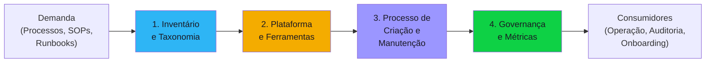

# Discovery Blueprint — Process Documentation

Documento completo e auto-contido para conduzir o discovery de um projeto de documentação de processos. Organizado em **4 componentes** que representam as partes concretas da solução, seguido de antipatterns, edge cases, especialistas disponíveis e perfil do delivery report.

Serve como guia tanto para os agentes de IA (carregado pelo orchestrator na Fase 1) quanto para o humano que acompanha o processo.

---

## Quando usar este blueprint

O orchestrator deve carregar este blueprint quando o briefing apresentar **dois ou mais** dos seguintes sinais:

- Objetivo é "documentar processos", "criar manual", "padronizar operação"
- Termos: SOP, runbook, playbook, manual operacional, knowledge base, wiki, processo
- Foco em **conhecimento** mais do que em código/sistema
- Stakeholders são pessoas operacionais (analistas, técnicos, ops, suporte)
- Demanda de auditoria, compliance, certificação (ISO, SOC, etc.)
- Necessidade de onboarding de novos times via documentação

---

## Visão geral dos componentes



| # | Componente | O que define | Blocos do discovery |
|---|-----------|-------------|-------------------|
| 1 | Inventário e Taxonomia | Tipos de docs, categorização, estado atual, público-alvo | #1, #2 |
| 2 | Plataforma e Ferramentas | Wiki, Confluence, GitBook, versionamento, busca | #5, #7 |
| 3 | Processo de Criação e Manutenção | Ciclo de vida, revisão, aprovação, ownership | #3, #4 |
| 4 | Governança e Métricas | RACI, qualidade, adoção, melhoria contínua | #4, #7, #8 |

---

## Componente 1 — Inventário e Taxonomia

O inventário e taxonomia é o ponto de partida do projeto. Define **o que** precisa ser documentado, **para quem** e com que **granularidade**. Erros nesta camada propagam para todo o resto — documentar os processos errados ou no nível errado de detalhe desperdiça esforço e gera frustração.

### Concerns

- **Público-alvo primário** — Quem vai ler / executar os documentos? Operacionais, técnicos, gestores, auditores?
- **Nível técnico do leitor** — Júnior, sênior, leigo, expert? O tom e a profundidade dependem disso
- **Idioma e tom esperado** — Formal técnico, conversacional, regulatório? Idioma único ou multilíngue?
- **Tipos de documento** — SOP, runbook, playbook, FAQ, knowledge base, guideline, policy? Cada tipo tem estrutura diferente
- **Categorização** — Como organizar? Por área (TI, RH, Finance), por criticidade, por processo de negócio?
- **Granularidade** — Nível alto (overview), passo-a-passo detalhado, código + comandos? Varia por tipo de doc?
- **Frequência de uso** — Consulta diária, eventual, emergencial? Impacta formato e acessibilidade
- **Modo de consumo** — Web, PDF, impresso, mobile, busca interna? Impacta plataforma e formatação
- **Estado atual** — Existe documentação legada? Em que plataforma? Qual a cobertura atual?
- **Escopo** — Quais processos documentar primeiro? Critério de priorização?

### Perguntas-chave

1. Quem é o público-alvo primário dos documentos? (listar personas com nível técnico)
2. Quais tipos de documento serão produzidos? (SOP, runbook, playbook, FAQ, knowledge base)
3. Como categorizar os documentos? (por área, por processo, por criticidade)
4. Qual a granularidade esperada por tipo de documento?
5. Em que idioma(s)? Qual o tom esperado?
6. Existe documentação legada? Onde está? Qual o estado atual?
7. Quais processos são mais críticos e devem ser documentados primeiro?
8. Como os usuários vão consumir os documentos? (web, mobile, PDF, busca)

### Decisões esperadas

| Decisão | Alternativas típicas | Critério |
|---------|---------------------|----------|
| Tipos de documento | SOP / Runbook / Playbook / FAQ / Knowledge base | Natureza do processo e público |
| Categorização | Por área / Por processo / Por criticidade / Híbrido | Estrutura organizacional e volume |
| Granularidade | Alto nível / Passo-a-passo / Código + comandos | Nível técnico do leitor |
| Priorização de escopo | Compliance primeiro / Operacional primeiro / Quick-wins | Risco e impacto |
| Idioma e tom | Formal / Conversacional / Regulatório | Público-alvo e regulação |

### Critérios de completude

- [ ] Público-alvo definido com personas e nível técnico
- [ ] Tipos de documento definidos com template esperado para cada um
- [ ] Categorização documentada (taxonomia)
- [ ] Granularidade definida por tipo de documento
- [ ] Estado atual mapeado (cobertura, plataforma, qualidade)
- [ ] Escopo priorizado com critério explícito

---

## Componente 2 — Plataforma e Ferramentas

A plataforma é a infraestrutura que sustenta toda a base de documentação. Define **onde** os documentos vivem, **como** são versionados e **como** os usuários encontram o que precisam. Uma plataforma mal escolhida gera atrito na criação e abandono na consulta.

### Concerns

- **Plataforma de docs** — Confluence, Notion, Obsidian, GitBook, MkDocs, Docusaurus, SharePoint, Wiki interna? SaaS vs self-hosted?
- **Versionamento** — Git-based (GitBook, Docusaurus), versionamento nativo da plataforma, manual?
- **Busca** — Full-text search nativo? Integração com busca corporativa (Elastic, Algolia)? Tags, filtros?
- **Integrações** — Ticketing (Jira), monitoring (Grafana), RH, SSO corporativo, CI/CD?
- **Classificação de acesso** — Público / interno / confidencial / restrito por documento?
- **Controle de acesso** — Por grupo, por área, por nível hierárquico? SSO/RBAC?
- **Audit trail** — Quem editou, quem aprovou, quem leu? Log de exportações?
- **Assinatura digital** — Requisito de assinatura digital para aprovações?
- **Migração** — Docs legados precisam migrar? Big bang ou strangler fig?
- **Build vs Buy** — SaaS (Confluence, Notion) vs self-hosted (MediaWiki, Docusaurus) vs híbrido?
- **TCO** — Licenças por usuário + horas de redação + horas de revisão + manutenção contínua + migração

### Perguntas-chave

1. Já existe uma plataforma de documentação? Qual? Estão satisfeitos?
2. Há preferência por SaaS ou self-hosted?
3. Vale pagar Confluence por usuário ou manter MkDocs self-hosted?
4. Como os usuários buscam documentação hoje? Funciona?
5. Como integrar busca com outros sistemas corporativos?
6. Como rastrear audit trail completo de aprovações para compliance?
7. Há requisito de assinatura digital?
8. Precisa de SSO? RBAC por área/grupo?
9. Migração de docs legados: big bang ou strangler fig?
10. Idioma único ou multilíngue?

### Decisões esperadas

| Decisão | Alternativas típicas | Critério |
|---------|---------------------|----------|
| Plataforma | Confluence / Notion / GitBook / MkDocs / SharePoint | Budget, skills do time, integrações necessárias |
| Hospedagem | SaaS / Self-hosted / Híbrido | Controle vs conveniência, compliance |
| Versionamento | Git-based / Nativo da plataforma / Manual | Maturidade técnica, necessidade de auditoria |
| Busca | Nativo / Elastic / Algolia / Custom | Volume de docs, complexidade de taxonomia |
| Migração | Big bang / Strangler fig / Paralelo | Volume de legado, risco operacional |
| Controle de acesso | SSO+RBAC / Grupos manuais / Sem restrição | Regulação, tamanho da organização |

### Critérios de completude

- [ ] Plataforma escolhida com justificativa (Build vs Buy documentado)
- [ ] Estratégia de versionamento definida
- [ ] Solução de busca definida (ou risco documentado)
- [ ] Integrações necessárias listadas
- [ ] Controle de acesso e classificação documentados
- [ ] Plano de migração de legado (se aplicável)
- [ ] Estimativa de TCO (licenças + horas + manutenção, projeção 12 meses)

---

## Componente 3 — Processo de Criação e Manutenção

O processo de criação e manutenção define o **ciclo de vida** de cada documento — desde a demanda até a aposentadoria. É onde a complexidade operacional se concentra — fluxo editorial, ownership, revisão periódica, tratamento de conflitos. Um processo mal desenhado gera documentação desatualizada que mina a confiança dos usuários.

### Concerns

- **Fluxo editorial** — Criação → revisão → aprovação → publicação. Quem faz cada etapa?
- **Ownership** — Quem é o dono de cada documento/tipo de documento? Responsável por manter atualizado
- **Ciclo de revisão obrigatório** — Anual, semestral, ad hoc? Como garantir que aconteça?
- **Time editorial** — Redatores, revisores, aprovadores. Dedicados ou part-time?
- **Templates** — Template padronizado por tipo de documento? Quem mantém os templates?
- **Demanda** — Como nasce a demanda por um novo documento? Ticket, processo, decisão gerencial?
- **Conflitos** — Dois docs descrevem o mesmo processo de formas diferentes — como resolver?
- **Aposentadoria** — Quando e como aposentar um documento obsoleto?
- **Urgência** — Doc com erro grave em produção — como corrigir rapidamente?
- **Feedback loop** — Como o leitor reporta erro, sugere melhoria?

### Perguntas-chave

1. Qual o fluxo editorial? (criação → revisão → aprovação → publicação)
2. Quem é o dono de cada tipo de documento? Como é definido ownership?
3. Qual o ciclo de revisão obrigatório? (anual, semestral, ad hoc)
4. Quem redige, quem revisa, quem aprova? São pessoas dedicadas ou part-time?
5. Existem templates padronizados por tipo de documento?
6. Como nasce a demanda por um novo documento?
7. Sem critério de "documento aprovado vs draft" — como diferenciar?
8. Como o leitor reporta um erro ou sugere melhoria?
9. O que acontece quando o dono de um documento sai da empresa?
10. Doc descreve processo que mudou ontem — quem é responsável por atualizar?

### Decisões esperadas

| Decisão | Alternativas típicas | Critério |
|---------|---------------------|----------|
| Fluxo editorial | Linear (autor→reviewer→approver) / Paralelo / Self-publish com revisão posterior | Volume de docs, risco do conteúdo |
| Ownership | Por área / Por processo / Por indivíduo / Rotativo | Estrutura organizacional |
| Ciclo de revisão | Anual / Semestral / Trimestral / Ad hoc por trigger | Criticidade e taxa de mudança do processo |
| Aprovação | Uma pessoa / Duas pessoas / Comitê / Self-approval com peer review | Risco regulatório, bottleneck |
| Aposentadoria | Arquivamento / Exclusão / Merge com outro doc | Compliance, relevância histórica |

### Critérios de completude

- [ ] Fluxo editorial definido (etapas, papéis, ferramentas)
- [ ] Ownership definido por tipo de documento
- [ ] Ciclo de revisão obrigatório documentado
- [ ] Time editorial identificado (quem redige, revisa, aprova)
- [ ] Templates padronizados definidos ou planejados
- [ ] Processo de aposentadoria/arquivamento definido
- [ ] Plano de contingência para perda de ownership (saída de colaborador)

---

## Componente 4 — Governança e Métricas

A governança e métricas garantem que a documentação **permaneça viva e útil** ao longo do tempo. É o ponto de controle que mede adoção, qualidade e custo. Sem métricas, é impossível saber se a documentação está funcionando ou apodrecendo silenciosamente.

### Concerns

- **RACI** — Quem é Responsible, Accountable, Consulted, Informed para cada tipo de documento?
- **Métricas de qualidade** — % de docs com revisão em dia, % com dono claro, tempo médio de publicação
- **Métricas de adoção** — Acessos, buscas, taxa de busca sem resultado, NPS de documentação
- **Melhoria contínua** — Cadência de revisão das métricas, plano de ação para métricas fora do alvo
- **Regulação aplicável** — ISO 9001, ISO 27001, SOC 2, regulação setorial — requisitos de audit trail
- **OKRs** — Tempo de onboarding reduzido, tickets reduzidos, NPS interno, cobertura de processos
- **ROI esperado** — Como medir retorno do investimento em documentação?
- **Custo total** — Plataforma + horas dedicadas + manutenção contínua
- **Compliance e auditoria** — Evidências para auditoria, preservação de log de aprovações

### Perguntas-chave

1. Quem é Responsible, Accountable, Consulted, Informed (RACI) para documentação?
2. Quais métricas serão rastreadas? (acessos, buscas, NPS, cobertura, freshness)
3. Qual a cadência de revisão das métricas?
4. Quais OKRs mensuráveis? (redução de onboarding, redução de tickets, cobertura)
5. Qual o ROI esperado? Como será medido?
6. Há regulação aplicável? (ISO 9001, ISO 27001, SOC 2, regulação setorial)
7. Auditor externo pede log de aprovações de 2 anos — como gerar?
8. Qual o budget mensal estimado para manter a documentação (plataforma + horas)?
9. Como lidar com métricas fora do alvo? Plano de ação automático ou manual?

### Decisões esperadas

| Decisão | Alternativas típicas | Critério |
|---------|---------------------|----------|
| RACI | Por tipo de doc / Por área / Centralizado / Federado | Tamanho da organização, maturidade |
| Métricas | Básicas (acesso, busca) / Avançadas (+NPS, +freshness) / Custom | Maturidade, ferramentas disponíveis |
| Cadência de revisão | Mensal / Trimestral / Semestral | Volume e criticidade |
| Compliance | ISO 9001 / ISO 27001 / SOC 2 / Sem certificação | Setor, clientes, regulação |
| Budget | Centralizado (TI) / Distribuído (por área) / Projeto | Estrutura organizacional |

### Critérios de completude

- [ ] RACI definido para cada tipo de documento
- [ ] Métricas de qualidade e adoção definidas com metas
- [ ] OKRs mensuráveis documentados
- [ ] Cadência de revisão das métricas definida
- [ ] Regulação aplicável identificada e requisitos mapeados
- [ ] Estimativa de custo total (plataforma + horas + manutenção)
- [ ] Plano de melhoria contínua documentado

---

## Concerns transversais — Produto e Organização

Além dos 4 componentes, o discovery precisa cobrir aspectos de produto e organização que atravessam todos os componentes. Estes são endereçados principalmente nos blocos #1 a #4 pelo **po**.

### Quem consome e por quê

- Público-alvo primário (quem vai ler / executar)
- Nível técnico do leitor (júnior, sênior, leigo, expert)
- Idioma e tom esperado
- Granularidade (nível alto / passo-a-passo / código + comandos)
- Frequência de uso (consulta diária, eventual, emergencial)
- Modo de consumo (web, PDF, impresso, mobile, busca interna)

### Valor e métricas

- OKRs mensuráveis — tempo de onboarding reduzido, tickets reduzidos, NPS interno, cobertura de processos
- ROI esperado
- Sinais de resposta incompleta:
  - "Pra geral" (sem público-alvo)
  - "Vamos escrever do jeito que sai" (sem padrão de tom/granularidade)
  - Sem critério de "documento aprovado vs draft"

### Organização e governança

- Regulação aplicável (ISO 9001, ISO 27001, SOC 2, regulação setorial) — como contexto
- Ownership por documento (quem é o dono de cada SOP/runbook)
- Fluxo editorial (criação → revisão → aprovação → publicação)
- Ciclo de revisão obrigatório (anual, semestral, ad hoc)
- Time de redatores, revisores, aprovadores

---

## Concerns transversais — Privacidade (bloco #6)

O **cyber-security-architect** sempre roda este bloco. Em projetos de documentação de processos, o **modo magro é o caso comum** — documentação interna costuma ter baixa sensibilidade de privacidade. Modo profundo se aplica quando os docs contêm dados pessoais (contratos, salários, identificação de clientes/colaboradores), quando são expostos externamente, ou quando há compliance regulatório específico.

### Concerns específicos de documentação

- Classificação de sensibilidade por doc (público / interno / confidencial / restrito)
- Dados pessoais em docs (masking automático? revisão manual?)
- Retenção de versões antigas com dados pessoais
- Audit trail de quem leu/exportou docs sensíveis
- Política de remoção de docs vazados

---

## Antipatterns conhecidos

| # | Antipattern | Por quê é ruim |
|---|---|---|
| 1 | **Documentação sem dono** | Em 6 meses está desatualizada e ninguém sabe quem mexe |
| 2 | **Tudo no mesmo template** | Runbook técnico com tom de guideline executivo confunde leitor |
| 3 | **Sem ciclo de revisão obrigatório** | Documentação envelhece silenciosamente |
| 4 | **"Vamos documentar tudo"** | Escopo infinito, nada pronto, frustração |
| 5 | **Sem busca eficiente** | Usuário desiste de procurar e cria caminho próprio |
| 6 | **Aprovação por uma pessoa só** | Bottleneck e SPOF; documentação fica em backlog do gerente |
| 7 | **Sem versionamento** | "Qual é a versão correta?" vira pergunta diária |
| 8 | **Migração big-bang de docs legados** | Projeto morre antes de migrar tudo |
| 9 | **Documentação separada do código/produto** | Drift entre o que está documentado e o que existe |
| 10 | **Sem métricas de uso** | Impossível saber o que está funcionando ou não |

---

## Edge cases para o 10th-man verificar

- O que acontece com docs cujo dono saiu da empresa?
- Como auditar quem aprovou determinada versão de uma SOP crítica?
- Doc com erro grave em produção — como reverter rapidamente?
- Conflito entre dois docs que descrevem o mesmo processo de formas diferentes?
- Doc traduzido fica desatualizado em relação ao original — qual é a fonte da verdade?
- Como lidar com docs internos vazados publicamente?
- Plataforma de docs cai — qual é o fallback?
- Mudança regulatória obriga revisão de 200 docs em 30 dias — como executar?
- Doc descreve processo que mudou ontem — quem é responsável por atualizar?
- Migração de plataforma — como preservar histórico de versões e aprovações?
- Auditor externo pede log de aprovações de 2 anos — como gerar?
- Doc com PII vazada por descuido — política de remoção?

---

## Custom-specialists disponíveis

Quando po, solution-architect ou cyber-security-architect precisarem de profundidade em subtópico específico durante a reunião, o orchestrator pode invocar um dos specialists abaixo:

| Specialist | Domínio | Quando invocar |
|---|---|---|
| `compliance-iso` | ISO 9001 / ISO 27001 / SOC 2 | Briefing menciona certificação ISO ou SOC 2 como requisito |
| `regulated-documentation-health` | Documentação regulada em saúde | SOPs em hospitais, clínicas, laboratórios; compliance ANS, ANVISA |
| `regulated-documentation-finance` | Documentação regulada financeira | Políticas Bacen, CVM, SUSEP; auditoria financeira |
| `regulated-documentation-government` | Documentação em setor público | LAI, transparência, compliance TCU |
| `docs-migration-strategy` | Migração de plataforma legada | Movendo de SharePoint/Confluence antigo para plataforma nova; preservação de histórico |
| `localization-strategy` | Tradução e i18n de documentação | Docs em múltiplos idiomas, sincronização entre versões, RTL |
| `developer-documentation` | Documentação técnica de API/SDK | Docs de API pública, referências SDK, tutoriais de integração |
| `legal-documentation` | Documentação para auditoria fiscal/legal | Evidências para auditoria, preservação legal, discovery |
| `knowledge-management-strategy` | Taxonomia, busca, findability | Catálogo grande, usuários não encontram conteúdo, necessidade de ontologia |
| `change-management-strategy` | Gestão de mudança de processos | Processo que afeta >50 pessoas, resistência esperada, treinamento |

> [!info] Fallback genérico
> Se o subtópico não casa com nenhum specialist acima, o orchestrator gera um specialist genérico e registra `[CUSTOM-SPECIALIST-GENERIC]` no log.

> [!note] LGPD/Privacidade
> LGPD/Privacidade NÃO é custom-specialist — é coberta obrigatoriamente pelo `cyber-security-architect`.

### Prompt base de invocação

```
Você é o specialist `{specialist-id}` do blueprint process-documentation no Discovery Pipeline v0.5.

Domínio: {domínio da tabela}

Contexto da reunião até aqui:
{log dos blocos já cobertos}

Subtópico que pediram sua ajuda:
{descrição do ponto}

Sua missão:
1. Aprofunda o subtópico com vocabulário real do domínio (SOP, runbook, audit trail, review cycle, taxonomy, etc.)
2. Sinaliza antipatterns conhecidos (doc sem dono, escopo infinito, sem ciclo de revisão, etc.)
3. Se o customer marcar [INFERENCE] em ponto crítico (compliance, quem aprova, quem mantém), force aprofundamento
4. Se o domínio exige especialista humano de verdade (ex: compliance regulatório profundo), marque [NEEDS-HUMAN-SPECIALIST]
5. Devolve controle ao especialista fixo que te invocou
```

---

## Perfil do Delivery Report

Configurações específicas que o `consolidator` aplica ao delivery report na Fase 3 para projetos deste tipo.

> [!info] Como funciona o merge
> O template base define 11 seções obrigatórias. Este report-profile **adiciona** seções extras, **define** métricas obrigatórias do domínio e **ajusta** ênfases nas seções base. Se o cliente tiver um override total em `custom-artifacts/{client}/config/final-report-template.md`, este profile é ignorado.

### Seções extras no relatório

| Seção | Posição | Conteúdo esperado |
|-------|---------|-------------------|
| **Taxonomia e Governança de Docs** | Entre Organização e Tecnologia e Segurança | Taxonomia de tipos de documento (SOP, runbook, playbook, knowledge base), ciclo de revisão obrigatório, RACI de manutenção, políticas de aprovação, audit trail |

### Métricas obrigatórias no relatório

| Métrica | Onde incluir | Descrição |
|---------|-------------|-----------|
| Tempo médio de publicação | Métricas-chave | Tempo entre criação e publicação de um documento novo |
| % docs com revisão em dia | Métricas-chave | Percentual de documentos dentro do ciclo de revisão obrigatório |
| % docs com dono claro | Métricas-chave | Percentual de documentos com owner designado e ativo |
| Taxa de busca sem resultado | Métricas-chave | % de buscas que não retornam documentos relevantes |
| NPS de documentação | Métricas-chave | Satisfação dos usuários com a base de conhecimento |
| Custo total mensal | Métricas-chave + Análise Estratégica | Plataforma + horas dedicadas à manutenção de docs |

### Diagramas obrigatórios no relatório

| Diagrama | Obrigatório? | Seção destino | Descrição |
|----------|-------------|---------------|-----------|
| Arquitetura macro | Sim (base) | Tecnologia e Segurança | Já obrigatório no template base |
| RACI simplificado | Opcional | Taxonomia e Governança | Matriz RACI de quem cria, revisa, aprova e consome cada tipo de documento |

### Ênfases por seção base

| Seção base | Ênfase Process-Docs |
|------------|---------------------|
| **Organização** | Destacar RACI de manutenção de documentação, ciclo de revisão obrigatório, papéis de governance (doc owner, reviewer, approver) |
| **Visão de Produto** | Focar em taxonomia de documentos (SOP, runbook, playbook, FAQ, knowledge base), categorização, e descoberta (search/browse) |
| **Tecnologia e Segurança** | Destacar plataforma de docs (Confluence, Notion, GitBook, custom), versionamento, controle de acesso por tipo de doc, integração com ferramentas de workflow |
| **Backlog Priorizado** | Priorizar por criticidade do processo documentado: compliance/regulatório primeiro, operacional segundo, conhecimento tácito terceiro |
| **Matriz de Riscos** | Incluir riscos específicos: docs desatualizados sendo seguidos como verdade, knowledge silos, perda de conhecimento tácito por turnover |

---

## Mapeamento para os 8 Blocos do Discovery

| Componente | Bloco(s) principal(is) | Agente responsável |
|------------|----------------------|-------------------|
| **1. Inventário e Taxonomia** | #1 (Visão e Personas), #2 (Valor e Métricas) | po |
| **2. Plataforma e Ferramentas** | #5 (Tecnologia e Segurança), #7 (Arquitetura Macro) | solution-architect |
| **3. Processo de Criação e Manutenção** | #3 (Processo e Equipe), #4 (Organização) | po, solution-architect |
| **4. Governança e Métricas** | #4 (Organização), #7 (Arquitetura Macro), #8 (TCO) | po, solution-architect |

> [!tip] Concerns transversais
> Alguns temas atravessam todos os componentes:
> - **Privacidade (bloco #6)** — Classificação de sensibilidade, dados pessoais em docs, audit trail de acesso
> - **Custo (bloco #8)** — Plataforma, horas de redação/revisão, manutenção contínua, migração
> - **Governança (bloco #4)** — Ownership, RACI, ciclo de revisão e aprovação afetam todos os componentes

---

## Regions do Delivery Report

Regions de informação que o `consolidator` deve gerar no delivery report para projetos de documentação de processos. Referência completa no [Information Regions Catalog](../../projects/discovery-to-go/base-artifacts/templates/report-regions/README.md).

### Obrigatórias

Regions com Default "Todos" no catálogo — sempre presentes no delivery report.

| ID | Nome | Grupo |
|----|------|-------|
| REG-EXEC-01 | Overview one-pager | Executivo |
| REG-EXEC-02 | Product brief | Executivo |
| REG-EXEC-03 | Decisão de continuidade | Executivo |
| REG-EXEC-04 | Próximos passos | Executivo |
| REG-PROD-01 | Problema e contexto | Produto |
| REG-PROD-02 | Personas | Produto |
| REG-PROD-04 | Proposta de valor | Produto |
| REG-PROD-05 | OKRs e ROI | Produto |
| REG-PROD-07 | Escopo | Produto |
| REG-ORG-01 | Mapa de stakeholders | Organização |
| REG-ORG-02 | Estrutura de equipe | Organização |
| REG-TECH-01 | Stack tecnológica | Técnico |
| REG-TECH-02 | Integrações | Técnico |
| REG-TECH-03 | Arquitetura macro | Técnico |
| REG-TECH-06 | Build vs Buy | Técnico |
| REG-SEC-01 | Classificação de dados | Segurança |
| REG-SEC-02 | Autenticação e autorização | Segurança |
| REG-SEC-04 | Compliance e regulação | Segurança |
| REG-FIN-01 | TCO 3 anos | Financeiro |
| REG-FIN-05 | Estimativa de esforço | Financeiro |
| REG-RISK-01 | Matriz de riscos | Riscos |
| REG-RISK-02 | Riscos técnicos | Riscos |
| REG-RISK-03 | Hipóteses críticas não validadas | Riscos |
| REG-QUAL-01 | Score do auditor | Qualidade |
| REG-QUAL-02 | Questões do 10th-man | Qualidade |
| REG-BACK-01 | Épicos priorizados | Backlog |
| REG-METR-01 | KPIs de negócio | Métricas |
| REG-NARR-01 | Como chegamos aqui | Narrativa |

### Opcionais

Regions com Default "Opcional", "Quando há PII", "Quando SaaS" ou "Quando platform" no catálogo — incluídas quando o contexto do projeto justificar.

> [!note] Privacidade
> Projetos de documentação de processos tipicamente **não manipulam PII**. Todas as regions de privacidade (REG-PRIV-*) são opcionais neste contexto. Incluir quando os documentos contiverem dados pessoais (contratos, salários, identificação de clientes/colaboradores), forem expostos externamente, ou houver compliance regulatório específico de privacidade.

| ID | Nome | Grupo |
|----|------|-------|
| REG-PROD-03 | Jornadas de usuário | Produto |
| REG-PROD-06 | Modelo de negócio | Produto |
| REG-PROD-08 | Roadmap | Produto |
| REG-PROD-09 | Visão do produto | Produto |
| REG-PESQ-01 | Relatório de entrevistas | Pesquisa |
| REG-PESQ-02 | Citações representativas | Pesquisa |
| REG-PESQ-03 | Mapa de oportunidades | Pesquisa |
| REG-PESQ-04 | Dados quantitativos | Pesquisa |
| REG-PESQ-05 | Source tag summary | Pesquisa |
| REG-ORG-03 | RACI | Organização |
| REG-ORG-04 | Metodologia | Organização |
| REG-ORG-05 | On-call e sustentação | Organização |
| REG-TECH-04 | Arquitetura de containers | Técnico |
| REG-TECH-05 | ADRs | Técnico |
| REG-TECH-07 | Requisitos não-funcionais | Técnico |
| REG-SEC-03 | Criptografia | Segurança |
| REG-PRIV-01 | Dados pessoais mapeados | Privacidade |
| REG-PRIV-02 | Base legal LGPD | Privacidade |
| REG-PRIV-03 | DPO e responsabilidades | Privacidade |
| REG-PRIV-04 | Política de retenção | Privacidade |
| REG-PRIV-05 | Direito ao esquecimento | Privacidade |
| REG-PRIV-06 | Sub-operadores | Privacidade |
| REG-FIN-02 | Break-even analysis | Financeiro |
| REG-FIN-03 | Custo por componente | Financeiro |
| REG-FIN-04 | Projeção de receita | Financeiro |
| REG-RISK-04 | Análise de viabilidade | Riscos |
| REG-QUAL-03 | Gaps identificados | Qualidade |
| REG-QUAL-04 | Checklist de conclusão | Qualidade |
| REG-BACK-02 | User stories de alto nível | Backlog |
| REG-BACK-03 | Dependências | Backlog |
| REG-BACK-04 | Critérios de Go/No-Go | Backlog |
| REG-METR-02 | KPIs técnicos | Métricas |
| REG-METR-03 | SLAs e SLOs | Métricas |
| REG-METR-04 | Targets por fase | Métricas |
| REG-METR-05 | DORA metrics | Métricas |
| REG-NARR-02 | Condições para prosseguir | Narrativa |
| REG-NARR-03 | Assinaturas de aprovação | Narrativa |

### Domain-specific

Regions exclusivas do context-template `process-documentation` — sempre presentes quando este blueprint está ativo.

| ID | Path | Nome | Descrição | Template visual |
|----|------|------|-----------|-----------------|
| REG-DOM-PROC-01 | `domain/process-docs-taxonomy.md` | Taxonomia de documentos | Tipos de doc (SOP, runbook, playbook), categorização, lifecycle | Table com badges |
| REG-DOM-PROC-02 | `domain/process-docs-governance.md` | Governança de docs | RACI de manutenção, ciclo de revisão, aprovação, métricas de adoção | Card com RACI table |
