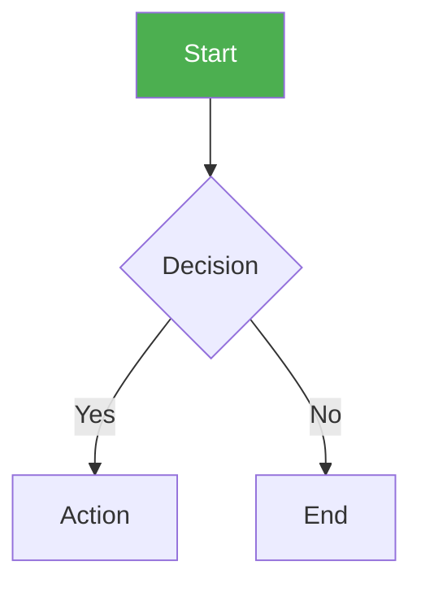
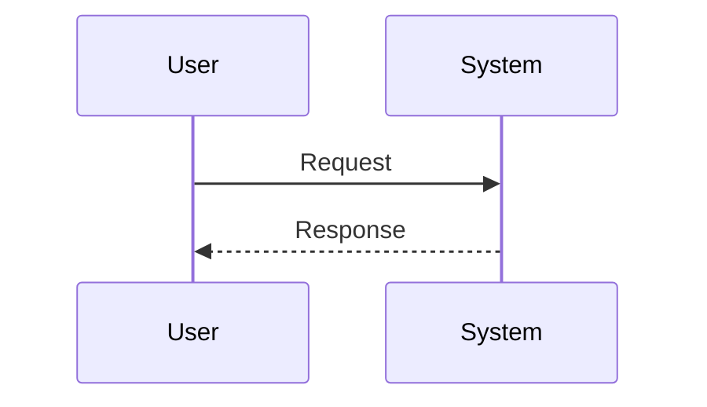
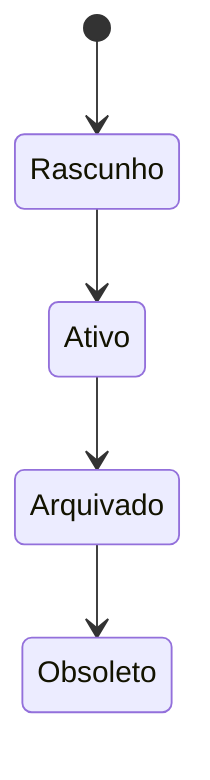
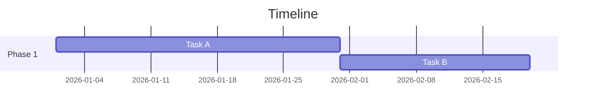

# Diagrams

Standard for diagrams in Markdown documents.

## Standard

- **Engine:** Mermaid only (no ASCII art)
- **Labels:** max 3 words; emojis when useful for clarity
- **Styling:** use `style` or `classDef` for colors

### Diagram Types

| Type | Use Case |
|---------------------|-------------------------------|
| `flowchart TD/LR` | Processes, workflows |
| `sequenceDiagram` | Interactions between actors |
| `stateDiagram-v2` | Lifecycle, state transitions |
| `gantt` | Timelines, schedules |

## Examples

