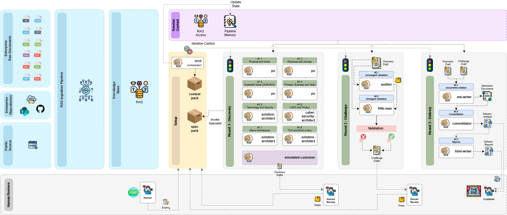
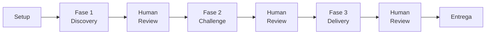

# Discovery To Go

Pipeline de discovery automatizado por agentes de IA que conduz levantamento de requisitos, validação arquitetural e geração de relatórios consolidados para novos projetos de software. Opera em **3 fases sequenciais** (Discovery, Challenge, Delivery), cada uma seguida por um **Human Review** obrigatório — o humano sempre tem a palavra final.

> [!danger] Regra fundamental
> **Nenhum projeto inicia sem completar as 3 fases com aprovação humana em cada uma.** Este processo é obrigatório e sequencial.



---

## O que este projeto faz

O Discovery To Go recebe um **briefing** descrevendo uma ideia de projeto e, a partir dele, conduz automaticamente:

1. **Entrevista simulada** com 8 blocos temáticos — um "cliente virtual" responde perguntas de especialistas em produto, arquitetura, segurança e privacidade
2. **Validação dupla** — um auditor verifica qualidade e um "advogado do diabo" desafia premissas, ambos em paralelo
3. **Entrega consolidada** — documentos markdown polidos são consolidados em um relatório final + versão HTML auto-contida

O resultado é um **delivery report** completo cobrindo visão de produto, personas, OKRs, arquitetura, TCO, Build vs Buy, privacidade, riscos e backlog priorizado.

---

## Arquitetura em 3 Camadas

O projeto é organizado em 3 camadas com prioridade crescente:

```
discovery-to-go/
├── base-artifacts/     ← Camada 1: cópia do workspace global (sincronizável)
├── dtg-artifacts/      ← Camada 2: artefatos específicos do pipeline
└── custom-artifacts/       ← Camada 3: customizações por cliente (maior prioridade)
```

| Camada | Pasta | Propósito | Prioridade |
|--------|-------|-----------|------------|
| **Base** | `base-artifacts/` | Cópia local do workspace global — assets, regras, convenções, context-templates, skills globais, support-tools. Sincronizável com o workspace central via `docs/dependency-manifest.md`. | Menor |
| **Pipeline** | `dtg-artifacts/` | Artefatos específicos do pipeline DTG — regras, skills, templates, samples de execução. É o "motor" do discovery. | Média |
| **Custom** | `custom-artifacts/` | Customizações por tenant/cliente — knowledge base do cliente, assets visuais, regras adicionais e overrides de configuração. | Maior |

> [!info] Resolução de conflitos
> Quando a mesma configuração existe em múltiplas camadas, a camada de **maior prioridade** vence: Custom > Pipeline > Base. Isso permite personalizar o pipeline por cliente sem alterar o core.

---

## Estrutura Completa de Pastas

```
discovery-to-go/
│
├── README.md                              ← este arquivo (entry point do projeto)
├── TODO.md                                ← lista de pendências do projeto
│
├── docs/                                  ← documentação operacional
│   ├── discovery-pipeline.md              ← guia completo do pipeline (3 fases, blocos, HR)
│   ├── quick-start.md                     ← como iniciar uma run (passo a passo)
│   ├── logging-process.md                 ← como funciona o logging (tipos, formato, regras)
│   ├── dependency-manifest.md             ← mapeamento de dependências do workspace global
│   └── diagrams/
│       ├── pipeline.drawio                ← diagrama completo do pipeline (draw.io)
│       └── pipeline.png                   ← versão PNG exportada
│
├── base-artifacts/                        ← CAMADA 1 — cópia do workspace global
│   ├── assets/                            ← logos, design system, playground, variáveis
│   │   ├── logos/                         ← dark.png, light.png + versões base64
│   │   ├── ui-ux/                         ← design-system.md, playground.html
│   │   └── variables/                     ← report-variables.md (empresa, footer, selo)
│   ├── behavior/rules/                    ← regras globais (skill-structure, etc.)
│   ├── conventions/                       ← 30+ convenções (frontmatter, markdown, naming, colors, etc.)
│   ├── context-templates/                 ← 10 blueprints de discovery por domínio
│   │   ├── saas/                          ← discovery-blueprint.md (documento único)
│   │   ├── datalake-ingestion/
│   │   ├── process-documentation/
│   │   ├── web-microservices/
│   │   ├── system-integration/
│   │   ├── migration-modernization/
│   │   ├── ai-ml/
│   │   ├── mobile-app/
│   │   ├── process-automation/
│   │   └── platform-engineering/
│   ├── skills/                            ← 8 skills globais (po, solution-architect, etc.)
│   ├── support-tools/                     ← ferramentas (md-validator Python)
│   ├── CLAUDE.md                          ← entry point do workspace global
│   └── dependency.md                      ← template de herança
│
├── dtg-artifacts/                         ← CAMADA 2 — artefatos do pipeline DTG
│   ├── rules/                             ← 7 regras do pipeline
│   │   ├── discovery/                     ← 3 fases, 8 blocos temáticos, critérios
│   │   ├── iteration-loop/                ← iterações, limites, convergência
│   │   ├── analyst-discovery-log/         ← formato da entrevista (tabela com emojis)
│   │   ├── audit-log/                     ← log de auditoria
│   │   ├── requirement-priority/          ← classificação de requisitos (MoSCoW)
│   │   ├── token-tracking/                ← rastreamento de consumo de tokens
│   │   └── custom-artifacts-priority/         ← cadeia de prioridade Custom > Pipeline > Base
│   ├── skills/                            ← 6 skills locais do pipeline
│   │   ├── orchestrator/                  ← coordenador central (transversal)
│   │   ├── customer/                      ← simulador do cliente (Fase 1)
│   │   ├── auditor/                       ← validação convergente (Fase 2)
│   │   ├── consolidator/                  ← consolidador de relatórios (Fase 3)
│   │   ├── report-planner/                ← planejador de layout HTML (Fase 3)
│   │   └── pipeline-md-writer/            ← formatador de markdown (Fase 3)
│   ├── templates/                         ← templates de artefatos
│   │   ├── briefing-template.md           ← template do briefing inicial
│   │   ├── audit-report-template.md       ← template do relatório do auditor
│   │   ├── challenge-report-template.md   ← template do relatório do 10th-man
│   │   ├── change-request-template.md     ← template de change request
│   │   ├── iteration-setup-template.md    ← template de setup de iteração
│   │   └── customization/                 ← defaults customizáveis por run
│   │       ├── final-report-template.md   ← estrutura do relatório final
│   │       ├── human-review-template.md   ← formato do Human Review
│   │       ├── iteration-policy.md        ← limites de iteração
│   │       └── scoring-thresholds.md      ← pisos de nota do auditor/10th-man
│   ├── assets/                            ← assets do pipeline (diagramas)
│   └── arctifact-samples/                 ← sample de uma run completa (FinTrack Pro)
│       └── run-sample/                    ← todos os artefatos gerados ponta a ponta
│
└── custom-artifacts/                          ← CAMADA 3 — customizações por cliente
    ├── README.md                          ← guia de estruturação
    └── {client-name}/                     ← pasta por cliente
        ├── kb/                            ← knowledge base do cliente
        ├── assets/                        ← logos, assets visuais
        ├── rules/                         ← regras adicionais
        └── config/                        ← overrides de scoring, iteração, report
```

---

## As 3 Fases do Pipeline



### Setup

O **orchestrator** recebe o briefing e prepara tudo:
- Cria o scaffold da run (`runs/run-{n}/`)
- Auto-detecta o context-template a partir de sinais no briefing
- Copia templates de customização e context-template para a run
- Cria `config.md` e `pipeline-state.md` (state tracker append-only)

### Fase 1 — Discovery (Reunião Conjunta Temática)

Uma reunião simulada com **8 blocos temáticos** onde especialistas de IA entrevistam um "cliente virtual":

| Bloco | Tema | Agente |
|-------|------|--------|
| #1 | Visão e Propósito | po |
| #2 | Personas e Jornada | po |
| #3 | Valor Esperado / OKRs | po |
| #4 | Processo, Negócio e Equipe | po |
| #5 | Tecnologia e Segurança | solution-architect |
| #6 | LGPD e Privacidade | cyber-security-architect |
| #7 | Arquitetura Macro | solution-architect |
| #8 | TCO e Build vs Buy | solution-architect |

O **customer** responde todas as perguntas baseado no briefing + context-template. Cada resposta carrega uma tag de rastreabilidade: `[BRIEFING]` (dado literal), `[RAG]` (base corporativa) ou `[INFERENCE]` (deduzido — obrigatoriamente justificado).

**Outputs:** 8 result files (`1.1` a `1.8`) + `interview.md`

### Fase 2 — Challenge (Validação em Paralelo)

Dois agentes independentes validam os drafts da Fase 1 **ao mesmo tempo**:

| Agente | Tipo | O que faz |
|--------|------|-----------|
| **auditor** | Convergente (#2.1) | Valida qualidade contra 5 dimensões com pisos mínimos |
| **10th-man** | Divergente (#2.2) | Desafia premissas, busca pontos cegos — "O que NÃO foi feito é aceitável?" |

**Outputs:** `2.1-convergent-validation.md` + `2.2-divergent-validation.md`

### Fase 3 — Delivery (Documentação + Consolidação)

Quatro sub-fases sequenciais transformam drafts aprovados em entregáveis finais:

| # | Sub-fase | Agente | Output |
|---|----------|--------|--------|
| 3.1 | Documents | pipeline-md-writer | Markdown polido dos 5 drafts |
| 3.2 | Consolidation | consolidator | `delivery-report.md` (one-pager + seções temáticas) |
| 3.3 | Report planning | report-planner | Report layout (regions para o HTML) |
| 3.4 | Reports | html-writer | `delivery-report.html` (auto-contido, dark/light theme) |

---

## Human Review

Após **cada fase**, o pipeline pausa para revisão humana. O humano avalia o material e escolhe uma das 4 decisões:

| Decisão | Comportamento |
|---------|---------------|
| **Re-executar desde a 1ª fase** (padrão) | Incorpora comentários, cria nova iteração, reinicia desde a Fase 1 |
| **Re-executar a última fase** | Re-executa apenas a última fase com os comentários |
| **Avançar para a próxima fase** | Material satisfatório — segue em frente |
| **Abortar** | Encerra o pipeline (requer `@` para confirmar) |

O humano também pode:
- Adicionar **observações gerais** sobre o material
- Responder **perguntas em aberto** levantadas pelos agentes
- Registrar **correções pontuais** com referência exata

> [!info] Memória persistente
> Em todos os cenários a memória persiste. Se nenhuma opção for marcada, o orchestrator assume re-executar desde a 1ª fase.

---

## Os 11 Agentes

| Agente | Fase | Escopo | Localização |
|--------|------|--------|-------------|
| **orchestrator** | Todas | Coordena o pipeline, cria scaffold, gerencia estado | `dtg-artifacts/skills/` |
| **customer** | 1 | Simula o cliente, responde perguntas dos especialistas | `dtg-artifacts/skills/` |
| **po** | 1 | Product Owner — visão, personas, valor, organização | `base-artifacts/skills/` |
| **solution-architect** | 1 | Arquitetura, tecnologia, TCO, Build vs Buy | `base-artifacts/skills/` |
| **cyber-security-architect** | 1 | Privacidade, segurança, compliance, LGPD | `base-artifacts/skills/` |
| **custom-specialist** | 1 | Especialista de domínio sob demanda (Kafka, SAP, etc.) | `base-artifacts/skills/` |
| **auditor** | 2 | Validação convergente — 5 dimensões com pisos mínimos | `dtg-artifacts/skills/` |
| **10th-man** | 2 | Validação divergente — devil's advocate | `base-artifacts/skills/` |
| **pipeline-md-writer** | 3 | Formata drafts em markdown polido | `dtg-artifacts/skills/` |
| **consolidator** | 3 | Consolida tudo no delivery report final | `dtg-artifacts/skills/` |
| **report-planner** | 3 | Planeja visualização do HTML por regions | `dtg-artifacts/skills/` |

> [!info] Global vs Local
> Skills em `base-artifacts/skills/` são cópias do workspace global — reutilizáveis em qualquer projeto. Skills em `dtg-artifacts/skills/` são específicas deste pipeline.

---

## Context-Templates

Blueprints de discovery por domínio tecnológico. Cada template é um **documento único e auto-contido** (`discovery-blueprint.md`) que cobre: componentes do projeto, concerns, perguntas, decisões, antipatterns, especialistas disponíveis e perfil do delivery report.

O orchestrator auto-detecta o(s) template(s) a partir de sinais no briefing. **Um projeto pode usar mais de um template** (ex: SaaS + datalake-ingestion). O briefing também pode declarar explicitamente via `context-templates: [saas, datalake-ingestion]`.

| Pack | Quando usar | Sinais no briefing |
|------|-------------|-------------------|
| `saas` | Projetos SaaS multi-tenant | "plataforma", "tenant", "billing", "subscription" |
| `datalake-ingestion` | Pipelines de dados / ETL | "datalake", "ETL", "bronze/silver/gold", "Spark" |
| `process-documentation` | Documentação de processos | "documentar processo", "SOP", "AS-IS/TO-BE" |
| `web-microservices` | Aplicações web com microserviços | "microserviços", "API gateway", "Kubernetes" |
| `system-integration` | Integração entre sistemas | "integração", "middleware", "ESB", "iPaaS" |
| `migration-modernization` | Migração e modernização | "migração", "legado", "cloud migration", "re-platform" |
| `ai-ml` | IA e Machine Learning | "machine learning", "LLM", "modelo preditivo", "MLOps" |
| `mobile-app` | Aplicações mobile | "app", "mobile", "iOS", "Android", "Flutter" |
| `process-automation` | Automação de processos | "RPA", "automação", "BPM", "workflow", "UiPath" |
| `platform-engineering` | Infraestrutura e DevOps | "DevOps", "platform", "CI/CD", "Kubernetes", "Terraform" |

---

## Regras do Pipeline

7 regras em `dtg-artifacts/rules/` governam o comportamento do pipeline:

| Regra | O que governa |
|-------|---------------|
| `discovery/` | 3 fases, 8 blocos temáticos, critérios de conclusão |
| `iteration-loop/` | Iterações, limites, critérios de convergência |
| `analyst-discovery-log/` | Formato da entrevista (tabela com emojis e source tags) |
| `audit-log/` | Log de auditoria |
| `requirement-priority/` | Classificação de requisitos (MoSCoW/RICE) |
| `token-tracking/` | Rastreamento de consumo de tokens por fase |
| `custom-artifacts-priority/` | Cadeia de prioridade: Custom > Pipeline > Base |

---

## Templates

Templates em `dtg-artifacts/templates/` usados pelo orchestrator ao criar o scaffold de uma run:

| Template | Quando usado |
|----------|-------------|
| `briefing-template.md` | Modelo para o briefing inicial do cliente |
| `audit-report-template.md` | Estrutura do relatório do auditor |
| `challenge-report-template.md` | Estrutura do relatório do 10th-man |
| `change-request-template.md` | Formato de change request entre iterações |
| `iteration-setup-template.md` | Setup de cada nova iteração |
| `customization/final-report-template.md` | Estrutura do delivery report (seções, one-pager) |
| `customization/human-review-template.md` | Formato do formulário de Human Review |
| `customization/iteration-policy.md` | Limites de iteração, threshold de estagnação |
| `customization/scoring-thresholds.md` | Pisos de nota por perfil (standard, PoC, high-risk) |

> [!tip] Customização
> Os templates em `customization/` podem ser sobrescritos por `custom-artifacts/{client}/config/` para personalização por cliente.

---

## Scaffold de uma Run

Quando o orchestrator inicia uma nova run, materializa esta estrutura:

```
runs/run-{n}/
├── pipeline-state.md                     ← estado + snapshots (append-only, imutável)
├── setup/
│   ├── briefing.md                       ← input do humano
│   ├── config.md                         ← configuração da run
│   └── customization/
│       ├── current-context/              ← context-template(s) copiado(s)
│       │   └── {pack}-discovery-blueprint.md
│       ├── report-templates/             ← templates de output
│       │   ├── final-report-template.md
│       │   └── human-review-template.md
│       └── rules/                        ← políticas da run
│           ├── iteration-policy.md
│           └── scoring-thresholds.md
├── iterations/
│   └── iteration-{i}/
│       ├── logs/
│       │   ├── interview.md              ← transcrição da reunião temática
│       │   └── hr-loop-round{N}-pass{M}.md
│       └── results/
│           ├── 1-discovery/              ← 8 blocos (1.1 a 1.8)
│           ├── 2-challenge/              ← 2 validações (2.1, 2.2)
│           └── 3-delivery/              ← 4 sub-fases (3.1, 3.2, 3.3, 3.4)
└── delivery/
    ├── delivery-report.md                ← relatório final consolidado
    └── delivery-report.html              ← versão HTML auto-contida
```

### Artefatos numerados

| # | Arquivo | Fase | Autor |
|---|---------|------|-------|
| 1.1 | `purpose-and-vision.md` | Discovery | po |
| 1.2 | `personas-and-journey.md` | Discovery | po |
| 1.3 | `value-and-okrs.md` | Discovery | po |
| 1.4 | `process-business-and-team.md` | Discovery | po |
| 1.5 | `technology-and-security.md` | Discovery | solution-architect |
| 1.6 | `privacy-and-compliance.md` | Discovery | cyber-security-architect |
| 1.7 | `macro-architecture.md` | Discovery | solution-architect |
| 1.8 | `tco-and-build-vs-buy.md` | Discovery | solution-architect |
| 2.1 | `convergent-validation.md` | Challenge | auditor |
| 2.2 | `divergent-validation.md` | Challenge | 10th-man |
| 3.1 | `markdown-documents.md` | Delivery | pipeline-md-writer |
| 3.2 | `consolidated-report.md` | Delivery | consolidator |
| 3.3 | `report-layout.md` | Delivery | report-planner |
| 3.4 | `delivery-reports.md` | Delivery | html-writer |

---

## Iterações

Quando o humano escolhe **re-executar desde a 1ª fase**, o orchestrator cria uma nova iteração preservando o histórico completo:

```
iterations/
├── iteration-1/     ← primeira tentativa (preservada intacta)
├── iteration-2/     ← segunda tentativa (herda results não-afetados)
└── iteration-3/     ← terceira tentativa
```

**Regras de iteração:**
- Results **não-afetados** são herdados da iteração anterior (cópia direta)
- Results **afetados** pelos comentários do humano são regenerados
- Snapshots no `pipeline-state.md` são **imutáveis** (append-only)
- Limites configuráveis em `setup/customization/rules/iteration-policy.md`

---

## Pipeline State (Memória)

O `pipeline-state.md` é o **state tracker central** de toda a run. É um arquivo **append-only** — o orchestrator adiciona snapshots ao final após cada fase, nunca edita entradas anteriores.

Contém:
- **Run metadata** — cliente, pack, datas, status
- **Estado atual** — fase corrente, iteração, próxima ação
- **Histórico de fases** — tabela com duração, decisão do HR, notas
- **Token tracking** — consumo por fase e iteração
- **Snapshots** — registro imutável de decisões, pendências e contexto ao fim de cada fase

---

## Artifact Sample

Em `dtg-artifacts/arctifact-samples/run-sample/` existe uma **run completa de exemplo** simulando o projeto **FinTrack Pro** (plataforma SaaS de consolidação financeira). Inclui todos os 14 artefatos numerados, logs de entrevista, logs de HR review, pipeline-state com 3 snapshots, e delivery report final (MD + HTML).

Use este sample como referência para entender exatamente o que o pipeline produz.

---

## Customização por Cliente

Para personalizar o pipeline para um cliente específico:

1. Crie uma pasta em `custom-artifacts/{client-name}/`
2. Adicione knowledge base em `kb/` (contexto da empresa, integrações, stack)
3. Coloque assets em `assets/` (logos para o report)
4. Crie regras em `rules/` (compliance setorial, formato obrigatório)
5. Override configs em `config/` (scoring, iteração, report structure)
6. No briefing, adicione `client: {client-name}` no frontmatter

O orchestrator detecta e carrega automaticamente. Ver `custom-artifacts/README.md` para detalhes.

---

## Dependências do Workspace

O projeto herda recursos do workspace global (`E:\Workspace`). O manifesto completo está em `docs/dependency-manifest.md` e cobre:

| Categoria | Quantidade | Exemplos |
|-----------|-----------|----------|
| Global Skills | 8 | po, solution-architect, html-writer, md-validator |
| Context-Templates | 10 domínios | saas, datalake-ingestion, web-microservices, system-integration, ai-ml, mobile-app, etc. |
| Assets | 7 recursos | logos, design system, playground, variáveis |
| Conventions | 30+ arquivos | frontmatter, markdown, naming, colors, typography |
| Behavior Rules | 2 | skill-structure, index |
| Support Tools | 1 | md-validator (Python) |

A camada `base-artifacts/` é a cópia local dessas dependências. Pode ser sincronizada com o workspace central a qualquer momento.

---

## Quick Start

1. Crie um `briefing.md` usando `dtg-artifacts/templates/briefing-template.md`
2. Invoque `/orchestrator briefing.md`
3. Acompanhe as 3 fases + 3 Human Reviews
4. Colete o `delivery/delivery-report.md` + `.html`

Guia detalhado passo a passo em `docs/quick-start.md`.

---

## Documentação

| Documento | O que contém |
|-----------|-------------|
| `docs/discovery-pipeline.md` | Guia completo do pipeline — fases, blocos, diagramas, agentes, outputs |
| `docs/quick-start.md` | Como iniciar e conduzir uma run de ponta a ponta (8 passos) |
| `docs/logging-process.md` | Tipos de log, formato de entradas, regras de imutabilidade |
| `docs/dependency-manifest.md` | Mapeamento de todas as dependências do workspace global |
| `docs/diagrams/pipeline.drawio` | Diagrama completo do pipeline (editável no draw.io) |

---

## Versionamento

- **Pipeline:** v0.5 (3 fases sequenciais com reunião conjunta temática)
- **Projeto:** v03.00.000 (3 camadas: base-artifacts, dtg-artifacts, custom-artifacts)
- **Formato de versão:** `XX.YY.ZZZ` (semver estendido)

---

## Glossário

| Termo | Significado |
|-------|-------------|
| **Run** | Uma execução completa do pipeline para um projeto específico |
| **Iteração** | Uma tentativa dentro de uma run (cria-se nova quando o humano pede re-execução) |
| **Bloco temático** | Um dos 8 temas da reunião da Fase 1 (#1 a #8) |
| **Human Review** | Pausa obrigatória onde o humano revisa e decide o próximo passo |
| **Pipeline state** | Arquivo append-only que registra todo o histórico da run |
| **Context-template** | Conjunto de concerns e especialistas para um domínio tecnológico |
| **Source tag** | Marcação `[BRIEFING]`/`[RAG]`/`[INFERENCE]` que indica a origem de cada informação |
| **Custom artifacts** | Personalizações por cliente que sobrescrevem os defaults do pipeline |
| **Scaffold** | Estrutura de pastas e arquivos criada automaticamente pelo orchestrator |
| **Context-template** | Conjunto de concerns, perguntas recomendadas e especialistas para um domínio tecnológico (sinônimo histórico: "knowledge pack") |

---

## Documentos Relacionados

- `dtg-artifacts/rules/` — Regras comportamentais do pipeline
- `dtg-artifacts/templates/` — Templates de artefatos
- `dtg-artifacts/skills/` — Skills locais do pipeline
- `dtg-artifacts/arctifact-samples/` — Sample de uma run completa
- `custom-artifacts/` — Customizações por tenant/cliente
- `base-artifacts/` — Cópia local do workspace global

## Historico de Alteracoes

| Versao | Data | Descricao |
|--------|------|-----------|
| 03.00.000 | 2026-04-11 | README.md criado como entry point detalhado do projeto, substituindo index.md como documento de referência principal |
| 02.00.000 | 2026-04-11 | Reestruturação em 3 camadas (base-artifacts, dtg-artifacts, custom-artifacts) |
| 01.00.000 | 2026-04-10 | Criação — reestruturação completa do projeto com separação definição/execução |
