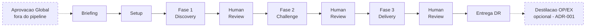

# Discovery To Go

Pipeline de discovery automatizado por agentes de IA que conduz levantamento de requisitos, validação arquitetural e geração de relatórios consolidados para novos projetos de software. Opera em **3 fases sequenciais** (Discovery, Challenge, Delivery), cada uma seguida por um **Human Review** obrigatório — o humano sempre tem a palavra final.

> [!danger] Regra fundamental
> **Nenhum projeto inicia sem completar as 3 fases com aprovação humana em cada uma.** Este processo é obrigatório e sequencial.


---

## Estrutura do Projeto

```
discovery-to-go/
├── base/                              ← fundação reutilizável (assets, padrões, ferramentas)
│   ├── assets/                        ← logos, variáveis
│   ├── setup/                         ← como iniciar um projeto (dependency.md)
│   ├── standards/                     ← padrões que devem ser seguidos
│   │   ├── conventions/               ← convenções globais
│   │   │   ├── organization/          ← tags, versioning
│   │   │   ├── report-regions/        ← catálogo de regions (rules + samples)
│   │   │   ├── visual/               ← design tokens, componentes, charts, playground
│   │   │   └── writing/              ← markdown, naming, frontmatter, acronyms
│   │   └── playbook/                 ← o que fazer e como produzir
│   │       ├── skills/               ← 9 skills globais (fonte de verdade)
│   │       └── templates/            ← project-blueprints (22 tipos de projeto)
│   └── support-tools/                ← ferramentas (md-validator Python)
│
├── artifacts/                         ← artefatos específicos do pipeline
│   ├── rules/                         ← 7 regras comportamentais do pipeline
│   ├── skills/                        ← skills do pipeline + cópias das globais
│   └── templates/                     ← templates de execução
│       ├── client-template/           ← scaffold para novos clientes
│       ├── customization/             ← defaults customizáveis por run
│       ├── draft-templates/           ← templates de artefatos (briefing, audit, etc.)
│       └── report-setups/             ← catálogo legacy de regions por HTML (ver `deliverables_scope`)
│
├── projects/                          ← pastas por cliente (runs de discovery)
│
├── docs/                              ← documentação operacional
│   ├── diagrams/                      ← pipeline.drawio + pipeline.png
│   ├── guides/                        ← discovery-pipeline, quick-start, logging
│   ├── reference/                     ← dependency-manifest, deliverables
│   └── starter-kit/                   ← briefing-template.md
│
└── tools/                             ← utilitários
    └── create-run/                    ← script Python para criar scaffold de runs
```

---

## Camadas e Prioridade

| Camada | Pasta | Propósito | Prioridade |
|--------|-------|-----------|------------|
| **Base** | `base/` | Fundação reutilizável — assets, convenções, skills globais, support-tools. Fonte de verdade para skills compartilhadas. | Menor |
| **Pipeline** | `artifacts/` | Artefatos específicos do pipeline DTG — regras, skills de pipeline, templates de execução. | Média |
| **Custom** | `projects/{client}/` | Customizações por cliente — knowledge base, assets visuais, regras adicionais e overrides. | Maior |

> [!info] Resolução de conflitos
> Quando a mesma configuração existe em múltiplas camadas, a camada de **maior prioridade** vence: Custom > Pipeline > Base.

---

## As 3 Fases do Pipeline



> [!info] Caixas pontilhadas são opcionais
> **Aprovação Global** acontece antes do pipeline (patrocínio/fundo); **Destilação OP/EX** acontece depois, sob demanda, para gerar One-Pager e Executive Report a partir do Delivery Report (ver ADR-001).

### Setup

O **orchestrator** recebe o briefing e prepara tudo:
- Cria o scaffold da run (`projects/{client}/runs/run-{n}/`)
- Auto-detecta o context-template a partir de sinais no briefing
- Copia templates de customização e context-template para a run
- Cria `config.md` e `pipeline-state.md` (state tracker append-only)

### Fase 1 — Discovery (Reunião Conjunta Temática)

Uma reunião simulada com **8 blocos temáticos** onde especialistas de IA entrevistam um "cliente virtual":

| Bloco | Tema | Agente |
|-------|------|--------|
| #1 | Visão e Propósito | po |
| #2 | Personas e Jornada | po |
| #3 | Valor Esperado / OKRs | po |
| #4 | Processo, Negócio e Equipe | po |
| #5 | Tecnologia e Segurança | solution-architect |
| #6 | LGPD e Privacidade | cyber-security-architect |
| #7 | Arquitetura Macro | solution-architect |
| #8 | TCO e Build vs Buy | solution-architect |

O **customer** responde todas as perguntas baseado no briefing + context-template. Cada resposta carrega uma tag de rastreabilidade: `[BRIEFING]` (dado literal), `[RAG]` (base corporativa) ou `[INFERENCE]` (deduzido — obrigatoriamente justificado).

**Outputs:** 8 result files (`1.1` a `1.8`) + `interview.md`

### Fase 2 — Challenge (Validação em Paralelo)

Dois agentes independentes validam os drafts da Fase 1 **ao mesmo tempo**:

| Agente | Tipo | O que faz |
|--------|------|-----------|
| **auditor** | Convergente (#2.1) | Valida qualidade contra 5 dimensões com pisos mínimos |
| **10th-man** | Divergente (#2.2) | Desafia premissas, busca pontos cegos — "O que NÃO foi feito é aceitável?" |

**Outputs:** `2.1-convergent-validation.md` + `2.2-divergent-validation.md`

### Fase 3 — Delivery (Documentação + Consolidação)

Quatro sub-fases sequenciais transformam drafts aprovados em entregáveis finais:

| # | Sub-fase | Agente | Output |
|---|----------|--------|--------|
| 3.1 | Documents | pipeline-md-writer | Markdown polido dos 5 drafts |
| 3.2 | Consolidation | consolidator | `delivery-report.md` com marcadores de region |
| 3.3 | Visual Planning | report-planner | `report-plan.md` (especificação visual por region) |
| 3.4 | Reports | html-writer | HTMLs com regions visuais renderizadas |

---

## Human Review

Após **cada fase**, o pipeline pausa para revisão humana. O humano avalia o material e escolhe uma das 4 decisões:

| Decisão | Comportamento |
|---------|---------------|
| **Re-executar desde a 1ª fase** (padrão) | Incorpora comentários, cria nova iteração, reinicia desde a Fase 1 |
| **Re-executar a última fase** | Re-executa apenas a última fase com os comentários |
| **Avançar para a próxima fase** | Material satisfatório — segue em frente |
| **Abortar** | Encerra o pipeline (requer `@` para confirmar) |

> [!info] Memória persistente
> Em todos os cenários a memória persiste. Se nenhuma opção for marcada, o orchestrator assume re-executar desde a 1ª fase.

---

## Os Agentes

| Agente | Fase | Escopo | Localização |
|--------|------|--------|-------------|
| **orchestrator** | Todas | Coordena o pipeline, cria scaffold, gerencia estado | `artifacts/skills/` |
| **customer** | 1 | Simula o cliente, responde perguntas dos especialistas | `artifacts/skills/` |
| **po** | 1 | Product Owner — visão, personas, valor, organização | `base/.../playbook/skills/` |
| **solution-architect** | 1 | Arquitetura, tecnologia, TCO, Build vs Buy | `base/.../playbook/skills/` |
| **cyber-security-architect** | 1 | Privacidade, segurança, compliance, LGPD | `base/.../playbook/skills/` |
| **custom-specialist** | 1 | Especialista de domínio sob demanda (Kafka, SAP, etc.) | `base/.../playbook/skills/` |
| **auditor** | 2 | Validação convergente — 5 dimensões com pisos mínimos | `artifacts/skills/` |
| **10th-man** | 2 | Validação divergente — devil's advocate | `base/.../playbook/skills/` |
| **pipeline-md-writer** | 3 | Formata drafts em markdown polido | `artifacts/skills/` |
| **consolidator** | 3 | Consolida tudo no delivery report final | `artifacts/skills/` |
| **report-planner** | 3 | Planeja visualização do HTML por regions | `artifacts/skills/` |

> [!info] Global vs Local
> Skills em `base/standards/playbook/skills/` são a **fonte de verdade** — reutilizáveis em qualquer projeto. Skills em `artifacts/skills/` são específicas deste pipeline ou cópias locais das globais.

---

## Regras do Pipeline

7 regras em `artifacts/rules/` governam o comportamento do pipeline:

| Regra | O que governa |
|-------|---------------|
| `discovery/` | 3 fases, 8 blocos temáticos, critérios de conclusão |
| `iteration-loop/` | Iterações, limites, critérios de convergência |
| `analyst-discovery-log/` | Formato da entrevista (tabela com emojis e source tags) |
| `audit-log/` | Log de auditoria |
| `requirement-priority/` | Classificação de requisitos (MoSCoW/RICE) |
| `token-tracking/` | Rastreamento de consumo de tokens por fase |
| `custom-artifacts-priority/` | Cadeia de prioridade: Custom > Pipeline > Base |

---

## Templates

Templates em `artifacts/templates/` usados pelo orchestrator ao criar o scaffold de uma run:

| Template | Quando usado |
|----------|-------------|
| `draft-templates/briefing-template.md` | Modelo para o briefing inicial do cliente |
| `draft-templates/audit-report-template.md` | Estrutura do relatório do auditor |
| `draft-templates/challenge-report-template.md` | Estrutura do relatório do 10th-man |
| `draft-templates/change-request-template.md` | Formato de change request entre iterações |
| `draft-templates/iteration-setup-template.md` | Setup de cada nova iteração |
| `customization/final-report-template.md` | Estrutura do delivery report (seções, one-pager) |
| `customization/human-review-template.md` | Formato do formulário de Human Review |
| `customization/iteration-policy.md` | Limites de iteração, threshold de estagnação |
| `customization/scoring-thresholds.md` | Pisos de nota por perfil (standard, PoC, high-risk) |
| `report-setups/` | **Legacy** — catálogo de regions por HTML (consumido pelo html-writer). Novo canônico: `deliverables_scope` no briefing + layouts (`one-pager-layout.md`, `executive-layout.md`). |

---

## Entregáveis (`deliverables_scope`)

O briefing declara quais entregáveis são produzidos via `deliverables_scope` (lista contendo `DR`, `OP`, `EX`). O DR (Delivery Report) é sempre produzido; `OP` e `EX` são **destilados** do DR pelo `deliverable-distiller`. Ver [ADR-001](projects/patria/kb/adr-001-deliverable-hierarchy.md).

| `deliverables_scope` | MDs produzidos | HTMLs | Público |
|---|---|---|---|
| `["DR"]` | `delivery-report.md` | `full-report.html` | Time técnico, PO |
| `["DR", "OP"]` | + `one-pager.md` | + `one-pager.html` | + C-level, sponsor |
| `["DR", "OP", "EX"]` | + `executive-report.md` | + `executive-report.html` | + Diretoria, gestão |

> **Legacy:** a flag `report-setup: essential|executive|complete` continua funcionando como alias. Mapeamento e catálogo de regions em [base/starter-kit/report-setups/README.md](base/starter-kit/report-setups/README.md).

---

## Scaffold de uma Run

Quando o orchestrator inicia uma nova run, materializa esta estrutura:

```
projects/{client}/runs/run-{n}/
├── pipeline-state.md                     ← estado + snapshots (append-only, imutável)
├── setup/
│   ├── briefing.md                       ← input do humano
│   ├── config.md                         ← configuração da run
│   └── customization/
│       ├── current-context/              ← context-template(s) copiado(s)
│       ├── report-templates/             ← templates de output
│       ├── rules/                        ← políticas da run
│       └── html-layout.md               ← layout customizado para o HTML
├── iterations/
│   └── iteration-{i}/
│       ├── logs/                         ← interview.md, hr-loop-round*.md
│       └── results/
│           ├── 1-discovery/              ← 8 blocos (1.1 a 1.8)
│           ├── 2-challenge/              ← 2 validações (2.1, 2.2)
│           └── 3-delivery/              ← 4 sub-fases (3.1, 3.2, 3.3, 3.4)
└── delivery/
    ├── delivery-report.md                ← relatório final consolidado
    ├── report-plan.md                    ← especificação visual por region
    ├── one-pager.html                    ← sempre gerado (setup essential+)
    ├── executive-report.html             ← setup executive/complete
    └── full-report.html                  ← setup complete
```

---

## Quick Start

1. Crie um `briefing.md` usando `docs/starter-kit/briefing-template.md`
2. Invoque `/orchestrator briefing.md`
3. Acompanhe as 3 fases + 3 Human Reviews
4. Colete o `delivery/delivery-report.md` + `.html`

Guia detalhado em `docs/guides/quick-start.md`.

---

## Documentação

| Documento | O que contém |
|-----------|-------------|
| `docs/guides/discovery-pipeline.md` | Guia completo do pipeline — fases, blocos, diagramas, agentes, outputs |
| `docs/guides/quick-start.md` | Como iniciar e conduzir uma run de ponta a ponta |
| `docs/guides/logging-process.md` | Tipos de log, formato de entradas, regras de imutabilidade |
| `docs/reference/dependency-manifest.md` | Mapeamento de dependências do workspace global |
| `docs/diagrams/pipeline.drawio` | Diagrama completo do pipeline (editável no draw.io) |

---

## Historico de Alteracoes

| Versao | Data | Descricao |
|--------|------|-----------|
| 04.00.000 | 2026-04-15 | Reestruturação: base-artifacts→base, dtg-artifacts→artifacts, custom-artifacts→projects. Skills globais consolidadas em base/ como fonte de verdade |
| 03.00.000 | 2026-04-11 | README.md criado como entry point detalhado do projeto |
| 02.00.000 | 2026-04-11 | Reestruturação em 3 camadas (base-artifacts, dtg-artifacts, custom-artifacts) |
| 01.00.000 | 2026-04-10 | Criação — reestruturação completa do projeto com separação definição/execução |
