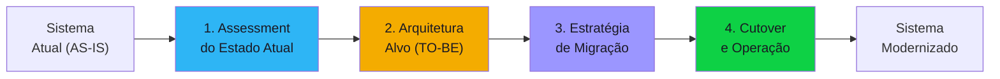

# Discovery Blueprint — Migration and Modernization

Documento completo para conduzir o discovery de projetos de migração e modernização de sistemas. Cobre cenários como migração para cloud, decomposição de monólito, re-platforming e lift-and-shift. Organizado em **4 componentes**.

---

## Quando usar este blueprint

- Menção a "migração", "modernização", "legado", "cloud migration", "lift-and-shift", "re-platform"
- Termos: monólito, decomposição, strangler fig, cloud-native, containerização
- Motivações: custo de manutenção, fim de suporte, escalabilidade, agilidade
- Sistemas legados: mainframe, on-premises, tecnologias descontinuadas
- Termos: 6 R's (Rehost, Replatform, Refactor, Repurchase, Retire, Retain)

---

## Visão geral dos componentes

| # | Componente | O que define | Blocos do discovery |
|---|-----------|-------------|-------------------|
| 1 | Assessment do Estado Atual (AS-IS) | O que existe hoje, dívidas técnicas, dependências | #1, #4, #5 |
| 2 | Arquitetura Alvo (TO-BE) | Para onde migrar, stack, padrão arquitetural | #5, #7 |
| 3 | Estratégia de Migração | Como migrar, faseamento, convivência dual | #7, #8 |
| 4 | Cutover e Operação | Go-live, rollback, operação pós-migração | #4, #7, #8 |

---

## Componente 1 — Assessment do Estado Atual (AS-IS)

Não se migra o que não se entende. O assessment mapeia o sistema atual — tecnologias, dependências, pontos de dor, dívida técnica e riscos. É o fundamento para toda decisão de migração.

### Concerns

- **Stack atual** — Linguagem, framework, banco de dados, infra (on-prem/cloud/híbrido)
- **Arquitetura atual** — Monólito? N-tier? Distribuído? Diagrama de componentes atualizado?
- **Dependências externas** — Integrações, bibliotecas, licenças, hardware específico
- **Dívida técnica** — Código sem testes, documentação desatualizada, workarounds acumulados
- **Dados** — Volume, schema, histórico a migrar, estratégia de ETL
- **Métricas operacionais atuais** — Uptime, latência, incidentes/mês, custo mensal
- **Conhecimento do time** — Quem entende o sistema legado? Há risco de knowledge loss?
- **Compliance** — Regulações que afetam a migração (dados que não podem sair do país, auditorias)

### Perguntas-chave

1. Qual a stack completa do sistema atual? (linguagem, framework, banco, infra)
2. Existe diagrama de arquitetura atualizado? Se não, quem pode descrever os componentes?
3. Quais as integrações com outros sistemas? (listar todas)
4. Qual o nível de cobertura de testes? (%, tipos)
5. Qual o custo mensal atual? (infra + licenças + manutenção)
6. Quantos incidentes/mês? Qual o MTTR?
7. Quem no time entende profundamente o sistema legado? Risco de turnover?
8. Há dados que não podem migrar para cloud? (residência, compliance)
9. Qual o principal motivador da migração? (custo, escalabilidade, fim de suporte, agilidade)

### Decisões esperadas

| Decisão | Alternativas típicas | Critério |
|---------|---------------------|----------|
| Escopo do assessment | Sistema inteiro / Módulos críticos / Camada por camada | Prazo, tamanho do sistema |
| Nível de documentação | Reverse engineering completo / Doc de alto nível / Apenas gap analysis | Budget, urgência |
| Dados a migrar | Tudo / Últimos N anos / Apenas ativo | Volume, compliance, custo |

### Critérios de completude

- [ ] Stack atual documentada (linguagem, framework, banco, infra, versões)
- [ ] Diagrama de arquitetura AS-IS
- [ ] Dependências externas catalogadas
- [ ] Métricas operacionais atuais levantadas (custo, uptime, incidentes)
- [ ] Riscos de knowledge loss identificados
- [ ] Volume de dados a migrar estimado

---

## Componente 2 — Arquitetura Alvo (TO-BE)

Define para onde o sistema vai. A arquitetura alvo precisa resolver os problemas atuais sem criar novos — e ser realista para o time e budget disponíveis.

### Concerns

- **6 R's** — Qual estratégia por componente? Rehost (lift-and-shift), Replatform (lift-and-reshape), Refactor (re-architect), Repurchase (trocar por SaaS), Retire (aposentar), Retain (manter)
- **Cloud provider** — AWS, Azure, GCP? Multi-cloud? Hybrid?
- **Padrão arquitetural** — Monólito modular, microserviços, serverless, containers?
- **Banco de dados alvo** — Mesmo tipo (relift) ou migrar para managed (RDS, Cloud SQL, Cosmos)?
- **Containerização** — Docker + Kubernetes? ECS/Fargate? Cloud Run? Ou VM direta?
- **CI/CD** — Pipeline de deploy para o novo ambiente? GitOps?
- **Observabilidade** — Stack de monitoring no novo ambiente
- **Segurança** — IAM, network, secrets management, encryption no novo ambiente

### Perguntas-chave

1. Qual a estratégia de migração preferida? (lift-and-shift, re-platform, refactor, hybrid)
2. Cloud provider definido? Há restrição contratual ou de compliance?
3. O sistema deve virar microserviços ou um monólito modular basta?
4. Banco de dados: migrar para managed service ou manter self-hosted em VM?
5. Containers (Kubernetes) ou serverless? Qual a maturidade do time?
6. Como ficará o CI/CD no novo ambiente?
7. Qual stack de observabilidade? (Datadog, Grafana, CloudWatch, etc.)
8. Há requisitos de multi-região ou disaster recovery?

### Decisões esperadas

| Decisão | Alternativas típicas | Critério |
|---------|---------------------|----------|
| Estratégia por componente (6 R's) | Rehost / Replatform / Refactor / Repurchase / Retire / Retain | Complexidade, benefício, urgência |
| Cloud provider | AWS / Azure / GCP / Hybrid | Ecossistema existente, pricing, compliance |
| Padrão arquitetural | Monólito modular / Microserviços / Serverless | Tamanho do time, complexidade, escala |
| Banco de dados | Managed service / Self-hosted / Troca de engine | Compatibilidade, features, custo |

### Critérios de completude

- [ ] Estratégia (6 R's) definida para cada componente do sistema
- [ ] Cloud provider selecionado
- [ ] Arquitetura TO-BE desenhada (diagrama)
- [ ] Stack de banco, compute, observabilidade e segurança definida
- [ ] Estimativa de custo mensal do ambiente alvo

---

## Componente 3 — Estratégia de Migração

Como ir do ponto A ao ponto B sem derrubar o avião em voo. Define faseamento, convivência entre sistemas, migração de dados e critérios de rollback.

### Concerns

- **Faseamento** — Big bang (migra tudo de uma vez) ou incremental (módulo por módulo)?
- **Strangler fig** — Migrar funcionalidade por funcionalidade, roteando tráfego gradualmente?
- **Convivência dual** — Período com sistema antigo e novo rodando em paralelo? Sync de dados bidirecional?
- **Migração de dados** — ETL de histórico, validação pós-migração, reconciliação
- **Feature freeze** — Parar desenvolvimento no legado durante a migração?
- **Testes** — Testes de regressão no novo ambiente? Testes de performance? Chaos testing?
- **Rollback** — Se der errado, como voltar? Em quanto tempo?
- **Comunicação** — Como stakeholders acompanham o progresso? Critérios de go/no-go?

### Perguntas-chave

1. Migração big bang ou incremental? Qual a tolerância a downtime?
2. Haverá período de convivência com ambos os sistemas rodando? Como sincronizar dados?
3. Desenvolvimento no legado congela durante a migração?
4. Como migrar dados históricos? Qual o volume? Quanto tempo leva?
5. Como validar que o novo sistema produz os mesmos resultados que o antigo?
6. Qual o plano de rollback se a migração falhar?
7. Quais são os critérios de go/no-go para cada fase?
8. Quem aprova o go-live? Qual o processo de sign-off?

### Decisões esperadas

| Decisão | Alternativas típicas | Critério |
|---------|---------------------|----------|
| Abordagem | Big bang / Incremental / Strangler fig | Risco, downtime aceitável, complexidade |
| Convivência | Dual-run com sync / Feature flag / Blue-green | Duração da transição, consistência de dados |
| Migração de dados | ETL batch / CDC contínuo / Dump + restore | Volume, downtime aceitável |
| Rollback | Automático / Manual com procedimento / Sem rollback | Criticidade, custo de preparar |

### Critérios de completude

- [ ] Abordagem de migração definida (big bang vs incremental vs strangler)
- [ ] Faseamento documentado (o que migra em cada fase)
- [ ] Estratégia de migração de dados definida
- [ ] Plano de rollback documentado
- [ ] Critérios de go/no-go definidos
- [ ] Downtime estimado e comunicado

---

## Componente 4 — Cutover e Operação Pós-Migração

O go-live não é o fim — é o começo da operação no novo ambiente. Precisa de runbook de cutover, monitoring, on-call e plano para decomissionar o legado.

### Concerns

- **Runbook de cutover** — Passo a passo do go-live com responsáveis e tempos
- **Monitoring pós-go-live** — Métricas críticas a observar nas primeiras 48h
- **Hypercare** — Período de suporte intensivo pós-migração (tipicamente 2-4 semanas)
- **Decomissioning** — Quando desligar o sistema legado? Como garantir que ninguém ainda usa?
- **Treinamento** — Time precisa de treinamento na nova stack/ferramenta?
- **Documentação** — Documentação operacional atualizada para o novo ambiente
- **Performance baseline** — Comparação de métricas antes vs depois

### Perguntas-chave

1. Existe runbook de cutover com checklist, responsáveis e timing?
2. Quais métricas serão monitoradas nas primeiras 48h pós-go-live?
3. Qual o período de hypercare planejado? Quem participa?
4. Quando o sistema legado será desligado? Tem data definida?
5. O time precisa de treinamento na nova stack? Quem treina?
6. Como medir sucesso da migração? (métricas antes vs depois)

### Decisões esperadas

| Decisão | Alternativas típicas | Critério |
|---------|---------------------|----------|
| Período de hypercare | 1 semana / 2 semanas / 1 mês | Criticidade, confiança no novo ambiente |
| Decomissioning | Imediato pós-hypercare / Após 3 meses / Manter indefinidamente | Dependências residuais, compliance |
| Treinamento | Antes do go-live / On-the-job / Documentação self-service | Gap de skills, tamanho do time |

### Critérios de completude

- [ ] Runbook de cutover documentado
- [ ] Plano de monitoring pós-go-live definido
- [ ] Período de hypercare planejado com equipe
- [ ] Data de decomissioning do legado (ou critérios para definir)
- [ ] Treinamento planejado (se necessário)
- [ ] Baseline de métricas antes da migração registrado

---

## Concerns transversais — Produto e Organização

- Qual o principal motivador da migração? (custo, escalabilidade, agilidade, fim de suporte)
- Qual o impacto para usuários finais durante a migração? Downtime aceitável?
- OKRs: redução de custo operacional, melhoria de tempo de deploy, redução de incidentes
- Time: quem lidera a migração? Precisa de consultoria externa?
- Sinais de resposta incompleta:
  - "Migrar para cloud para ficar moderno" (sem benefício concreto)
  - "Refazer tudo do zero" (ignora o valor do sistema atual)
  - "Vamos migrar sem parar o desenvolvimento" (ignora feature freeze)

---

## Concerns transversais — Privacidade (bloco #6)

- Dados pessoais sendo migrados para ambiente diferente? Nova jurisdição?
- Dados em trânsito durante migração — criptografia?
- Ambiente de testes usando dados de produção? Mascaramento?
- Período de convivência dual — dados pessoais em 2 sistemas? Quem controla?
- Compliance: auditoria da migração de dados sensíveis

---

## Antipatterns conhecidos

| # | Antipattern | Por quê é ruim |
|---|-------------|----------------|
| 1 | **Big bang sem rollback** | Se falhar, não tem volta — downtime catastrófico |
| 2 | **Refactor disfarçado de rehost** | Prometeu lift-and-shift mas está refazendo tudo — estoura prazo |
| 3 | **Migrar sem entender o legado** | Reproduz bugs e workarounds no novo sistema |
| 4 | **Dual-run sem sync automático** | Dados divergem entre os 2 sistemas |
| 5 | **Nunca desligar o legado** | Custo duplo indefinido, time mantém 2 sistemas |
| 6 | **Migração de dados como "etapa final"** | Dados são o mais complexo — deveria ser o primeiro piloto |
| 7 | **Sem performance baseline** | Não sabe se o novo é melhor ou pior que o antigo |
| 8 | **Feature freeze muito longo** | Negócio paralisa durante a migração |
| 9 | **Ignorar treinamento** | Time não sabe operar o novo ambiente |
| 10 | **Microserviços porque é moderno** | Monólito modular resolve 80% dos casos com menos overhead |

---

## Edge cases para o 10th-man verificar

- Migração está 80% concluída e o time principal sai da empresa — quem continua?
- Sistema legado tem lógica de negócio não documentada — como garantir paridade?
- Cloud provider sofre outage regional durante o cutover — plano B?
- Custos de cloud ficam 2x maiores que o legado nos primeiros 6 meses — é aceitável?
- Contrato com fornecedor de licença legada vence em 3 meses — e se a migração atrasar?
- Regulador exige auditoria durante a migração — como evidenciar integridade dos dados?
- Microserviços geraram latência inter-serviço maior que o monólito — reverter ou otimizar?
- Integração com sistema externo não funciona no novo ambiente — quem resolve?

---

## Custom-specialists disponíveis

| Specialist | Domínio | Quando invocar |
|-----------|---------|----------------|
| `cloud-migration-aws` | Migração para AWS (EC2, ECS, RDS, DMS) | AWS como cloud alvo |
| `cloud-migration-azure` | Migração para Azure (AKS, Azure SQL, Data Factory) | Azure como cloud alvo |
| `cloud-migration-gcp` | Migração para GCP (GKE, Cloud SQL, Dataflow) | GCP como cloud alvo |
| `mainframe-modernization` | Modernização de mainframe (COBOL, AS/400, DB2) | Sistema legado em mainframe |
| `database-migration` | Migração de banco de dados (DMS, pgLoader, ora2pg) | Mudança de engine de banco |
| `container-orchestration` | Kubernetes, ECS, Cloud Run | Containerização do sistema |
| `strangler-fig-architect` | Decomposição incremental de monólito | Migração gradual com convivência dual |
| `data-migration-specialist` | ETL de dados históricos em grande volume | Volume > 1TB de dados a migrar |

---

## Perfil do Delivery Report

### Seções extras no relatório

| Seção | Posição | Conteúdo esperado |
|-------|---------|-------------------|
| **Roadmap de Migração** | Entre Análise Estratégica e Backlog | Faseamento visual da migração com marcos, critérios de go/no-go e timeline |

### Métricas obrigatórias no relatório

| Métrica | Onde incluir |
|---------|-------------|
| Custo mensal AS-IS vs TO-BE | Análise Estratégica |
| Downtime estimado durante cutover | Roadmap de Migração |
| Número de componentes por estratégia (6 R's) | Roadmap de Migração |
| MTTR atual vs MTTR alvo | Métricas-chave |
| Cobertura de testes antes vs depois | Métricas-chave |
| Prazo estimado total da migração | Roadmap de Migração |

### Diagramas obrigatórios

| Diagrama | Seção destino |
|----------|---------------|
| Arquitetura AS-IS | Tecnologia e Segurança |
| Arquitetura TO-BE | Tecnologia e Segurança |
| Roadmap de fases | Roadmap de Migração |

### Ênfases por seção base

| Seção base | Ênfase |
|------------|--------|
| **Tecnologia e Segurança** | Comparação AS-IS vs TO-BE, stack de cada |
| **Análise Estratégica** | TCO comparativo 3 anos (legado vs migrado), break-even point |
| **Backlog Priorizado** | Por fase de migração, não por feature |
| **Matriz de Riscos** | Downtime, knowledge loss, custo cloud acima do esperado, data loss |

---

## Mapeamento para os 8 Blocos do Discovery

| Componente | Bloco(s) principal(is) | Agente responsável |
|------------|----------------------|-------------------|
| **1. Assessment AS-IS** | #1 (Visão), #4 (Processo/Equipe), #5 (Tech) | po, solution-architect |
| **2. Arquitetura TO-BE** | #5 (Tech), #7 (Arquitetura Macro) | solution-architect |
| **3. Estratégia de Migração** | #7 (Arch), #8 (TCO) | solution-architect |
| **4. Cutover e Operação** | #4 (Processo/Equipe), #7 (Arch), #8 (TCO) | po, solution-architect |

---

## Regions do Delivery Report

Regions de informação que compõem o delivery report deste blueprint. Referência completa no [Information Regions Catalog](../../projects/discovery-to-go/base-artifacts/templates/report-regions/README.md).

### Obrigatórias

Regions incluídas em todos os projetos deste tipo (Default: Todos no catálogo).

| ID | Nome | Grupo |
|----|------|-------|
| REG-EXEC-01 | Overview one-pager | Executivo |
| REG-EXEC-02 | Product brief | Executivo |
| REG-EXEC-03 | Decisão de continuidade | Executivo |
| REG-EXEC-04 | Próximos passos | Executivo |
| REG-PROD-01 | Problema e contexto | Produto |
| REG-PROD-02 | Personas | Produto |
| REG-PROD-04 | Proposta de valor | Produto |
| REG-PROD-05 | OKRs e ROI | Produto |
| REG-PROD-07 | Escopo | Produto |
| REG-ORG-01 | Mapa de stakeholders | Organização |
| REG-ORG-02 | Estrutura de equipe | Organização |
| REG-TECH-01 | Stack tecnológica | Técnico |
| REG-TECH-02 | Integrações | Técnico |
| REG-TECH-03 | Arquitetura macro | Técnico |
| REG-TECH-06 | Build vs Buy | Técnico |
| REG-SEC-01 | Classificação de dados | Segurança |
| REG-SEC-02 | Autenticação e autorização | Segurança |
| REG-SEC-04 | Compliance e regulação | Segurança |
| REG-FIN-01 | TCO 3 anos | Financeiro |
| REG-FIN-05 | Estimativa de esforço | Financeiro |
| REG-RISK-01 | Matriz de riscos | Riscos |
| REG-RISK-02 | Riscos técnicos | Riscos |
| REG-RISK-03 | Hipóteses críticas não validadas | Riscos |
| REG-QUAL-01 | Score do auditor | Qualidade |
| REG-QUAL-02 | Questões do 10th-man | Qualidade |
| REG-BACK-01 | Épicos priorizados | Backlog |
| REG-METR-01 | KPIs de negócio | Métricas |
| REG-NARR-01 | Como chegamos aqui | Narrativa |

### Opcionais

Regions incluídas conforme contexto do projeto.

| ID | Nome | Grupo | Condição |
|----|------|-------|----------|
| REG-PROD-03 | Jornadas de usuário | Produto | Quando há personas com jornadas mapeadas |
| REG-PROD-06 | Modelo de negócio | Produto | Quando há monetização |
| REG-PROD-08 | Roadmap | Produto | Quando há faseamento de produto |
| REG-PROD-09 | Visão do produto | Produto | Quando há horizonte de longo prazo |
| REG-ORG-03 | RACI | Organização | Quando há múltiplos stakeholders |
| REG-ORG-04 | Metodologia | Organização | Quando a metodologia é relevante |
| REG-ORG-05 | On-call e sustentação | Organização | Quando há operação contínua pós-migração |
| REG-TECH-04 | Arquitetura de containers | Técnico | Quando há containerização |
| REG-TECH-05 | ADRs | Técnico | Quando há decisões arquiteturais significativas |
| REG-TECH-07 | Requisitos não-funcionais | Técnico | Quando há SLAs explícitos |
| REG-SEC-03 | Criptografia | Segurança | Quando há dados sensíveis em trânsito |
| REG-PRIV-01 | Dados pessoais mapeados | Privacidade | Quando há dados pessoais sendo migrados |
| REG-PRIV-02 | Base legal LGPD | Privacidade | Quando há dados pessoais sendo migrados |
| REG-PRIV-03 | DPO e responsabilidades | Privacidade | Quando há dados pessoais sendo migrados |
| REG-PRIV-04 | Política de retenção | Privacidade | Quando há dados pessoais sendo migrados |
| REG-PRIV-05 | Direito ao esquecimento | Privacidade | Quando há dados pessoais com direito a exclusão |
| REG-PRIV-06 | Sub-operadores | Privacidade | Quando há terceiros processando dados pessoais |
| REG-FIN-02 | Break-even analysis | Financeiro | Quando há investimento com retorno mensurável |
| REG-FIN-03 | Custo por componente | Financeiro | Quando há breakdown detalhado de custos |
| REG-FIN-04 | Projeção de receita | Financeiro | Quando há modelo SaaS |
| REG-RISK-04 | Análise de viabilidade | Riscos | Quando há dúvida de viabilidade |
| REG-QUAL-03 | Gaps identificados | Qualidade | Quando há lacunas no discovery |
| REG-QUAL-04 | Checklist de conclusão | Qualidade | Quando há critérios formais de completude |
| REG-BACK-02 | User stories de alto nível | Backlog | Quando há refinamento inicial |
| REG-BACK-03 | Dependências | Backlog | Quando há dependências entre épicos |
| REG-BACK-04 | Critérios de Go/No-Go | Backlog | Quando há gates formais |
| REG-METR-02 | KPIs técnicos | Métricas | Quando há métricas de saúde técnica |
| REG-METR-03 | SLAs e SLOs | Métricas | Quando há SLAs contratuais |
| REG-METR-04 | Targets por fase | Métricas | Quando há metas por fase |
| REG-METR-05 | DORA metrics | Métricas | Quando há plataforma de engenharia |
| REG-NARR-02 | Condições para prosseguir | Narrativa | Quando há pré-requisitos obrigatórios |
| REG-NARR-03 | Assinaturas de aprovação | Narrativa | Quando há sign-off formal |
| REG-PESQ-01 | Relatório de entrevistas | Pesquisa | Quando há entrevistas conduzidas |
| REG-PESQ-02 | Citações representativas | Pesquisa | Quando há quotes relevantes |
| REG-PESQ-03 | Mapa de oportunidades | Pesquisa | Quando há Opportunity Solution Tree |
| REG-PESQ-04 | Dados quantitativos | Pesquisa | Quando há dados numéricos coletados |
| REG-PESQ-05 | Source tag summary | Pesquisa | Quando há rastreamento de fontes |

### Domain-specific

Regions exclusivas do context-template `migration-modernization`.

| ID | Path | Nome | Descrição | Template visual |
|----|------|------|-----------|-----------------|
| REG-DOM-MIGR-01 | `domain/migration-roadmap.md` | Roadmap de migração | Faseamento visual com marcos, critérios de go/no-go, timeline | Timeline horizontal |
| REG-DOM-MIGR-02 | `domain/migration-as-is-vs-to-be.md` | Comparativo AS-IS vs TO-BE | Stack, custo, performance antes e depois | Split comparison card |
