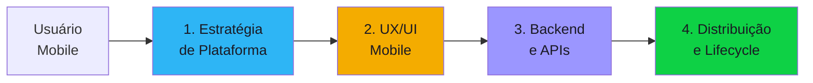

# Discovery Blueprint — Mobile App

Documento completo para conduzir o discovery de projetos de aplicações mobile. Cobre apps nativos, híbridos (React Native, Flutter), PWA e super apps. Organizado em **4 componentes**.

---

## Quando usar este blueprint

- Menção a "app", "aplicativo", "mobile", "celular", "smartphone"
- Termos: iOS, Android, React Native, Flutter, Swift, Kotlin, PWA
- Publicação em lojas: App Store, Google Play, distribuição enterprise
- Features mobile: push notification, offline, câmera, GPS, biometria

---

## Visão geral dos componentes

| # | Componente | O que define | Blocos do discovery |
|---|-----------|-------------|-------------------|
| 1 | Estratégia de Plataforma | Nativo vs híbrido vs PWA, plataformas-alvo, devices | #1, #5 |
| 2 | UX/UI Mobile | Design system, navegação, acessibilidade, offline | #2, #3 |
| 3 | Backend e APIs | API mobile-first, autenticação, sync, push, real-time | #5, #7 |
| 4 | Distribuição e Lifecycle | Stores, CI/CD mobile, updates, analytics, crash reporting | #4, #7, #8 |

---

## Componente 1 — Estratégia de Plataforma

A primeira decisão é **como** construir: nativo para cada plataforma, cross-platform com framework híbrido, ou PWA. Cada escolha tem trade-offs de performance, custo e time-to-market.

### Concerns

- **Plataformas-alvo** — iOS, Android, ambos? Qual a distribuição dos usuários?
- **Nativo vs Híbrido vs PWA** — Swift/Kotlin (nativo), React Native/Flutter (híbrido), PWA (web)?
- **Devices** — Smartphones apenas? Tablets? Wearables? TV?
- **Versões mínimas** — iOS 15+? Android 10+? Qual o parque de devices dos usuários?
- **Features nativas** — Câmera, GPS, biometria, NFC, Bluetooth, push? Quais são essenciais?
- **Performance** — Animações pesadas, 3D, AR? Ou app corporativo simples?
- **Offline** — App funciona sem internet? Quais features? Como sincroniza depois?

### Perguntas-chave

1. Quais plataformas? (iOS, Android, ambos, web/PWA)
2. Nativo, híbrido ou PWA? Há preferência do time?
3. Quais features nativas são essenciais? (câmera, GPS, biometria, push, offline)
4. Qual a versão mínima de OS suportada?
5. App precisa funcionar offline? Quais funcionalidades?
6. Qual o perfil de device dos usuários? (high-end, mid-range, low-end)
7. Existe app atual sendo substituído ou é greenfield?
8. Performance é crítica? (animações, processamento pesado, AR/VR)

### Decisões esperadas

| Decisão | Alternativas típicas | Critério |
|---------|---------------------|----------|
| Plataforma | iOS only / Android only / Ambos / PWA | Market share, budget, urgência |
| Abordagem | Nativo (Swift+Kotlin) / React Native / Flutter / PWA | Performance requerida, skills do time, budget |
| Offline strategy | Offline-first / Offline parcial / Online-only | Cenário de uso, conectividade |
| Versão mínima de OS | Últimas 2 / Últimas 3 / Específica | Parque de devices dos usuários |

### Critérios de completude

- [ ] Plataformas-alvo definidas com justificativa
- [ ] Abordagem técnica escolhida (nativo/híbrido/PWA)
- [ ] Features nativas mapeadas (essenciais vs nice-to-have)
- [ ] Estratégia offline definida
- [ ] Versões mínimas de OS definidas

---

## Componente 2 — UX/UI Mobile

Mobile tem constraints únicos: tela pequena, toque, gestos, atenção fragmentada, acessibilidade. O design precisa ser mobile-first, não desktop adaptado.

### Concerns

- **Design system** — Existe DS? Material Design, Human Interface Guidelines, custom?
- **Navegação** — Tab bar, drawer, stack navigation? Profundidade máxima?
- **Responsividade** — Adapta para tablet? Landscape?
- **Acessibilidade** — VoiceOver/TalkBack, contraste, tamanho de toque, screen reader
- **Onboarding** — Fluxo de primeiro acesso? Tutorial? Permissões (câmera, localização, push)?
- **Performance percebida** — Skeleton screens, loading states, optimistic updates?
- **Gestos** — Swipe, pull-to-refresh, long press? Customizados?
- **Dark mode** — Obrigatório? Automático pelo sistema?

### Perguntas-chave

1. Existe design system? Se sim, qual? Se não, criar do zero ou adotar Material/HIG?
2. Qual o padrão de navegação principal? (tab bar, drawer, stack)
3. App precisa suportar tablet e/ou landscape?
4. Quais requisitos de acessibilidade? (regulatório, público com necessidades especiais)
5. Como funciona o onboarding do primeiro acesso?
6. Dark mode é obrigatório?
7. Quem faz o design? (time interno, agência, freelancer)
8. Existem wireframes ou protótipos?

### Decisões esperadas

| Decisão | Alternativas típicas | Critério |
|---------|---------------------|----------|
| Design system | Material Design / HIG / Custom / Existente | Plataforma, identidade visual |
| Navegação | Tab bar / Drawer / Stack / Hybrid | Número de seções, profundidade |
| Acessibilidade | WCAG AA / WCAG AAA / Básico | Regulação, público-alvo |
| Dark mode | Sim (automático) / Sim (manual) / Não | UX, guideline da plataforma |

### Critérios de completude

- [ ] Design system definido ou escolhido
- [ ] Padrão de navegação definido
- [ ] Requisitos de acessibilidade documentados
- [ ] Fluxo de onboarding desenhado
- [ ] Personas mobile validadas (contexto de uso: em pé, uma mão, distraído)

---

## Componente 3 — Backend e APIs

Mobile depende de APIs eficientes. Latência, payload size, autenticação e sincronização offline definem a experiência do usuário.

### Concerns

- **API design** — REST, GraphQL, gRPC? Mobile-first (BFF — Backend for Frontend)?
- **Autenticação** — OAuth2 + biometria? Social login? MFA? Token refresh?
- **Push notifications** — FCM (Firebase), APNs, ou serviço unificado (OneSignal, Pushwoosh)?
- **Real-time** — WebSocket, SSE, polling? Para quais features?
- **Sync offline** — Conflict resolution? Last-write-wins, CRDT, merge manual?
- **Payload optimization** — Pagination, field filtering, compression, CDN para assets?
- **Versionamento de API** — Como forçar update do app quando API muda?
- **Rate limiting** — Proteger backend de app comprometido ou abuso?

### Perguntas-chave

1. Backend já existe ou precisa ser criado? (API existente, novo, BFF)
2. REST ou GraphQL? Há preferência?
3. Como funciona a autenticação? (OAuth2, biometria, social login, MFA)
4. Precisa de push notifications? Para quais cenários?
5. Alguma feature precisa de real-time? (chat, tracking, feed)
6. Se app tem offline: como resolver conflitos de sync?
7. Como versionar a API para forçar update do app?
8. Precisa de CDN para assets (imagens, vídeos)?

### Decisões esperadas

| Decisão | Alternativas típicas | Critério |
|---------|---------------------|----------|
| Estilo de API | REST / GraphQL / gRPC / BFF | Complexidade, performance, skills |
| Autenticação | OAuth2 + biometria / Social login / Custom | Segurança, UX |
| Push | FCM+APNs direto / OneSignal / Custom | Volume, segmentação, analytics |
| Sync strategy | Last-write-wins / CRDT / Merge manual / No offline | Complexidade, frequência de conflitos |

### Critérios de completude

- [ ] Estilo de API definido (REST/GraphQL/BFF)
- [ ] Autenticação mobile definida
- [ ] Push notification strategy definida
- [ ] Sync offline e conflict resolution documentados (se aplicável)
- [ ] Versionamento de API e forced update policy definidos

---

## Componente 4 — Distribuição e Lifecycle

Mobile tem um ciclo de vida único: publicação em stores, reviews, updates, crash reporting, analytics. O discovery precisa mapear o processo de release e sustentação.

### Concerns

- **Publicação** — App Store (iOS), Google Play (Android), distribuição enterprise (MDM)?
- **CI/CD mobile** — Fastlane, Bitrise, Codemagic, GitHub Actions? Build para 2+ plataformas?
- **Code signing** �� Certificados iOS (provisioning profiles), keystore Android? Quem gerencia?
- **Updates** — OTA updates (CodePush, Expo Updates) ou só via store? Forced update para breaking changes?
- **Analytics** — Firebase Analytics, Mixpanel, Amplitude? Quais eventos rastrear?
- **Crash reporting** — Crashlytics, Sentry, Bugsnag? Alertas?
- **App size** — Restrição de tamanho? Usuários com pouco armazenamento?
- **Review de loja** — Tempo de aprovação (~24-48h iOS), guidelines, rejeições comuns

### Perguntas-chave

1. Publicação em quais stores? (App Store, Google Play, enterprise/MDM)
2. Existe CI/CD mobile hoje? Se não, qual ferramenta?
3. Quem gerencia certificados e code signing?
4. Pode usar OTA updates (CodePush) ou apenas releases via store?
5. Quais analytics são essenciais? (DAU, retenção, funil, receita)
6. Qual ferramenta de crash reporting? Quem monitora?
7. Qual a cadência de releases planejada? (semanal, quinzenal, mensal)
8. Tem experiência com processo de review das stores?

### Decisões esperadas

| Decisão | Alternativas típicas | Critério |
|---------|---------------------|----------|
| CI/CD | Fastlane + GitHub Actions / Bitrise / Codemagic | Budget, complexidade, plataformas |
| Updates | Store only / OTA (CodePush) / Hybrid | Urgência de fixes, compliance |
| Analytics | Firebase / Mixpanel / Amplitude / Custom | Budget, features, privacidade |
| Crash reporting | Crashlytics / Sentry / Bugsnag | Integração, alertas, budget |
| Cadência de release | Semanal / Quinzenal / Mensal | Maturidade, capacidade do time |

### Critérios de completude

- [ ] Canais de distribuição definidos (stores, enterprise)
- [ ] CI/CD mobile planejado
- [ ] Certificados e code signing com responsável
- [ ] Estratégia de updates definida (store vs OTA)
- [ ] Analytics e crash reporting definidos
- [ ] Cadência de releases planejada

---

## Concerns transversais — Produto e Organização

- Qual o perfil do usuário mobile? (idade, device, conectividade, contexto de uso)
- Competidores diretos no mobile? Benchmark de UX?
- OKRs: DAU/MAU, retenção D1/D7/D30, NPS, crash-free rate, app store rating
- Time: iOS + Android separados ou cross-platform? Designer dedicado?
- Sinais de resposta incompleta:
  - "App igual ao site" (mobile não é desktop compactado)
  - "Para todos os dispositivos" (sem priorizar plataforma)
  - "Offline não precisa" (sem validar cenário de uso real)

---

## Concerns transversais — Privacidade (bloco #6)

- Permissões do device: câmera, localização, contatos — justificativa para cada
- Tracking: IDFA (iOS ATT), GAID — opt-in obrigatório
- Dados armazenados no device: criptografia local? Biometria para acesso?
- Analytics: dados pessoais nos eventos? Anonimização?
- LGPD: consentimento para push, analytics, localização
- Crianças como público: COPPA, restrições de coleta de dados

---

## Antipatterns conhecidos

| # | Antipattern | Por quê é ruim |
|---|-------------|----------------|
| 1 | **Desktop design compactado para mobile** | UX horrível — mobile é contexto diferente |
| 2 | **Pedir todas as permissões no primeiro acesso** | Usuário nega tudo — pedir no momento de uso |
| 3 | **Ignorar offline** | App inútil em elevador, metrô, área rural |
| 4 | **API não otimizada para mobile** | Payloads enormes, muitas chamadas, latência alta |
| 5 | **Sem forced update** | Usuários em versão antiga com bugs ou vulnerabilidades |
| 6 | **Sem crash reporting** | Não sabe que app está crashando para 10% dos usuários |
| 7 | **WebView para tudo** | Performance ruim, UX inconsistente, perde vantagem do nativo |
| 8 | **Ignorar review guidelines** | App rejeitado repetidamente pela App Store |
| 9 | **Mesmo design para iOS e Android** | Cada plataforma tem conventions diferentes |
| 10 | **Sem deep linking** | Usuário não consegue compartilhar tela específica do app |

---

## Edge cases para o 10th-man verificar

- App rejeitado pela App Store por violar guideline — quanto atrasa o launch?
- Usuário com device antigo (3GB RAM) — app roda ou crasha?
- 10.000 usuários simultâneos no push de Black Friday — backend aguenta?
- Usuário troca de device — como migrar dados locais?
- iOS e Android com comportamentos diferentes na mesma feature — quem prioriza?
- App em background é matado pelo OS — como preservar estado?
- Concorrente lança feature similar 1 mês antes — como reagir no roadmap?
- LGPD: usuário pede exclusão de dados — como propagar para analytics e crash tools?

---

## Custom-specialists disponíveis

| Specialist | Domínio | Quando invocar |
|-----------|---------|----------------|
| `ios-native` | Desenvolvimento nativo iOS (Swift, SwiftUI, UIKit) | App nativo iOS |
| `android-native` | Desenvolvimento nativo Android (Kotlin, Jetpack Compose) | App nativo Android |
| `react-native-specialist` | React Native (Expo, bare workflow) | Cross-platform com RN |
| `flutter-specialist` | Flutter (Dart, Material, Cupertino) | Cross-platform com Flutter |
| `mobile-ux` | UX mobile (touch, gestos, acessibilidade, micro-interações) | Design system e UX crítico |
| `push-notification-architect` | Push em escala (FCM, APNs, segmentação, A/B) | Push como feature crítica |
| `offline-sync` | Estratégias de sync offline (CRDT, conflict resolution) | App offline-first |
| `app-store-optimization` | ASO, review guidelines, A/B testing de listing | Otimização de conversão na store |

---

## Perfil do Delivery Report

### Seções extras no relatório

| Seção | Posição | Conteúdo esperado |
|-------|---------|-------------------|
| **Estratégia Mobile** | Entre Visão de Produto e Organização | Plataformas, abordagem (nativo/híbrido/PWA), features nativas, offline strategy, distribuição |

### Métricas obrigatórias no relatório

| Métrica | Onde incluir |
|---------|-------------|
| DAU / MAU alvo | Métricas-chave |
| Retenção D1/D7/D30 | Métricas-chave |
| Crash-free rate alvo | Métricas-chave |
| App size estimado | Estratégia Mobile |
| Custo mensal (backend + serviços mobile) | Análise Estratégica |
| Time-to-market (1º release) | Estratégia Mobile |

### Diagramas obrigatórios

| Diagrama | Seção destino |
|----------|---------------|
| Arquitetura macro (app + backend) | Tecnologia e Segurança |

### Ênfases por seção base

| Seção base | Ênfase |
|------------|--------|
| **Visão de Produto** | Personas mobile, contexto de uso, jornada mobile-first |
| **Tecnologia e Segurança** | Stack mobile, autenticação biométrica, criptografia local |
| **Análise Estratégica** | Build nativo vs cross-platform, custo de manter 2 plataformas |
| **Matriz de Riscos** | Rejeição de store, fragmentação Android, performance em low-end |

---

## Mapeamento para os 8 Blocos do Discovery

| Componente | Bloco(s) principal(is) | Agente responsável |
|------------|----------------------|-------------------|
| **1. Estratégia de Plataforma** | #1 (Visão), #5 (Tech) | po, solution-architect |
| **2. UX/UI Mobile** | #2 (Personas), #3 (Valor/OKRs) | po |
| **3. Backend e APIs** | #5 (Tech), #7 (Arquitetura Macro) | solution-architect |
| **4. Distribuição e Lifecycle** | #4 (Processo/Equipe), #7 (Arch), #8 (TCO) | po, solution-architect |

---

## Regions do Delivery Report

Regions de informação que o delivery report **deve conter** quando este blueprint está ativo. Referência completa no [catálogo de regions](../../projects/discovery-to-go/base-artifacts/templates/report-regions/README.md).

### Obrigatórias

Regions com Default "Todos" (universais) + Privacidade (mobile apps coletam dados pessoais).

#### Executivo

| ID | Nome | Justificativa |
|----|------|---------------|
| REG-EXEC-01 | Overview one-pager | Default: Todos |
| REG-EXEC-02 | Product brief | Default: Todos |
| REG-EXEC-03 | Decisão de continuidade | Default: Todos |
| REG-EXEC-04 | Próximos passos | Default: Todos |

#### Produto

| ID | Nome | Justificativa |
|----|------|---------------|
| REG-PROD-01 | Problema e contexto | Default: Todos |
| REG-PROD-02 | Personas | Default: Todos |
| REG-PROD-04 | Proposta de valor | Default: Todos |
| REG-PROD-05 | OKRs e ROI | Default: Todos |
| REG-PROD-07 | Escopo | Default: Todos |

#### Organização

| ID | Nome | Justificativa |
|----|------|---------------|
| REG-ORG-01 | Mapa de stakeholders | Default: Todos |
| REG-ORG-02 | Estrutura de equipe | Default: Todos |

#### Técnico

| ID | Nome | Justificativa |
|----|------|---------------|
| REG-TECH-01 | Stack tecnológica | Default: Todos |
| REG-TECH-02 | Integrações | Default: Todos |
| REG-TECH-03 | Arquitetura macro | Default: Todos |
| REG-TECH-06 | Build vs Buy | Default: Todos |

#### Segurança

| ID | Nome | Justificativa |
|----|------|---------------|
| REG-SEC-01 | Classificação de dados | Default: Todos |
| REG-SEC-02 | Autenticação e autorização | Default: Todos |
| REG-SEC-04 | Compliance e regulação | Default: Todos |

#### Privacidade

| ID | Nome | Justificativa |
|----|------|---------------|
| REG-PRIV-01 | Dados pessoais mapeados | Mobile apps coletam PII (conta, localização, device ID, biometria) |
| REG-PRIV-02 | Base legal LGPD | Mobile apps coletam PII — base legal obrigatória |
| REG-PRIV-03 | DPO e responsabilidades | Mobile apps coletam PII — DPO obrigatório |
| REG-PRIV-04 | Política de retenção | Mobile apps coletam PII — retenção obrigatória |

#### Financeiro

| ID | Nome | Justificativa |
|----|------|---------------|
| REG-FIN-01 | TCO 3 anos | Default: Todos |
| REG-FIN-05 | Estimativa de esforço | Default: Todos |

#### Riscos

| ID | Nome | Justificativa |
|----|------|---------------|
| REG-RISK-01 | Matriz de riscos | Default: Todos |
| REG-RISK-02 | Riscos técnicos | Default: Todos |
| REG-RISK-03 | Hipóteses críticas não validadas | Default: Todos |

#### Qualidade

| ID | Nome | Justificativa |
|----|------|---------------|
| REG-QUAL-01 | Score do auditor | Default: Todos |
| REG-QUAL-02 | Questões do 10th-man | Default: Todos |

#### Backlog

| ID | Nome | Justificativa |
|----|------|---------------|
| REG-BACK-01 | Épicos priorizados | Default: Todos |

#### Métricas

| ID | Nome | Justificativa |
|----|------|---------------|
| REG-METR-01 | KPIs de negócio | Default: Todos |

#### Narrativa

| ID | Nome | Justificativa |
|----|------|---------------|
| REG-NARR-01 | Como chegamos aqui | Default: Todos |

### Opcionais

Regions recomendadas para mobile apps mas não obrigatórias.

| ID | Nome | Justificativa |
|----|------|---------------|
| REG-PROD-03 | Jornadas de usuário | Muito relevante para mobile — mapeia touchpoints, contexto de uso (em pé, uma mão, distraído), pontos de fricção |
| REG-PESQ-01 | Relatório de entrevistas | Quando houver entrevistas com usuários mobile |
| REG-PESQ-02 | Citações representativas | Quando houver entrevistas com usuários mobile |
| REG-PESQ-03 | Mapa de oportunidades | Quando houver mapeamento de oportunidades |
| REG-PESQ-04 | Dados quantitativos | Quando houver dados de analytics ou mercado mobile |
| REG-PESQ-05 | Source tag summary | Quando houver entrevistas processadas |

### Domain-specific

Regions exclusivas do context-template `mobile-app`.

| ID | Path | Nome | Descrição | Template visual |
|----|------|------|-----------|-----------------|
| REG-DOM-MOB-01 | `domain/mobile-strategy.md` | Estratégia mobile | Plataformas, abordagem (nativo/híbrido/PWA), features nativas, offline | Card com badges |
| REG-DOM-MOB-02 | `domain/mobile-distribution.md` | App distribution | Stores, CI/CD mobile, OTA updates, analytics, crash reporting | Table |
