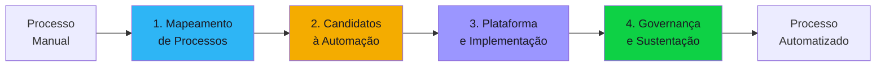

# Discovery Blueprint — Process Automation

Documento completo para conduzir o discovery de projetos de automação de processos. Cobre RPA (Robotic Process Automation), BPM (Business Process Management), workflows e plataformas low-code/no-code. Organizado em **4 componentes**.

---

## Quando usar este blueprint

- Menção a "automação", "RPA", "robô", "workflow", "BPM", "low-code", "no-code"
- Termos: UiPath, Automation Anywhere, Power Automate, Camunda, n8n, Zapier
- Processos manuais repetitivos que precisam ser automatizados
- Formulários, aprovações, roteamento de tarefas, notificações
- Integração entre sistemas sem API via UI automation (screen scraping)

---

## Visão geral dos componentes

| # | Componente | O que define | Blocos do discovery |
|---|-----------|-------------|-------------------|
| 1 | Mapeamento de Processos | AS-IS dos processos manuais, gargalos, volumes | #1, #4 |
| 2 | Candidatos à Automação | Quais processos automatizar, priorização, ROI | #3, #4 |
| 3 | Plataforma e Implementação | Ferramenta, tipo de automação (RPA/BPM/workflow), integrações | #5, #7, #8 |
| 4 | Governança e Sustentação | CoE, monitoring, manutenção, evolução | #4, #7, #8 |

---

## Componente 1 — Mapeamento de Processos

Não se automatiza o que não se entende. O mapeamento documenta os processos atuais (AS-IS), identifica gargalos, variações e exceções.

### Concerns

- **Processos candidatos** — Quais processos são manuais e repetitivos? Lista com frequência e volume
- **AS-IS detalhado** — Passos, responsáveis, sistemas envolvidos, tempo por passo, variações
- **Exceções** — O que acontece quando o processo sai do caminho feliz? Quantas exceções por mês?
- **Gargalos** — Onde o processo demora mais? Onde há filas? Onde há retrabalho?
- **Compliance** — Processos com requisitos regulatórios (aprovações obrigatórias, auditoria, SLA)?
- **Volume** — Quantas execuções por dia/semana/mês? Sazonalidade?
- **Custo atual** — FTEs dedicados, tempo gasto, custo de erro

### Perguntas-chave

1. Quais processos são candidatos à automação? (listar com frequência e volume)
2. Existe documentação dos processos atuais (fluxogramas, SOPs)?
3. Quais são os gargalos? Onde o processo demora mais ou falha mais?
4. Quantas variações/exceções existem por processo?
5. Quais sistemas são usados em cada processo? (ERP, email, planilha, portal)
6. Quantas FTEs são dedicadas a esses processos manuais?
7. Qual o custo de um erro? (retrabalho, multa, perda de cliente)
8. Há processos com SLA regulatório? (resposta em X horas, aprovação obrigatória)

### Decisões esperadas

| Decisão | Alternativas típicas | Critério |
|---------|---------------------|----------|
| Nível de mapeamento | Detalhado (cada passo) / Alto nível (fluxo macro) / Apenas críticos | Prazo, complexidade, número de processos |
| Documentação | BPMN / Fluxograma simples / Texto / Vídeo | Audiência, ferramenta disponível |

### Critérios de completude

- [ ] Processos candidatos listados com volume, frequência e responsável
- [ ] AS-IS documentado (pelo menos para os top 5)
- [ ] Exceções e variações mapeadas
- [ ] Gargalos identificados
- [ ] Custo atual estimado (FTEs, tempo, erros)

---

## Componente 2 — Candidatos à Automação

Nem todo processo deve ser automatizado. Este componente prioriza com base em ROI, complexidade e viabilidade técnica.

### Concerns

- **Critérios de seleção** — Volume alto + regras claras + poucas exceções = bom candidato
- **ROI por processo** — Tempo economizado × custo da FTE vs custo de automação + manutenção
- **Viabilidade técnica** — Sistemas envolvidos têm API? Ou precisa de UI automation (RPA)?
- **Quick wins** — Processos simples que podem ser automatizados em dias para demonstrar valor
- **Complexidade de exceções** — Muitas exceções = difícil automatizar ou precisa de human-in-the-loop
- **Tipo de automação** — RPA (UI automation), workflow (aprovações, roteamento), integração (API-to-API), documento (OCR, extração)

### Perguntas-chave

1. Quais processos têm maior volume E regras mais claras?
2. Para cada candidato: sistemas envolvidos têm API ou precisa de screen scraping?
3. Qual o ROI estimado por processo? (horas economizadas × custo/hora)
4. Há quick wins (automatizar em < 1 semana)?
5. Quais processos exigem human-in-the-loop para exceções?
6. A automação substitui a pessoa ou assiste a pessoa?
7. Quais processos, se automatizados, teriam maior impacto no negócio?
8. Há resistência das pessoas que fazem o processo hoje?

### Decisões esperadas

| Decisão | Alternativas típicas | Critério |
|---------|---------------------|----------|
| Priorização | Por ROI / Por facilidade / Por impacto no negócio / Matriz (ROI × facilidade) | Estratégia da organização |
| Tipo por processo | RPA / Workflow/BPM / Integração API / OCR + extração / Híbrido | Sistemas envolvidos, complexidade |
| Human-in-the-loop | Sem humano / Humano aprova exceções / Humano revisa tudo | Volume de exceções, risco |

### Critérios de completude

- [ ] Processos priorizados com critério explícito
- [ ] Tipo de automação definido para cada processo (RPA/workflow/integração)
- [ ] ROI estimado para top 5 processos
- [ ] Quick wins identificados
- [ ] Human-in-the-loop definido por processo

---

## Componente 3 — Plataforma e Implementação

Escolha da ferramenta e definição de como cada automação será implementada.

### Concerns

- **Plataforma RPA** — UiPath, Automation Anywhere, Power Automate, Blue Prism?
- **Plataforma BPM/Workflow** — Camunda, Bonita, ProcessMaker, ServiceNow, Power Automate?
- **Low-code/No-code** — Outsystems, Mendix, Retool, Appsmith, n8n, Zapier?
- **Licenciamento** — Por robô, por processo, por usuário? Custo de escala?
- **Infraestrutura** — Cloud, on-premises, híbrido? Robôs attended vs unattended?
- **Integração** — Como a automação interage com sistemas? API, UI, banco, email?
- **Segurança** — Credenciais do robô, princípio do menor privilégio, auditoria de ações
- **Testes** — Como testar automações? Ambiente de teste? Dados de teste?

### Perguntas-chave

1. Já existe plataforma de automação na empresa? (UiPath, Power Automate, etc.)
2. Robôs attended (assistem o usuário) ou unattended (rodam sozinhos)?
3. Como o robô acessa os sistemas? API, UI automation, banco direto?
4. Como gerenciar credenciais dos robôs? Vault? Service account?
5. Precisa de OCR para processar documentos? (notas fiscais, contratos, formulários)
6. Como testar automações antes de ir para produção?
7. Qual o budget para licenças e infraestrutura?
8. Precisa de low-code para formulários e dashboards complementares?

### Decisões esperadas

| Decisão | Alternativas típicas | Critério |
|---------|---------------------|----------|
| Plataforma principal | UiPath / Power Automate / Automation Anywhere / Open-source (n8n) | Budget, complexidade, ecossistema |
| Tipo de robô | Attended / Unattended / Hybrid | Processo, interação com usuário |
| Integração | API / UI automation / Database / Email | Disponibilidade de API, estabilidade de UI |
| OCR | Built-in da plataforma / Serviço dedicado (ABBYY, Google Vision) / Sem OCR | Volume e tipo de documento |

### Critérios de completude

- [ ] Plataforma selecionada com justificativa
- [ ] Tipo de robô definido por processo (attended/unattended)
- [ ] Método de integração definido por sistema
- [ ] Estratégia de credenciais e segurança documentada
- [ ] Estimativa de custo (licenças + infra + desenvolvimento)

---

## Componente 4 — Governança e Sustentação

Automações sem governança quebram silenciosamente. Um CoE (Center of Excellence) e monitoring garantem sustentabilidade.

### Concerns

- **CoE (Center of Excellence)** — Quem define padrões, prioriza novos processos, mantém existentes?
- **Monitoring** — Dashboard de execuções, taxa de sucesso, tempo de execução, exceções?
- **Manutenção** — Quando UI muda, automação quebra. Quem corrige? Em quanto tempo?
- **Versionamento** — Automações versionadas? Git? Repositório da plataforma?
- **Escalabilidade** — Como adicionar novos processos sem criar caos? Pipeline de onboarding?
- **Métricas de valor** — FTEs economizadas, horas devolvidas, erros evitados, ROI acumulado
- **Change management** — Como comunicar automações para as pessoas afetadas?

### Perguntas-chave

1. Quem será responsável por manter as automações? (CoE, time de TI, área de negócio)
2. Como monitorar execuções? Dashboard? Alertas de falha?
3. Quando uma tela de sistema muda, quem atualiza o robô? Em quanto tempo?
4. Como priorizar novos processos para automação? Tem fila? Critério?
5. Como comunicar para as pessoas que o processo foi automatizado?
6. Quais métricas de valor serão rastreadas? (horas economizadas, erros, ROI)
7. Automações são versionadas? Tem rollback?
8. Existe processo de homologação antes de colocar em produção?

### Decisões esperadas

| Decisão | Alternativas típicas | Critério |
|---------|---------------------|----------|
| Modelo de governança | CoE centralizado / Federado por área / Sem CoE | Número de automações, maturidade |
| Monitoring | Plataforma nativa / Custom dashboard / Manual | Volume de execuções |
| Manutenção | Time dedicado / Rotação / Área de negócio | Complexidade, volume |

### Critérios de completude

- [ ] Modelo de governança definido (CoE, federado, etc.)
- [ ] Monitoring e alertas planejados
- [ ] Responsável por manutenção identificado
- [ ] Processo de onboarding de novas automações definido
- [ ] Métricas de valor definidas
- [ ] Change management planejado

---

## Concerns transversais — Produto e Organização

- Qual o objetivo estratégico? (reduzir custo, liberar pessoas para trabalho de valor, compliance)
- Impacto nas pessoas: automação substitui ou assiste? Resistência esperada?
- OKRs: FTEs economizadas, horas devolvidas, taxa de erro, SLA de processo, ROI
- Sinais de resposta incompleta:
  - "Automatizar tudo" (sem priorização)
  - "O robô faz sozinho" (sem plano para exceções)
  - "Vamos automatizar e depois vemos" (sem governança)

---

## Concerns transversais — Privacidade (bloco #6)

- Robô acessa dados pessoais? Quais? Com que justificativa?
- Credenciais do robô: acesso mínimo necessário? Auditoria de ações?
- Dados em screenshots ou logs do RPA contêm PII?
- OCR processando documentos com dados sensíveis (CPF, salário, saúde)?
- LGPD: decisão automatizada afeta pessoa? (art. 20 — direito a revisão)

---

## Antipatterns conhecidos

| # | Antipattern | Por quê é ruim |
|---|-------------|----------------|
| 1 | **Automatizar processo ruim** | Automação amplifica ineficiência — otimizar antes de automatizar |
| 2 | **RPA quando API existe** | UI automation é frágil — se tiver API, use API |
| 3 | **Sem tratamento de exceções** | Robô para e ninguém sabe — processo fica sem fazer |
| 4 | **Credencial pessoal no robô** | Pessoa sai da empresa, robô para |
| 5 | **Sem monitoring** | Robô falha silenciosamente por semanas |
| 6 | **Muitas automações sem CoE** | Cada área cria robôs, ninguém mantém, vira caos |
| 7 | **Ignorar change management** | Pessoas sabotam a automação por medo ou desinformação |
| 8 | **ROI inflado** | Prometeu 10 FTEs mas economizou 2 — credibilidade perdida |
| 9 | **Automação como projeto, não como produto** | Entrega e abandona — quebra em 3 meses |
| 10 | **OCR sem validação humana** | Extração errada gera dados errados em escala |

---

## Edge cases para o 10th-man verificar

- Sistema atualiza a tela (novo layout) — quantas automações quebram?
- Robô unattended executa ação errada 500 vezes antes de alguém notar — impacto?
- Fornecedor de RPA dobra o preço da licença — tem alternativa?
- Pessoa que fazia o processo manualmente saiu — e se o robô falhar?
- Automação gera documento com erro de OCR — quem paga o prejuízo?
- Regulador exige auditoria do processo automatizado — tem trilha completa?
- Robô executa no weekend e precisa de aprovação humana — como funciona?
- 3 robôs acessam o mesmo sistema simultaneamente — rate limiting do sistema?

---

## Custom-specialists disponíveis

| Specialist | Domínio | Quando invocar |
|-----------|---------|----------------|
| `rpa-uipath` | UiPath (Studio, Orchestrator, AI Center) | UiPath como plataforma |
| `rpa-power-automate` | Power Automate (Desktop, Cloud, AI Builder) | Microsoft ecosystem |
| `bpm-camunda` | Camunda (BPMN, DMN, process orchestration) | BPM com Camunda |
| `ocr-document-processing` | OCR e extração de documentos (ABBYY, Google Vision, Azure AI) | Processamento de documentos |
| `process-mining` | Process mining (Celonis, Minit, UiPath Process Mining) | Descoberta automatizada de processos |
| `low-code-platform` | Low-code (OutSystems, Mendix, Retool) | Formulários e dashboards complementares |
| `change-management` | Gestão de mudança organizacional | Resistência à automação, comunicação |

---

## Perfil do Delivery Report

### Seções extras no relatório

| Seção | Posição | Conteúdo esperado |
|-------|---------|-------------------|
| **Roadmap de Automação** | Entre Visão de Produto e Organização | Processos priorizados, tipo de automação, ROI estimado, timeline de implementação |

### Métricas obrigatórias no relatório

| Métrica | Onde incluir |
|---------|-------------|
| FTEs economizadas (projeção) | Métricas-chave |
| Horas devolvidas por mês | Métricas-chave |
| ROI estimado por processo | Roadmap de Automação |
| Taxa de sucesso esperada por robô | Métricas-chave |
| Custo total (licença + infra + dev + manutenção) | Análise Estratégica |
| Número de processos priorizados (wave 1, 2, 3) | Roadmap de Automação |

### Diagramas obrigatórios

| Diagrama | Seção destino |
|----------|---------------|
| Mapa de processos priorizados | Roadmap de Automação |

### Ênfases por seção base

| Seção base | Ênfase |
|------------|--------|
| **Visão de Produto** | Processos mapeados, gargalos, impacto no negócio |
| **Organização** | CoE, change management, treinamento |
| **Análise Estratégica** | ROI comparativo (manual vs automatizado), payback period |
| **Matriz de Riscos** | Fragilidade de RPA (UI change), vendor lock-in, resistência organizacional |

---

## Mapeamento para os 8 Blocos do Discovery

| Componente | Bloco(s) principal(is) | Agente responsável |
|------------|----------------------|-------------------|
| **1. Mapeamento de Processos** | #1 (Visão), #4 (Processo/Equipe) | po |
| **2. Candidatos à Automação** | #3 (Valor/OKRs), #4 (Processo) | po |
| **3. Plataforma e Implementação** | #5 (Tech), #7 (Arch), #8 (TCO) | solution-architect |
| **4. Governança e Sustentação** | #4 (Processo), #7 (Arch), #8 (TCO) | po, solution-architect |

---

## Regions do Delivery Report

Regions de informação que o delivery report deste blueprint deve conter. Referência completa no [Information Regions Catalog](../../projects/discovery-to-go/base-artifacts/templates/report-regions/README.md).

### Obrigatórias

Regions com Default "Todos" — sempre presentes no delivery report.

| ID | Nome | Grupo |
|----|------|-------|
| REG-EXEC-01 | Overview one-pager | Executivo |
| REG-EXEC-02 | Product brief | Executivo |
| REG-EXEC-03 | Decisão de continuidade | Executivo |
| REG-EXEC-04 | Próximos passos | Executivo |
| REG-PROD-01 | Problema e contexto | Produto |
| REG-PROD-02 | Personas | Produto |
| REG-PROD-04 | Proposta de valor | Produto |
| REG-PROD-05 | OKRs e ROI | Produto |
| REG-PROD-07 | Escopo | Produto |
| REG-ORG-01 | Mapa de stakeholders | Organização |
| REG-ORG-02 | Estrutura de equipe | Organização |
| REG-TECH-01 | Stack tecnológica | Técnico |
| REG-TECH-02 | Integrações | Técnico |
| REG-TECH-03 | Arquitetura macro | Técnico |
| REG-TECH-06 | Build vs Buy | Técnico |
| REG-SEC-01 | Classificação de dados | Segurança |
| REG-SEC-02 | Autenticação e autorização | Segurança |
| REG-SEC-04 | Compliance e regulação | Segurança |
| REG-FIN-01 | TCO 3 anos | Financeiro |
| REG-FIN-05 | Estimativa de esforço | Financeiro |
| REG-RISK-01 | Matriz de riscos | Riscos |
| REG-RISK-02 | Riscos técnicos | Riscos |
| REG-RISK-03 | Hipóteses críticas não validadas | Riscos |
| REG-QUAL-01 | Score do auditor | Qualidade |
| REG-QUAL-02 | Questões do 10th-man | Qualidade |
| REG-BACK-01 | Épicos priorizados | Backlog |
| REG-METR-01 | KPIs de negócio | Métricas |
| REG-NARR-01 | Como chegamos aqui | Narrativa |

### Opcionais

Regions que dependem do contexto do projeto.

| ID | Nome | Grupo | Condição |
|----|------|-------|----------|
| REG-PRIV-01 | Dados pessoais mapeados | Privacidade | Quando robô acessa PII |
| REG-PRIV-02 | Base legal LGPD | Privacidade | Quando robô acessa PII |
| REG-PRIV-03 | DPO e responsabilidades | Privacidade | Quando robô acessa PII |
| REG-PRIV-04 | Política de retenção | Privacidade | Quando robô acessa PII |

> [!note] RPA e dados pessoais
> Robôs RPA frequentemente acessam telas com dados pessoais (CPF, salário, dados de saúde). Se o processo automatizado manipula PII, as regions de privacidade tornam-se obrigatórias.

### Domain-specific

Regions exclusivas do context-template `process-automation`.

| ID | Path | Nome | Descrição | Template visual |
|----|------|------|-----------|-----------------|
| REG-DOM-RPA-01 | `domain/rpa-automation-roadmap.md` | Roadmap de automação | Processos priorizados, tipo de automação, ROI, timeline | Timeline com ROI |
| REG-DOM-RPA-02 | `domain/rpa-coe-governance.md` | CoE governance | Center of Excellence, monitoring, manutenção, métricas de valor | Card |
