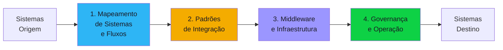

# Discovery Blueprint — System Integration

Documento completo e auto-contido para conduzir o discovery de um projeto de integração de sistemas. Cobre cenários como conexão entre ERPs, CRMs, legados, APIs externas, middleware e iPaaS. Organizado em **4 componentes**.

---

## Quando usar este blueprint

O orchestrator deve carregar este blueprint quando o briefing apresentar **dois ou mais** dos seguintes sinais:

- Menção a "integração", "conectar sistemas", "middleware", "ESB", "iPaaS"
- Termos: API gateway, webhook, message broker, event-driven, pub/sub
- Sistemas mencionados: SAP, Salesforce, Oracle, ServiceNow, Dynamics, legados
- Necessidade de sincronizar dados entre sistemas distintos
- Fluxos que cruzam fronteiras organizacionais (departamentos, empresas, parceiros)
- Termos: MuleSoft, Boomi, Workato, Apache Camel, Kong, n8n

---

## Visão geral dos componentes

| # | Componente | O que define | Blocos do discovery |
|---|-----------|-------------|-------------------|
| 1 | Mapeamento de Sistemas e Fluxos | Quais sistemas, quais dados trafegam, quem é dono | #1, #4, #5 |
| 2 | Padrões de Integração | Sync/async, request-reply, event-driven, batch file | #5, #7 |
| 3 | Middleware e Infraestrutura | Plataforma, API gateway, message broker, segurança | #5, #7, #8 |
| 4 | Governança e Operação | Versionamento de APIs, SLA, monitoring, on-call | #4, #7, #8 |

---

## Componente 1 — Mapeamento de Sistemas e Fluxos

Antes de integrar, é preciso saber **o que** conectar com **o que**, **quais dados** trafegam e **quem é responsável**. Um mapeamento incompleto gera integrações que surgem depois como "surpresa".

### Concerns

- **Inventário de sistemas** — Lista completa de sistemas envolvidos, com tecnologia, versão, responsável técnico e proprietário de negócio
- **Fluxos de dados** — Quais dados saem de qual sistema e vão para qual? Direção (unidirecional/bidirecional)?
- **Volumetria** — Quantas transações/mensagens por dia por fluxo? Picos?
- **Sistemas legados** — Algum sistema não tem API? Só aceita arquivo flat, SOAP, stored procedure?
- **Dependências circulares** — Sistema A depende de B que depende de A?
- **Donos de dados** — Quem é a fonte de verdade (golden source) para cada entidade?
- **Contratos existentes** — Já existem integrações funcionando? Documentadas? Com SLA?

### Perguntas-chave

1. Quais são todos os sistemas que precisam ser integrados? (listar nome, tecnologia, versão, responsável)
2. Para cada par de sistemas: quais dados trafegam? Em qual direção?
3. Qual sistema é a "fonte de verdade" para cada entidade (cliente, pedido, produto, etc.)?
4. Algum sistema é legado sem API moderna? Como se comunica hoje?
5. Já existem integrações funcionando entre esses sistemas? Documentadas?
6. Qual o volume de transações por fluxo? Há picos sazonais?
7. Há integrações com parceiros externos (fora da empresa)? Quais restrições?
8. Quem é o responsável técnico e de negócio de cada sistema?

### Decisões esperadas

| Decisão | Alternativas típicas | Critério |
|---------|---------------------|----------|
| Fonte de verdade por entidade | Sistema A / Sistema B / MDM centralizado | Quem tem o dado mais completo e atualizado |
| Escopo da integração | Todos os fluxos / Apenas críticos / MVP incremental | Prazo, complexidade, dependências |
| Tratamento de legados | Wrapper API / Arquivo batch / Conector customizado / Substituição | Custo de manutenção vs substituição |

### Critérios de completude

- [ ] Todos os sistemas listados com tecnologia, versão e responsável
- [ ] Mapa de fluxos documentado (origem → destino → dados → volume)
- [ ] Golden source definida para cada entidade principal
- [ ] Sistemas legados identificados com estratégia de acesso
- [ ] Integrações existentes catalogadas (o que funciona, o que não)

---

## Componente 2 — Padrões de Integração

Cada fluxo exige um padrão de integração diferente. Escolher o padrão errado (ex: sync quando deveria ser async) gera acoplamento, timeouts e fragilidade.

### Concerns

- **Síncrono vs Assíncrono** — Request-reply (REST, gRPC) vs fire-and-forget (mensageria, eventos)?
- **Event-driven** — Eventos de domínio (order-placed, payment-confirmed) vs replicação de dados?
- **Batch vs Real-time** — Alguns fluxos são D+1 (batch file), outros precisam de milissegundos
- **Orquestração vs Coreografia** — Fluxo centralizado (orchestrator) vs cada sistema reage ao evento (choreography)?
- **Transformação** — Dados precisam ser transformados entre formatos/schemas? Quem transforma?
- **Idempotência** — Mensagem duplicada gera efeito duplicado? Como garantir exactly-once ou at-least-once?
- **Compensação** — Se um passo falha num fluxo distribuído, como desfazer os anteriores? (Saga pattern)
- **Ordenação** — A ordem das mensagens importa? Como garantir?

### Perguntas-chave

1. Para cada fluxo: precisa de resposta imediata (sync) ou pode ser processado depois (async)?
2. Algum fluxo é baseado em eventos de domínio? (ex: "pedido criado" dispara ações em 3 sistemas)
3. Há fluxos que são batch por natureza? (ex: conciliação diária, importação de arquivo)
4. Se um passo falha num fluxo multi-sistema, o que acontece? Tem compensação?
5. A ordem das mensagens importa para algum fluxo?
6. Os sistemas conseguem lidar com mensagens duplicadas (idempotência)?
7. Dados precisam ser transformados entre formatos? (ex: XML ↔ JSON, esquemas diferentes)
8. Quem define o contrato de cada integração? Há versionamento?

### Decisões esperadas

| Decisão | Alternativas típicas | Critério |
|---------|---------------------|----------|
| Padrão por fluxo | Sync REST / Async message / Event-driven / Batch file | Latência requerida, acoplamento aceitável |
| Orquestração vs Coreografia | Orchestrator centralizado / Coreografia por eventos / Híbrido | Complexidade do fluxo, número de participantes |
| Estratégia de compensação | Saga orquestrada / Saga coreografada / Manual | Criticidade, consistência requerida |
| Transformação | No middleware / No produtor / No consumidor | Quem tem mais contexto sobre o formato |

### Critérios de completude

- [ ] Padrão de integração definido para cada fluxo (sync/async/event/batch)
- [ ] Estratégia de compensação para fluxos multi-sistema
- [ ] Tratamento de duplicação e ordenação documentado
- [ ] Contratos de integração definidos (formato, schema, versão)

---

## Componente 3 — Middleware e Infraestrutura

A plataforma de integração é o "sistema nervoso" que conecta tudo. A escolha entre iPaaS, ESB, API gateway ou código customizado define custo, flexibilidade e complexidade operacional.

### Concerns

- **Plataforma de integração** — iPaaS (MuleSoft, Boomi, Workato), ESB (Apache Camel, WSO2), API gateway (Kong, Apigee), custom code, low-code (n8n, Make)?
- **API Gateway** — Rate limiting, autenticação centralizada, throttling, caching, analytics?
- **Message broker** — RabbitMQ, Kafka, SQS/SNS, Azure Service Bus? Garantias de entrega?
- **Segurança** — OAuth2/mTLS entre sistemas, secrets management, network isolation, criptografia em trânsito?
- **Resiliência** — Circuit breaker, retry, dead letter queue, fallback?
- **Escalabilidade** — Horizontal scaling? Auto-scaling? Limites por sistema?
- **Observabilidade** — Distributed tracing entre sistemas, logging centralizado, alertas de SLA?
- **Cloud vs On-premises** — Plataforma cloud-native ou on-premises? Híbrido?

### Perguntas-chave

1. Já existe uma plataforma de integração na empresa? (ESB, iPaaS, API gateway)
2. Há preferência por solução cloud-native ou on-premises?
3. Como autenticar chamadas entre sistemas? OAuth2, API key, mTLS, certificados?
4. Precisa de message broker? Se sim, quais garantias de entrega? (at-least-once, exactly-once)
5. Como lidar com falhas temporárias entre sistemas? (retry, circuit breaker, DLQ)
6. Precisa de distributed tracing entre sistemas? (Jaeger, Zipkin, Datadog APM)
7. Qual o budget para plataforma de integração? (licença iPaaS vs open-source vs custom)
8. Os sistemas ficam em redes diferentes? Precisa de VPN/PrivateLink?

### Decisões esperadas

| Decisão | Alternativas típicas | Critério |
|---------|---------------------|----------|
| Plataforma de integração | iPaaS (MuleSoft/Boomi) / ESB (Camel) / API Gateway (Kong) / Custom | Volume, complexidade, budget, skills do time |
| Message broker | Kafka / RabbitMQ / SQS-SNS / Azure Service Bus | Throughput, ordering, replay, ecosystem |
| Autenticação | OAuth2 / mTLS / API key / Certificados | Política de segurança, maturidade |
| Resiliência | Circuit breaker + retry + DLQ / Manual | Criticidade dos fluxos |

### Critérios de completude

- [ ] Plataforma de integração selecionada com justificativa
- [ ] Message broker definido (se necessário)
- [ ] Estratégia de autenticação e segurança documentada
- [ ] Padrões de resiliência definidos (retry, circuit breaker, DLQ)
- [ ] Observabilidade planejada (tracing, logging, alertas)
- [ ] Estimativa de custo (licença + infra + operação)

---

## Componente 4 — Governança e Operação

Integrações sem governança viram spaghetti. Versionamento de APIs, SLA entre sistemas, monitoring e on-call definem se a integração é sustentável a longo prazo.

### Concerns

- **Versionamento de APIs** — Como versionar contratos? URL versioning, header versioning, schema evolution?
- **Catálogo de integrações** — Existe catálogo centralizado de todas as integrações? Documentação atualizada?
- **SLA entre sistemas** — Latência máxima, disponibilidade, throughput por fluxo?
- **Monitoring e alertas** — Dashboard de saúde das integrações? Alerta quando SLA é violado?
- **On-call** — Quem é acionado quando uma integração falha de madrugada?
- **Change management** — Como propagar mudanças de schema/API sem quebrar consumidores?
- **Deprecation policy** — Como aposentar integrações/versões antigas?
- **Compliance** — Dados sensíveis trafegando entre sistemas — auditoria, logging, LGPD?

### Perguntas-chave

1. Existe catálogo de integrações hoje? Documentação atualizada?
2. Como versionam APIs e contratos de integração? Tem política?
3. Qual o SLA de cada integração? (latência, disponibilidade, throughput)
4. Quem monitora a saúde das integrações? Tem dashboard?
5. Quem é acionado quando integração falha fora do horário comercial?
6. Como propagam mudanças de schema sem quebrar consumidores?
7. Dados sensíveis trafegam entre sistemas? Tem auditoria de payloads?
8. Existe processo para aposentar integrações antigas?

### Decisões esperadas

| Decisão | Alternativas típicas | Critério |
|---------|---------------------|----------|
| Versionamento de API | URL versioning / Header / Schema evolution | Maturidade dos consumidores |
| Catálogo | Portal de APIs (Backstage/SwaggerHub) / Wiki / Nenhum | Número de integrações, tamanho do time |
| On-call | DevOps centralizado / Time dono do fluxo / SRE dedicado | Volume de incidentes, criticidade |
| Deprecation | Sunset header + prazo / Breaking change avisado / Ad-hoc | Número de consumidores |

### Critérios de completude

- [ ] Política de versionamento de APIs definida
- [ ] SLA por fluxo documentado
- [ ] Estratégia de monitoring e alertas definida
- [ ] On-call e escalation definidos
- [ ] Change management documentado (como propagar mudanças)
- [ ] Compliance: auditoria de dados sensíveis em trânsito

---

## Concerns transversais — Produto e Organização

- Quais processos de negócio dependem dessas integrações? Impacto de downtime?
- Quais departamentos/times são stakeholders de cada fluxo?
- OKRs: redução de retrabalho manual, eliminação de digitação dupla, tempo de sincronização
- Sinais de resposta incompleta:
  - "Integrar tudo com tudo" (sem priorização de fluxos)
  - "Já funciona mais ou menos" (integração informal/gambiarras)
  - "O TI resolve" (sem dono de negócio identificado)

---

## Concerns transversais — Privacidade (bloco #6)

- Dados pessoais trafegam entre sistemas? Quais fluxos carregam PII?
- Logging de payloads com PII — mascaramento obrigatório?
- Transferência entre ambientes (dev/staging/prod) — dados reais em dev?
- Parceiros externos recebem dados pessoais? DPA necessário?
- Direito ao esquecimento impacta dados replicados entre sistemas?

---

## Antipatterns conhecidos

| # | Antipattern | Por quê é ruim |
|---|-------------|----------------|
| 1 | **Point-to-point spaghetti** | N sistemas com N² integrações diretas — impossível manter |
| 2 | **Sync quando deveria ser async** | Acoplamento temporal — se destino cai, origem para |
| 3 | **Sem idempotência** | Retry duplica efeitos (cobranças, pedidos, notificações) |
| 4 | **API sem versionamento** | Mudança quebra todos os consumidores ao mesmo tempo |
| 5 | **Integração por banco compartilhado** | Dois sistemas acessando mesma tabela — acoplamento máximo |
| 6 | **Sem dead letter queue** | Mensagem falha e some — perda de dados silenciosa |
| 7 | **Transformação no produtor E no consumidor** | Dados transformados 2x, inconsistência garantida |
| 8 | **Sem monitoring de SLA** | Integração degrada progressivamente sem ninguém notar |
| 9 | **Credenciais hardcoded** | Rotação de secret quebra integração, risco de segurança |
| 10 | **Integração como projeto, não como produto** | Entrega e abandona — sem dono para manter |

---

## Edge cases para o 10th-man verificar

- Sistema A muda o schema da API sem avisar — o que quebra?
- Message broker fica indisponível por 2 horas — como recuperar mensagens perdidas?
- Pico de Black Friday: throughput 10x o normal — a plataforma escala?
- Parceiro externo muda o certificado SSL — como detectar antes de quebrar?
- Dois sistemas enviam dados conflitantes sobre o mesmo cliente — quem ganha?
- Integração batch de D+1 falha num feriado — quando alguém percebe?
- LGPD pede exclusão de dados — como propagar para todos os sistemas integrados?
- Migração de sistema legado — como manter integração dual durante transição?
- Time-out em cadeia: A chama B que chama C — quanto tempo A espera?
- Rollback de deploy num sistema quebra o contrato de API — como reverter?

---

## Custom-specialists disponíveis

| Specialist | Domínio | Quando invocar |
|-----------|---------|----------------|
| `api-design` | Design de APIs REST/GraphQL/gRPC | Definição de contratos, padrões REST, pagination, HATEOAS |
| `event-driven-architect` | Arquitetura event-driven com Kafka/RabbitMQ | Eventos de domínio, CQRS, event sourcing, sagas |
| `ipaas-comparison` | MuleSoft vs Boomi vs Workato vs custom | Decisão de plataforma de integração |
| `legacy-integration` | Integração com sistemas legados (mainframe, SOAP, flat files) | Sistemas sem API moderna, COBOL, AS/400 |
| `sap-integration` | Integração com SAP (RFC, IDoc, OData, BTP) | SAP como origem ou destino |
| `salesforce-integration` | Integração com Salesforce (REST, Bulk, Platform Events) | Salesforce no ecossistema |
| `edi-b2b` | EDI e integração B2B (AS2, EDIFACT, XML) | Troca de dados com parceiros comerciais |
| `api-security` | Segurança de APIs (OAuth2, mTLS, API gateway policies) | Requisitos de segurança elevados |

> [!info] Fallback genérico
> Se o subtópico não casa com nenhum specialist acima, o orchestrator gera um specialist genérico e registra `[CUSTOM-SPECIALIST-GENERIC]` no log.

---

## Perfil do Delivery Report

### Seções extras no relatório

| Seção | Posição | Conteúdo esperado |
|-------|---------|-------------------|
| **Mapa de Integrações** | Entre Tecnologia e Segurança e Privacidade e Compliance | Diagrama de todos os sistemas e fluxos entre eles, com padrão (sync/async/batch), volume e SLA |

### Métricas obrigatórias no relatório

| Métrica | Onde incluir |
|---------|-------------|
| Número de fluxos de integração | Métricas-chave |
| Latência P95 por fluxo crítico | Métricas-chave |
| Disponibilidade alvo por fluxo | Métricas-chave |
| Throughput máximo por fluxo | Métricas-chave |
| Custo mensal da plataforma de integração | Análise Estratégica |
| Número de sistemas legados vs modernos | Métricas-chave |

### Diagramas obrigatórios no relatório

| Diagrama | Obrigatório? | Seção destino |
|----------|-------------|---------------|
| Arquitetura macro | Sim (base) | Tecnologia e Segurança |
| Mapa de integrações | Sim | Mapa de Integrações |

### Ênfases por seção base

| Seção base | Ênfase |
|------------|--------|
| **Tecnologia e Segurança** | Plataforma, protocolos, autenticação entre sistemas, circuit breaker |
| **Análise Estratégica** | Build vs Buy para iPaaS, custo de manutenção de integrações custom |
| **Backlog Priorizado** | Por criticidade do fluxo de negócio, não por complexidade técnica |
| **Matriz de Riscos** | Single point of failure, vendor lock-in de iPaaS, legados sem suporte |

---

## Mapeamento para os 8 Blocos do Discovery

| Componente | Bloco(s) principal(is) | Agente responsável |
|------------|----------------------|-------------------|
| **1. Mapeamento de Sistemas** | #1 (Visão), #4 (Processo/Equipe), #5 (Tech) | po, solution-architect |
| **2. Padrões de Integração** | #5 (Tech), #7 (Arquitetura Macro) | solution-architect |
| **3. Middleware e Infra** | #5 (Tech), #7 (Arch), #8 (TCO) | solution-architect |
| **4. Governança e Operação** | #4 (Processo/Equipe), #7 (Arch), #8 (TCO) | po, solution-architect |

---

## Regions do Delivery Report

Regions de informação que o delivery report deve conter para projetos de integração de sistemas. Referência completa no [Information Regions Catalog](../../projects/discovery-to-go/base-artifacts/templates/report-regions/README.md).

### Obrigatórias

Regions com `Default: Todos` — sempre presentes independentemente do projeto.

| ID | Nome | Grupo |
|----|------|-------|
| REG-EXEC-01 | Overview one-pager | Executivo |
| REG-EXEC-02 | Product brief | Executivo |
| REG-EXEC-03 | Decisão de continuidade | Executivo |
| REG-EXEC-04 | Próximos passos | Executivo |
| REG-PROD-01 | Problema e contexto | Produto |
| REG-PROD-02 | Personas | Produto |
| REG-PROD-04 | Proposta de valor | Produto |
| REG-PROD-05 | OKRs e ROI | Produto |
| REG-PROD-07 | Escopo | Produto |
| REG-ORG-01 | Mapa de stakeholders | Organização |
| REG-ORG-02 | Estrutura de equipe | Organização |
| REG-TECH-01 | Stack tecnológica | Técnico |
| REG-TECH-02 | Integrações | Técnico |
| REG-TECH-03 | Arquitetura macro | Técnico |
| REG-TECH-06 | Build vs Buy | Técnico |
| REG-SEC-01 | Classificação de dados | Segurança |
| REG-SEC-02 | Autenticação e autorização | Segurança |
| REG-SEC-04 | Compliance e regulação | Segurança |
| REG-FIN-01 | TCO 3 anos | Financeiro |
| REG-FIN-05 | Estimativa de esforço | Financeiro |
| REG-RISK-01 | Matriz de riscos | Riscos |
| REG-RISK-02 | Riscos técnicos | Riscos |
| REG-RISK-03 | Hipóteses críticas não validadas | Riscos |
| REG-QUAL-01 | Score do auditor | Qualidade |
| REG-QUAL-02 | Questões do 10th-man | Qualidade |
| REG-BACK-01 | Épicos priorizados | Backlog |
| REG-METR-01 | KPIs de negócio | Métricas |
| REG-NARR-01 | Como chegamos aqui | Narrativa |

### Opcionais

Regions condicionais — incluir quando o contexto do projeto justificar.

| ID | Nome | Grupo | Condição |
|----|------|-------|----------|
| REG-PRIV-01 | Dados pessoais mapeados | Privacidade | Quando há PII trafegando entre sistemas |
| REG-PRIV-02 | Base legal LGPD | Privacidade | Quando há PII trafegando entre sistemas |
| REG-PRIV-03 | DPO e responsabilidades | Privacidade | Quando há PII trafegando entre sistemas |
| REG-PRIV-04 | Política de retenção | Privacidade | Quando há PII trafegando entre sistemas |

### Domain-specific

Regions exclusivas do context-template `system-integration`.

| ID | Nome | Descrição | Template visual |
|----|------|-----------|-----------------|
| REG-DOM-INTEG-01 | Mapa de integrações | Diagrama de sistemas e fluxos com padrão, volume e SLA | Diagram full-width |
| REG-DOM-INTEG-02 | Data contracts | Contratos entre sistemas: schema, versionamento, ownership | Table |
