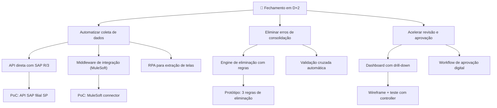

# Opportunity Map

Mapa de oportunidades seguindo o framework Opportunity Solution Tree (OST) de Teresa Torres. Organiza hierarquicamente o objetivo desejado, as oportunidades identificadas para alcançá-lo, as soluções possíveis para cada oportunidade e os experimentos para validar cada solução. Permite visualizar o espaço de solução completo e tomar decisões informadas sobre onde investir esforço.

## Schema de dados

| Campo | Tipo | Formato |
|-------|------|---------|
| objetivo | string | Resultado desejado de alto nível |
| oportunidades | list | Cada item: `{ oportunidade: string, evidencia: string, solucoes: list }` |
| solucoes[n] | object | `{ solucao: string, esforco: string, impacto: string, experimentos: list }` |
| experimentos[n] | object | `{ experimento: string, tipo: string, prazo: string }` |

## Exemplo

```markdown
## Mapa de Oportunidades (OST)

### Objetivo

Reduzir o tempo de fechamento financeiro consolidado de D+8 para D+2.



### Detalhamento

#### Oportunidade 1: Automatizar coleta de dados

**Evidência:** Analistas gastam 60% do tempo coletando e normalizando dados manualmente (entrevistas com 4/4 analistas).

| Solução | Esforço | Impacto | Experimento |
|---------|---------|---------|-------------|
| API direta com SAP R/3 | Alto | Alto | PoC com filial SP — 2 semanas |
| Middleware MuleSoft | Médio | Médio | PoC com connector existente — 1 semana |
| RPA (extração de telas) | Baixo | Baixo | Descartada — frágil e não escalável |

#### Oportunidade 2: Eliminar erros de consolidação

**Evidência:** 3 reapresentações ao conselho por erros de eliminação intercompany (CFO + Controller).

| Solução | Esforço | Impacto | Experimento |
|---------|---------|---------|-------------|
| Engine de eliminação com regras configuráveis | Alto | Alto | Protótipo com 3 regras mais frequentes — 3 semanas |
| Validação cruzada automática | Médio | Médio | Script de validação com dados reais — 1 semana |

#### Oportunidade 3: Acelerar revisão e aprovação

**Evidência:** Controller gasta 40% do tempo revisando cálculos manualmente (entrevista com controller).

| Solução | Esforço | Impacto | Experimento |
|---------|---------|---------|-------------|
| Dashboard com drill-down | Médio | Alto | Wireframe + teste de usabilidade com controller — 1 semana |
| Workflow de aprovação digital | Baixo | Médio | Protótipo em Figma — 3 dias |
```
