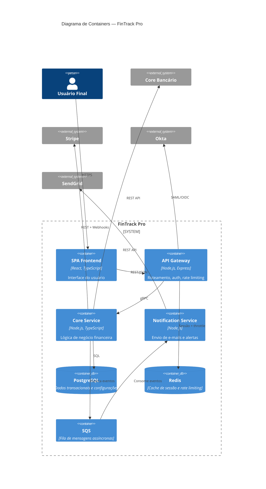

# Arquitetura de Containers (C4 L2)

Detalha os containers internos do FinTrack Pro (aplicações, serviços, bancos de dados), mostrando como se comunicam entre si e com sistemas externos. Essa visão é a referência principal para decisões de deploy, escalabilidade e ownership de componentes.

## Schema de dados

| Campo | Tipo | Descrição |
|-------|------|-----------|
| diagram | mermaid | Diagrama C4 Container em sintaxe Mermaid |
| containers | lista | Componentes internos do sistema |
| relacionamentos | lista | Fluxos entre containers e sistemas externos |

## Exemplo

## Representação Visual

### Dados de amostra

- **Ator:** Usuário Final
- **Containers internos (FinTrack Pro):** SPA Frontend (React, TypeScript), API Gateway (Node.js, Express), Core Service (Node.js, TypeScript), Notification Service (Node.js), PostgreSQL (dados transacionais), Redis (cache de sessão), SQS (fila de mensagens)
- **Sistemas externos:** Core Bancário, Stripe, Okta, SendGrid
- **Fluxos:** Usuário → SPA → API Gateway → Core Service → PostgreSQL/Core Bancário/Stripe; API Gateway → Redis/Okta; Core Service → SQS → Notification Service → SendGrid

### Formatos de exibição possíveis

| Formato | Descrição | Quando usar |
|---------|-----------|-------------|
| Texto corrido | Narrativa descritiva detalhando cada container interno, sua responsabilidade, tecnologia e como se conecta aos demais componentes e sistemas externos | Sempre — serve como base textual acessível para qualquer público |
| Tabela | Tabela com colunas Container, Tecnologia, Responsabilidade e Conexões | Sempre — permite consulta rápida dos componentes e seus vínculos |
| Diagrama C4 Container (Mermaid) | Diagrama C4 nível 2 renderizado via Mermaid, mostrando os containers dentro do boundary do sistema com seus relacionamentos internos e conexões a sistemas externos | Quando é necessário apresentar a decomposição interna do sistema, ideal para decisões de deploy, escalabilidade e ownership de componentes |

> [!info] Avaliação pendente
> Um especialista em visualização de dados deve avaliar qual formato gráfico melhor representa esta informação, considerando o público-alvo e o contexto de uso.
