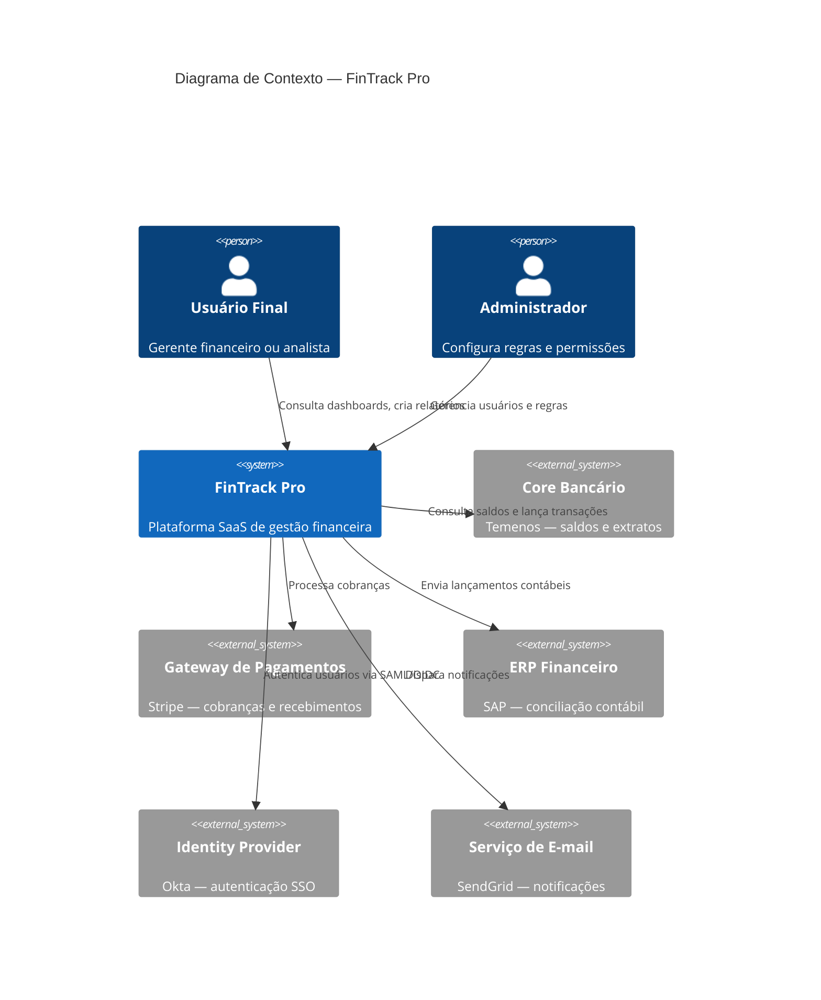

# Arquitetura Macro (C4 L1)

Apresenta o diagrama de contexto do sistema (nível 1 do modelo C4), mostrando o FinTrack Pro e suas relações com usuários e sistemas externos. Oferece a visão de mais alto nível da solução, ideal para comunicação com stakeholders não técnicos.

## Schema de dados

| Campo | Tipo | Descrição |
|-------|------|-----------|
| diagram | mermaid | Diagrama C4 Context em sintaxe Mermaid |
| atores | lista | Pessoas/papéis que interagem com o sistema |
| sistemas_externos | lista | Sistemas fora do boundary do projeto |

## Exemplo

## Representação Visual

### Dados de amostra

- **Atores:** Usuário Final (gerente financeiro/analista), Administrador (configura regras e permissões)
- **Sistema central:** FinTrack Pro — Plataforma SaaS de gestão financeira
- **Sistemas externos:** Core Bancário (Temenos), Gateway de Pagamentos (Stripe), ERP Financeiro (SAP), Identity Provider (Okta), Serviço de E-mail (SendGrid)
- **Relacionamentos:** Usuário consulta dashboards e cria relatórios; Admin gerencia usuários e regras; FinTrack consulta saldos, processa cobranças, envia lançamentos, autentica via SSO, dispara notificações

### Formatos de exibição possíveis

| Formato | Descrição | Quando usar |
|---------|-----------|-------------|
| Texto corrido | Narrativa descritiva explicando os atores, o sistema central e os sistemas externos com seus relacionamentos | Sempre — serve como base textual acessível para qualquer público |
| Tabela | Tabela com colunas Ator/Sistema, Tipo (Pessoa, Sistema Interno, Sistema Externo) e Relacionamento | Sempre — permite consulta rápida dos elementos e seus vínculos |
| Diagrama C4 Context (Mermaid) | Diagrama de contexto C4 nível 1 renderizado via Mermaid, mostrando o sistema central rodeado por atores e sistemas externos com setas de relacionamento rotuladas | Quando é necessário apresentar a visão de mais alto nível da arquitetura, ideal para stakeholders não técnicos e alinhamento sobre escopo e fronteiras do sistema |

> [!info] Avaliação pendente
> Um especialista em visualização de dados deve avaliar qual formato gráfico melhor representa esta informação, considerando o público-alvo e o contexto de uso.
