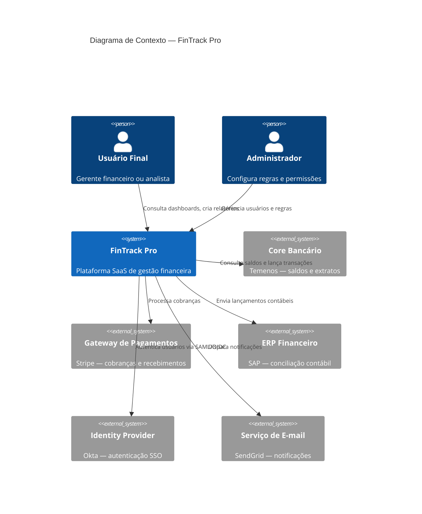

# Arquitetura Macro (C4 L1)

Apresenta o diagrama de contexto do sistema (nível 1 do modelo C4), mostrando o FinTrack Pro e suas relações com usuários e sistemas externos. Oferece a visão de mais alto nível da solução, ideal para comunicação com stakeholders não técnicos.

## Schema de dados

| Campo | Tipo | Descrição |
|-------|------|-----------|
| diagram | mermaid | Diagrama C4 Context em sintaxe Mermaid |
| atores | lista | Pessoas/papéis que interagem com o sistema |
| sistemas_externos | lista | Sistemas fora do boundary do projeto |

## Exemplo

