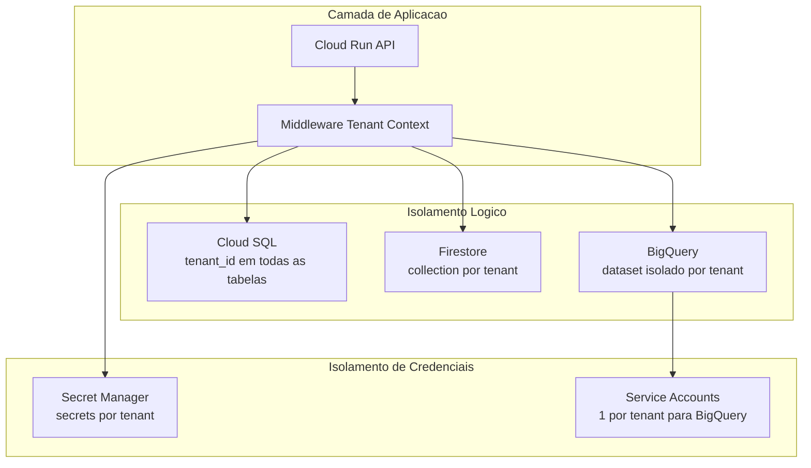

# Technology and Security — Veezoozin

> **Fase:** 1 — Discovery | **Iteracao:** 1 | **Bloco:** 1.5 | **Status:** Rascunho

---

## 🏗️ Stack Tecnologica

| Camada | Tecnologia | Justificativa |
|--------|-----------|---------------|
| **Backend API** | Python (FastAPI) + Cloud Run | FastAPI oferece async nativo para chamadas a LLM; Cloud Run e serverless com scale-to-zero, reduzindo custos no MVP |
| **Frontend** | React (TypeScript) + Vite | Ecossistema maduro para interfaces conversacionais e dashboards interativos com graficos |
| **Banco relacional** | Cloud SQL (PostgreSQL) | Metadata de tenants, configuracoes, glossarios de negocio, usuarios e planos |
| **Banco analitico** | BigQuery | Banco suportado nativamente no MVP; o Veezoozin executa queries NL-to-SQL diretamente no BigQuery do cliente |
| **Cache e sessoes** | Firestore | Historico de conversas, cache de schemas enriquecidos, sessoes de usuario |
| **Armazenamento** | Cloud Storage | Documentos exportados (PDF/HTML), glossarios importados, logs de auditoria |
| **Embeddings e IA** | Vertex AI | Embeddings de schema e glossario para similaridade semantica no NL-to-SQL |
| **Fila assincrona** | Cloud Tasks + Pub/Sub | Processamento assincrono de onboarding de schema, geracao de relatorios e re-indexacao de embeddings |
| **CI/CD** | Cloud Build + Artifact Registry | Pipeline nativo GCP; deploy automatizado para Cloud Run |
| **Monitoramento** | Cloud Monitoring + Cloud Logging + Error Reporting | Observabilidade completa com alertas por tenant e por pipeline |

> [!info] Estrategia GCP-first
> O cliente possui contrato enterprise com Google Cloud e creditos significativos. Toda a stack prioriza servicos nativos GCP para maximizar incentivos e reduzir overhead operacional. `[BRIEFING]`

---

## 🤖 Estrategia de IA e LLM

### Modelos e Provedores

| Aspecto | Decisao |
|---------|---------|
| LLM primario | **Claude API (Anthropic)** — raciocinio complexo, NL-to-SQL com contexto longo |
| LLM secundario | **Gemini API (Google)** — insights rapidos, sumarizacao, sugestao de prompts |
| Embeddings | **Vertex AI text-embedding** — embeddings de schema, colunas e glossario |
| Modelos proprios | **Nao** — fora do escopo; usar APIs externas exclusivamente `[BRIEFING]` |
| Fine-tuning | **Nao no MVP** — ajuste via prompt engineering e few-shot examples por tenant |

### Pipeline NL-to-SQL — Fluxo de IA

```mermaid
flowchart LR
    A[Pergunta NL] --> B[Deteccao de idioma]
    B --> C[Embedding da pergunta]
    C --> D[Schema Matching]
    D --> E[Contexto do Tenant]
    E --> F[LLM: SQL Generation]
    F --> G[Validacao e Sandbox]
    G --> H[Execucao BigQuery]
    H --> I[LLM: Insight Generation]
    I --> J[Visualizacao]
```

| Etapa | Tecnologia | Detalhes |
|-------|-----------|----------|
| Deteccao de idioma | LLM / heuristica | PT-BR, EN-US, ES — normaliza a pergunta para processamento |
| Embedding | Vertex AI | Gera embedding da pergunta para busca por similaridade |
| Schema Matching | Vector Search (Firestore) | Encontra tabelas/colunas mais relevantes via cosine similarity |
| Contexto do Tenant | Firestore + Cloud SQL | Glossario de negocio + historico de queries similares |
| SQL Generation | Claude API | Prompt com schema relevante + glossario + few-shot examples |
| Validacao | Parser SQL (sqlglot) | Verifica se e SELECT-only, sem DDL/DML, sem funcoes perigosas |
| Execucao | BigQuery API | Read-only, com timeout (30s) e limite de linhas (10K) |
| Insight | Gemini API | Gera insight textual sobre os resultados retornados |
| Visualizacao | Frontend (Chart.js) | Tipo de grafico escolhido por IA baseado na estrutura dos dados |

---

## 🔌 Integracoes

### Integracoes Externas

| Integracao | Protocolo | Finalidade |
|-----------|-----------|------------|
| **Claude API** | REST (HTTPS) | LLM principal para NL-to-SQL e raciocinio complexo |
| **Gemini API** | REST (HTTPS) via Vertex AI | LLM secundario para insights, sugestoes e sumarizacao |
| **BigQuery** | gRPC / REST | Execucao de queries SQL nos datasets dos clientes |
| **MCP (Model Context Protocol)** | Stdio / SSE | Integracao com RAGs e fontes de conhecimento externas do tenant |
| **Google Workspace** | OAuth 2.0 + REST | Exportacao de relatorios para Google Sheets/Drive (futuro) |

### MCP — Model Context Protocol

| Aspecto | Detalhe |
|---------|---------|
| Papel no Veezoozin | Permite que tenants conectem fontes externas de conhecimento (RAGs, wikis, APIs) |
| Arquitetura | Veezoozin atua como **MCP Client**; as fontes externas sao **MCP Servers** |
| Transporte | SSE (Server-Sent Events) para conexoes remotas |
| Contexto merge | Dados do BigQuery + contexto MCP + glossario do tenant = resposta completa |
| Seguranca | Cada conexao MCP e isolada por tenant; credenciais armazenadas no Secret Manager |

> [!warning] Seguranca MCP
> Conexoes MCP de terceiros podem injetar contexto malicioso. Implementar: (1) sanitizacao de inputs MCP, (2) limite de tokens por resposta MCP, (3) logging de todo contexto recebido para auditoria.

---

## 🔐 Seguranca

### Autenticacao e Autorizacao

| Recurso | Implementacao | Detalhe |
|---------|--------------|---------|
| Autenticacao | **Firebase Auth** (Identity Platform) | Login com email/senha, Google SSO; MFA opcional |
| Autorizacao | **RBAC** (Role-Based Access Control) | Roles: `owner`, `admin`, `analyst`, `viewer` por tenant |
| Tokens | JWT (Firebase) | Access token curto (1h) + refresh token |
| SSO corporativo | SAML 2.0 / OIDC | Disponivel em planos Enterprise |
| API Keys | Hash + rate limiting | Para integracoes programaticas (API publica do tenant) |

### Controle de Acesso a Dados

| Nivel | Mecanismo | Detalhe |
|-------|-----------|---------|
| **Tenant isolation** | Filtro obrigatorio em toda query | `tenant_id` injetado automaticamente; impossivel acessar dados de outro tenant |
| **Row-level security** | Policies no BigQuery | Administrador define quais linhas cada role pode ver (ex: regional vs nacional) |
| **Column-level security** | Mascara de colunas | Colunas sensiveis (CPF, salario) mascaradas para roles nao-autorizados |
| **Query allowlist** | Validador SQL | Apenas `SELECT` permitido; bloqueio de `INSERT`, `UPDATE`, `DELETE`, `DROP`, funcoes de sistema |

> [!important] Requisito do briefing
> O controle de acesso em nivel de registro/campo e requisito explicito do sponsor. A implementacao usa BigQuery column-level security + row-level policies configuradas pelo admin do tenant. `[BRIEFING]`

### Criptografia

| Contexto | Algoritmo | Servico |
|----------|-----------|---------|
| Dados em repouso (Cloud SQL) | AES-256 | Google-managed encryption keys (GMEK) |
| Dados em repouso (Firestore) | AES-256 | GMEK (automatico) |
| Dados em repouso (Cloud Storage) | AES-256 | CMEK via Cloud KMS para dados sensiveis |
| Dados em transito | TLS 1.3 | Todas as comunicacoes externas e internas |
| Credenciais e API keys | N/A | Secret Manager — nunca em codigo ou variaveis de ambiente |
| Backups | AES-256 | Criptografia automatica do Cloud SQL e BigQuery |

### Seguranca de API

| Controle | Implementacao |
|----------|--------------|
| Rate limiting | Cloud Armor + middleware FastAPI (por tenant, por usuario) |
| Input validation | Pydantic models (FastAPI) — validacao estrita de tipos e tamanhos |
| SQL injection | Queries parametrizadas + validacao via sqlglot antes da execucao |
| CORS | Whitelist de dominios por tenant |
| WAF | Cloud Armor com regras OWASP Top 10 |
| Abuse prevention | Limite de queries por minuto por usuario (configurable por plano) |

### Isolamento Multi-Tenant

| Estrategia | Detalhe |
|-----------|---------|
| **Modelo** | Isolamento logico (shared infrastructure, logical separation) |
| **Cloud SQL** | Tabelas compartilhadas com `tenant_id` obrigatorio em toda query |
| **Firestore** | Root collection por tenant (`/tenants/{id}/...`) |
| **BigQuery** | Cada tenant conecta seu proprio dataset; Veezoozin acessa via service account dedicada |
| **Secret Manager** | Credenciais de banco e MCP armazenadas por tenant |
| **Logging** | Todo log inclui `tenant_id` para rastreabilidade |

> [!danger] Risco de vazamento cross-tenant
> O middleware de contexto do tenant e o ponto critico de seguranca. Toda request deve ter `tenant_id` validado contra o JWT do usuario autenticado. Testes automatizados de isolamento sao obrigatorios.

---

## 🔗 Documentos Relacionados

- [[1.7-macro-architecture]] — Arquitetura macro que consome esta stack
- [[1.6-privacy-and-compliance]] — Requisitos de privacidade que moldam as decisoes de seguranca

## 📜 Historico de Alteracoes

| Versao | Timestamp | Descricao |
|--------|-----------|-----------|
| 01.00.000 | 2026-04-11 09:00 | Criacao do documento — stack GCP-first, integracoes LLM/MCP, seguranca multi-tenant |
