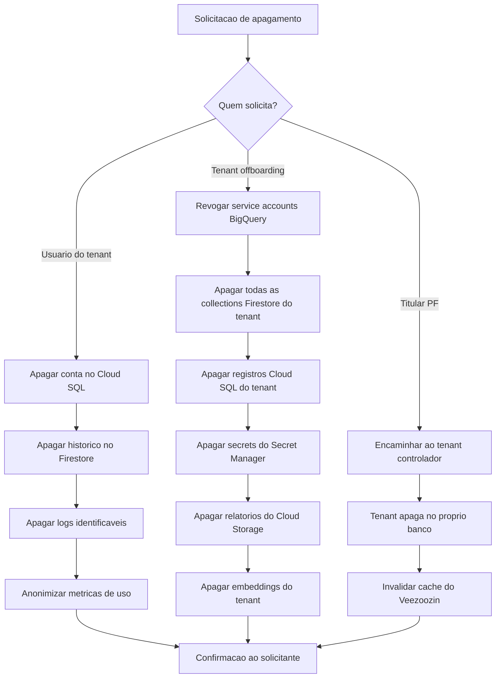

# Privacy and Compliance — Veezoozin

> **Fase:** 1 — Discovery | **Iteracao:** 1 | **Bloco:** 1.6 | **Status:** Rascunho

---

## ⚠️ Contexto de Risco

O Veezoozin opera em um cenario de **alto risco para privacidade**:

- **Acessa dados de clientes dos tenants** — o sistema consulta bancos de dados que podem conter dados pessoais, financeiros, de saude ou outros dados sensiveis
- **Processa perguntas em linguagem natural** — as queries dos usuarios podem conter informacoes confidenciais do negocio
- **Multi-tenant** — vazamento cross-tenant representa violacao grave da LGPD
- **Sub-processadores de IA** — queries e dados sao enviados para APIs externas (Claude, Gemini) para processamento

> [!danger] Modo Deep — LGPD
> Este documento aplica analise LGPD em **modo aprofundado** considerando que o sistema manipula documentos e queries de clientes, com dados potencialmente sensiveis de terceiros (clientes dos tenants). `[BRIEFING]`

---

## 📊 Classificacao de Dados

### Dados do Tenant (Empresa)

| Dado | Categoria LGPD | Sensibilidade | Armazenamento |
|------|---------------|---------------|---------------|
| Razao social, CNPJ | Pessoal (PJ — nao se aplica LGPD diretamente) | Baixa | Cloud SQL |
| Credenciais de conexao ao banco | Confidencial (nao-pessoal) | Critica | Secret Manager |
| Schema do banco (tabelas, colunas) | Confidencial (nao-pessoal) | Alta | Firestore |
| Glossario de negocio | Confidencial (nao-pessoal) | Media | Firestore |
| Configuracoes de MCP | Confidencial (nao-pessoal) | Alta | Secret Manager |

### Dados dos Usuarios do Tenant

| Dado | Categoria LGPD | Sensibilidade | Armazenamento |
|------|---------------|---------------|---------------|
| Nome, e-mail | Pessoal | Media | Cloud SQL |
| Historico de perguntas NL | Pessoal (pode conter dados sensiveis indiretamente) | Alta | Firestore |
| Preferencias e configuracoes | Pessoal | Baixa | Cloud SQL |
| Logs de acesso (IP, timestamp) | Pessoal | Media | Cloud Logging |

### Dados Consultados (Banco do Cliente)

| Dado | Categoria LGPD | Sensibilidade | Armazenamento |
|------|---------------|---------------|---------------|
| Resultados de queries SQL | **Potencialmente pessoal sensivel** | **Critica** | Transiente (nao persistido) |
| Cache de resultados | **Potencialmente pessoal sensivel** | **Critica** | Firestore (TTL curto) |
| Dados em relatorios exportados | **Potencialmente pessoal sensivel** | **Critica** | Cloud Storage (criptografado) |

> [!warning] Dados consultados — classificacao dinamica
> O Veezoozin nao conhece antecipadamente o conteudo dos dados que serao consultados. Uma query pode retornar nomes, CPFs, dados financeiros ou medicos. A classificacao deve ser tratada como **potencialmente sensivel por padrao** ate que o admin do tenant configure a mascara de colunas.

---

## ⚖️ Papeis LGPD

| Papel | Entidade | Justificativa |
|-------|---------|---------------|
| **Controlador** | Tenant (empresa cliente) | O tenant decide quais dados sao consultados, por quem, e com qual finalidade |
| **Operador** | mAInd Tech (Veezoozin) | Processa os dados conforme instrucoes do controlador (tenant) |
| **Sub-operador** | Anthropic (Claude API) | Recebe queries e contexto para gerar SQL e insights |
| **Sub-operador** | Google (Gemini API / Vertex AI) | Recebe queries para embeddings, insights e sumarizacao |
| **Sub-operador** | Google Cloud Platform | Infraestrutura onde os dados sao armazenados e processados |
| **Titular** | Pessoa fisica cujos dados estao no banco do tenant | Ex: clientes, funcionarios, fornecedores do tenant |

---

## 📜 Base Legal para Tratamento

| Tratamento | Base Legal | Artigo LGPD | Justificativa |
|-----------|-----------|-------------|---------------|
| Cadastro de usuarios do tenant | Execucao de contrato | Art. 7, V | Necessario para prestacao do servico SaaS |
| Consulta a dados do banco do tenant | Legitimo interesse do controlador | Art. 7, IX | O tenant (controlador) determina a consulta; Veezoozin e operador |
| Envio de queries para LLM (Claude/Gemini) | Execucao de contrato + consentimento | Art. 7, V + Art. 7, I | Funcionalidade core do produto; usuario consente ao usar o servico |
| Historico de perguntas | Legitimo interesse | Art. 7, IX | Melhoria do servico e aprendizado contextual por tenant |
| Logs de acesso | Obrigacao legal | Art. 7, II | Marco Civil da Internet — retencao obrigatoria de logs |
| Dados anonimizados para analytics | N/A (dado anonimizado) | Art. 12 | Dados anonimizados nao sao dados pessoais |

---

## 👤 DPO — Encarregado de Dados

| Aspecto | Situacao |
|---------|----------|
| DPO nomeado | **Nao** |
| Previsao de nomeacao | Antes do lancamento do MVP |
| Obrigatoriedade | **SIM** — o Veezoozin trata dados pessoais sensiveis em larga escala como operador |
| Recomendacao | DPO terceirizado (DPO-as-a-Service) ate que a empresa tenha porte para internalizar |

> [!danger] RISCO CRITICO
> A nomeacao de DPO e **obrigatoria** pela LGPD para o perfil de tratamento do Veezoozin. A ausencia de DPO nomeado antes do lancamento representa nao-conformidade legal e risco de sancao pela ANPD. **Bloqueante para go-live.**

---

## 🗄️ Politica de Retencao

| Categoria de Dado | Retencao | Acao pos-retencao |
|-------------------|----------|-------------------|
| Dados de conta do usuario | Duracao do contrato do tenant | Anonimizacao apos 90 dias do cancelamento |
| Historico de perguntas NL | 12 meses (rolling window) | Anonimizacao automatica (manter apenas estatisticas) |
| Cache de resultados de query | **4 horas** (TTL) | Exclusao automatica do Firestore |
| Relatorios exportados | 30 dias no Cloud Storage | Exclusao automatica; usuario pode re-exportar |
| Logs de acesso | 6 meses | Exclusao automatica (minimo legal: 6 meses — Marco Civil) |
| Embeddings de schema | Duracao do contrato do tenant | Exclusao completa no offboarding |
| Dados anonimizados | Indefinido | Nao se aplica (nao sao dados pessoais) |

> [!info] Principio da minimizacao
> O Veezoozin **nao persiste** os resultados das queries por padrao. Dados consultados no BigQuery do cliente sao retornados ao usuario e descartados. Apenas o cache temporario (4h TTL) e mantido para performance.

---

## 🗑️ Direito ao Apagamento (Art. 18, VI)

### Cenario Multi-Tenant — Complexidade

O direito ao apagamento no Veezoozin envolve tres niveis:

| Nivel | Solicitante | Escopo | Complexidade |
|-------|------------|--------|-------------|
| **1 — Usuario do tenant** | Funcionario da empresa cliente | Apagar sua conta, historico de perguntas e dados pessoais | Media — dados isolados no Firestore e Cloud SQL |
| **2 — Tenant (empresa)** | Administrador ou DPO do tenant | Offboarding completo: apagar toda configuracao, schemas, glossarios, historicos, credenciais | Alta — requer pipeline de offboarding automatizado |
| **3 — Titular dos dados consultados** | Cliente/funcionario do tenant (PF) | Solicitar que seus dados nao aparecam em consultas futuras | **Muito Alta** — o dado esta no banco do tenant, nao no Veezoozin |

### Procedimento de Apagamento

> [!warning] Titular PF — responsabilidade do controlador
> Quando um titular de dados pessoais (ex: cliente do tenant) solicita apagamento, a responsabilidade e do **tenant (controlador)**. O Veezoozin (operador) deve: (1) fornecer API para invalidacao de cache, (2) nao reter dados consultados alem do TTL, (3) documentar o processo para que o tenant possa cumprir a LGPD.

---

## 🏭 Sub-Processadores

| Sub-processador | Dados compartilhados | Finalidade | Localizacao dos dados | Risco |
|----------------|---------------------|------------|----------------------|-------|
| **Anthropic (Claude API)** | Perguntas NL + schema resumido + contexto do tenant | Geracao de SQL e raciocinio | EUA (servidores Anthropic) | **Alto** — transferencia internacional |
| **Google (Gemini API)** | Perguntas NL + resultados resumidos | Insights, sumarizacao, sugestoes | EUA / Multi-regiao Google | **Alto** — transferencia internacional |
| **Google (Vertex AI)** | Textos de schema e glossario | Geracao de embeddings | Regiao configurada (us-central1 ou southamerica-east1) | **Medio** — pode ser regional |
| **Google Cloud Platform** | Todos os dados armazenados | Infraestrutura (compute, storage, database) | southamerica-east1 (Sao Paulo) | **Baixo** — dados permanecem no Brasil |

### Mitigacoes para Transferencia Internacional

| Mitigacao | Detalhe |
|-----------|---------|
| **Clausulas contratuais padrao (SCCs)** | Exigir DPA (Data Processing Agreement) com Anthropic e Google |
| **Minimizacao de dados enviados ao LLM** | Enviar apenas schema relevante + pergunta; nunca enviar dados brutos do banco |
| **Anonimizacao pre-envio** | Para insights, anonimizar dados antes de enviar ao LLM (substituir nomes por placeholders) |
| **Configuracao regional** | Vertex AI e Cloud SQL em `southamerica-east1`; dados armazenados no Brasil |
| **Transparencia** | Informar aos tenants quais sub-processadores sao utilizados e onde os dados sao processados |
| **Opt-out de treinamento** | Garantir contratualmente que Anthropic e Google nao usem dados para treinar modelos |

> [!danger] Transferencia internacional — RISCO ALTO
> O envio de perguntas NL e contexto para APIs nos EUA configura transferencia internacional de dados. A LGPD (Art. 33) exige base legal especifica: clausulas contratuais padrao, consentimento especifico ou certificacao do pais destinatario. **DPA com Anthropic e Google e pre-requisito para lancamento.**

---

## ✅ Checklist LGPD

| # | Requisito | Status | Observacao |
|---|-----------|--------|------------|
| 1 | Base legal definida para todos os tratamentos | ✅ OK | Mapeado neste documento |
| 2 | Registro de atividades de tratamento (ROPA) | ⏳ Pendente | Elaborar antes do lancamento com base nesta analise |
| 3 | DPO nomeado e publicado | ❌ Pendente | **Bloqueante** — nomear antes do go-live |
| 4 | Politica de privacidade acessivel | ⏳ Pendente | Publicar no site e dentro da aplicacao |
| 5 | Termos de uso com clausula de sub-processadores | ⏳ Pendente | Listar Anthropic, Google e infraestrutura GCP |
| 6 | DPA com sub-processadores (Anthropic, Google) | ❌ Pendente | **Bloqueante** — transferencia internacional requer DPA |
| 7 | Mecanismo de consentimento para uso de LLM | ⏳ Pendente | Aceite explicito no onboarding do tenant |
| 8 | Criptografia em repouso e transito | ✅ OK | AES-256 (GMEK/CMEK) + TLS 1.3 |
| 9 | Politica de retencao e descarte | ✅ OK | Definida neste documento |
| 10 | Pipeline de apagamento (direito ao esquecimento) | ⏳ Pendente | Implementar pipeline automatizado de offboarding |
| 11 | Avaliacao de impacto (RIPD) | ❌ Pendente | **Obrigatoria** — tratamento de dados sensiveis em larga escala |
| 12 | Plano de resposta a incidentes | ⏳ Pendente | Incluir notificacao a ANPD em 72h |
| 13 | Isolamento multi-tenant validado | ⏳ Pendente | Testes automatizados de isolamento cross-tenant obrigatorios |
| 14 | Logs de auditoria imutaveis | ⏳ Pendente | Cloud Logging com bucket de retencao bloqueado |
| 15 | Treinamento da equipe em privacidade | ⏳ Pendente | Antes do lancamento |

---

## 📋 Riscos de Compliance Priorizados

| # | Risco | Severidade | Mitigacao | Prazo |
|---|-------|-----------|-----------|-------|
| 1 | Ausencia de DPO nomeado | **Critica** | Contratar DPO-as-a-Service | Antes do MVP |
| 2 | DPA com Anthropic/Google nao assinado | **Critica** | Negociar e assinar DPA | Antes do MVP |
| 3 | RIPD nao elaborada | **Alta** | Elaborar com suporte do DPO | Antes do MVP |
| 4 | Vazamento cross-tenant | **Critica** | Testes automatizados + pentest | Antes do MVP |
| 5 | Dados sensiveis enviados ao LLM sem anonimizacao | **Alta** | Implementar pipeline de anonimizacao pre-envio | Sprint 3 |
| 6 | Cache de dados sensiveis alem do TTL | **Media** | TTL enforced no Firestore + monitoramento | Sprint 2 |

---

## 🔗 Documentos Relacionados

- [[1.5-technology-and-security]] — Stack e controles de seguranca que suportam esta analise
- [[1.7-macro-architecture]] — Arquitetura que implementa o isolamento multi-tenant

## 📜 Historico de Alteracoes

| Versao | Timestamp | Descricao |
|--------|-----------|-----------|
| 01.00.000 | 2026-04-11 09:00 | Criacao do documento — analise LGPD deep mode, classificacao de dados, sub-processadores, checklist |
