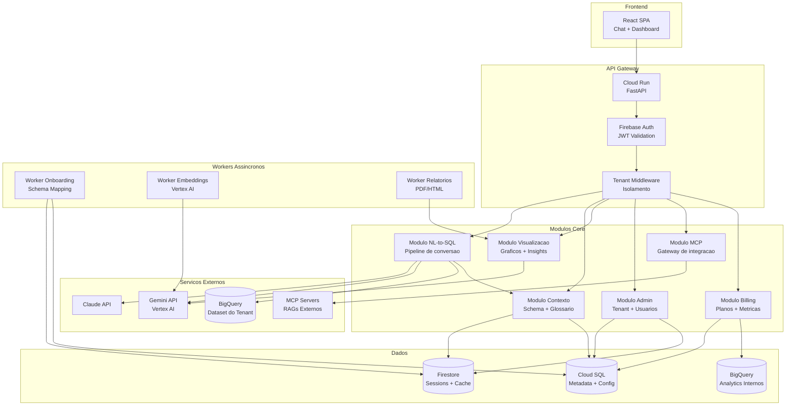
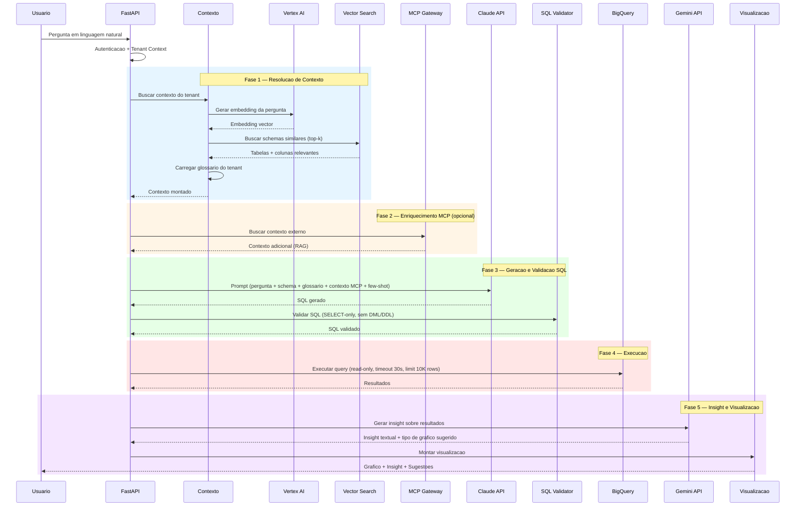
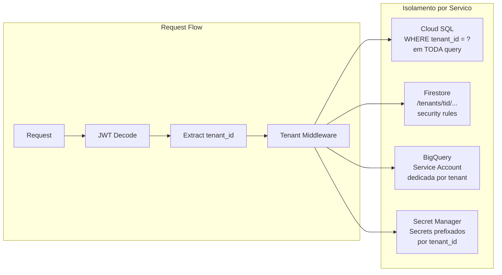
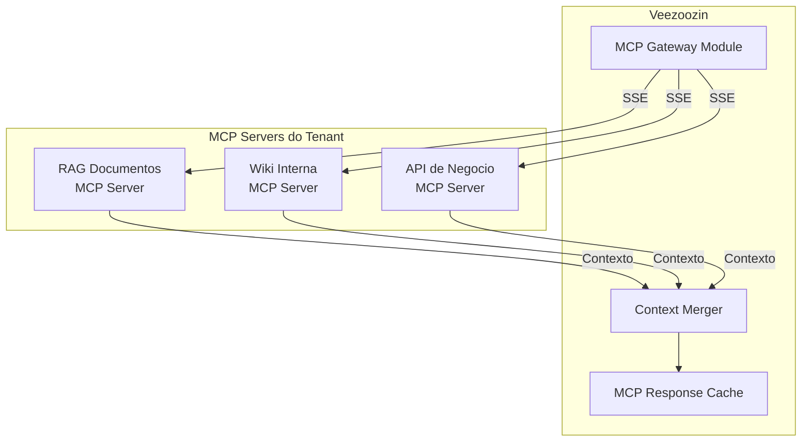

# Macro Architecture — Veezoozin

> **Fase:** 1 — Discovery | **Iteracao:** 1 | **Bloco:** 1.7 | **Status:** Rascunho

---

## 🏛️ Decisao de Arquitetura

| Aspecto | Decisao |
|---------|---------|
| Estilo | **Monolito modular** (MVP) com evolucao planejada para microservicos |
| Justificativa | Time a ser contratado, greenfield, foco em speed-to-market — monolito modular reduz complexidade operacional e acelera o MVP em 4 meses `[BRIEFING]` |
| Modulos | 6 dominios internos com fronteiras bem definidas |
| Deploy | Cloud Run (container unico com modulos internos) + workers separados |
| Evolucao | Fase 2: extrair NL-to-SQL engine e MCP gateway como servicos independentes |
| Validacao | CTO como sponsor e arquiteto valida a abordagem `[BRIEFING]` |

### Por que nao microservicos no MVP?

| Criterio | Monolito Modular | Microservicos |
|----------|-----------------|---------------|
| Time-to-market | **4 meses** (viavel) | 6-8 meses (overhead de infra) |
| Complexidade operacional | Baixa (1 deploy, 1 observabilidade) | Alta (service mesh, tracing distribuido) |
| Custo de infra MVP | **~R$ 3-5K/mes** | ~R$ 8-15K/mes (mais servicos rodando) |
| Debugging | Simples (stack trace unica) | Complexo (tracing distribuido) |
| Refatoracao futura | Fronteiras de modulo permitem extracao | N/A |

---

## 🧩 Visao Geral da Arquitetura



---

## 📦 Decomposicao em Modulos

### Modulo 1 — NL-to-SQL Engine

| Atributo | Detalhe |
|----------|---------|
| Responsabilidade | Receber pergunta em linguagem natural, converter em SQL, executar e retornar resultados |
| Processamento | Sincrono (request-response) com timeout de 30s |
| Dependencias internas | Modulo Contexto (schema + glossario) |
| Dependencias externas | Claude API, Gemini API, BigQuery |
| Criticidade | **Core** — sem este modulo o produto nao funciona |

### Modulo 2 — Contexto do Tenant

| Atributo | Detalhe |
|----------|---------|
| Responsabilidade | Gerenciar schema mapeado, glossario de negocio, historico de perguntas, embeddings |
| Processamento | Sincrono (leitura) + assincrono (re-indexacao de embeddings) |
| Dependencias internas | Nenhuma |
| Dependencias externas | Vertex AI (embeddings), Firestore, Cloud SQL |
| Criticidade | **Core** — contexto e o diferencial competitivo do Veezoozin |

### Modulo 3 — Visualizacao e Insights

| Atributo | Detalhe |
|----------|---------|
| Responsabilidade | Gerar graficos automaticos, insights textuais, sugestoes de proxima pergunta, relatorios |
| Processamento | Sincrono (graficos) + assincrono (relatorios PDF/HTML) |
| Dependencias internas | Modulo NL-to-SQL (resultados da query) |
| Dependencias externas | Gemini API (insights), Chart.js (frontend) |
| Criticidade | Alta — diferencia o produto de um simples NL-to-SQL |

### Modulo 4 — Administracao

| Atributo | Detalhe |
|----------|---------|
| Responsabilidade | CRUD de tenants, usuarios, roles, configuracoes de conexao, glossario |
| Processamento | Sincrono |
| Dependencias internas | Nenhuma |
| Dependencias externas | Firebase Auth, Cloud SQL, Firestore |
| Criticidade | Alta — administracao e onboarding sao pre-requisitos para uso |

### Modulo 5 — MCP Gateway

| Atributo | Detalhe |
|----------|---------|
| Responsabilidade | Gerenciar conexoes MCP, enviar/receber contexto de RAGs externos, merge de contexto |
| Processamento | Sincrono (consulta) com fallback (se MCP falhar, usa apenas contexto local) |
| Dependencias internas | Modulo Contexto (merge de resultados) |
| Dependencias externas | MCP Servers configurados pelo tenant |
| Criticidade | Media no MVP — diferencial, mas produto funciona sem MCP |

### Modulo 6 — Billing e Metricas

| Atributo | Detalhe |
|----------|---------|
| Responsabilidade | Controle de planos (Free, Pro, Enterprise), contagem de queries, limites, metricas de uso |
| Processamento | Sincrono (validacao de limites) + assincrono (agregacao de metricas) |
| Dependencias internas | Todos os modulos (interceptor de metricas) |
| Dependencias externas | Cloud SQL, BigQuery (analytics internos) |
| Criticidade | Alta — monetizacao e requisito do briefing `[BRIEFING]` |

---

## 🔄 Pipeline NL-to-SQL — Arquitetura Detalhada



### Tratamento de Erros no Pipeline

| Fase | Tipo de erro | Estrategia |
|------|-------------|-----------|
| Schema Matching | Nenhuma tabela relevante encontrada | Pedir ao usuario para reformular; sugerir perguntas possiveis |
| SQL Generation | LLM gera SQL invalido | Retry com feedback do erro (max 2 tentativas) |
| SQL Validation | SQL contem DML/DDL ou funcoes proibidas | Rejeitar imediatamente; log de seguranca |
| Execucao BigQuery | Timeout (>30s) | Sugerir filtros ou periodo menor |
| Execucao BigQuery | Erro de permissao | Verificar service account do tenant; alertar admin |
| Insight | LLM indisponivel | Retornar resultados sem insight (graceful degradation) |

---

## 🔒 Isolamento Multi-Tenant — Arquitetura

### Estrategia por Camada



| Camada | Estrategia | Detalhes |
|--------|-----------|----------|
| **Aplicacao** | Middleware obrigatorio | Todo request extrai `tenant_id` do JWT e injeta no contexto; impossivel prosseguir sem tenant valido |
| **Cloud SQL** | Row-level filtering | `tenant_id` como coluna obrigatoria em todas as tabelas; aplicado via ORM (SQLAlchemy) |
| **Firestore** | Collection isolation | Root collection `/tenants/{tenant_id}/` com security rules |
| **BigQuery (cliente)** | Service account por tenant | Cada tenant tem sua propria service account com acesso apenas ao seu dataset |
| **Secret Manager** | Prefixo por tenant | `veezoozin-{tenant_id}-{secret_name}` |
| **Cloud Storage** | Bucket path por tenant | `gs://veezoozin-exports/{tenant_id}/` |
| **Logging** | Label obrigatoria | Todo log inclui `tenant_id` como label estruturada |

> [!danger] Ponto critico
> O middleware de tenant e o **single point of enforcement**. Se falhar, todo o isolamento e comprometido. Requer: (1) 100% de cobertura de testes, (2) pentest focado em bypass de tenant, (3) code review obrigatorio em qualquer alteracao.

---

## 🗺️ Integracao MCP — Arquitetura



| Aspecto | Detalhe |
|---------|---------|
| Protocolo | MCP (Model Context Protocol) via SSE para conexoes remotas |
| Papel do Veezoozin | **MCP Client** — consome tools e resources dos MCP Servers |
| Configuracao | Admin do tenant cadastra MCP Servers (URL + credenciais) |
| Merge de contexto | Contexto MCP e concatenado ao schema + glossario antes de enviar ao LLM |
| Fallback | Se MCP Server estiver indisponivel, query prossegue apenas com contexto local |
| Seguranca | Conexoes isoladas por tenant; timeout de 5s por MCP Server; sanitizacao de respostas |
| Cache | Respostas MCP cacheadas no Firestore por 1h (configuravel por tenant) |

---

## ⚡ Estrategia de Caching

### Camadas de Cache

| Camada | Tecnologia | TTL | Conteudo | Invalidacao |
|--------|-----------|-----|----------|-------------|
| **L1 — Schema Cache** | Firestore | 24h | Schema mapeado + embeddings por tenant | Manual (admin atualiza) ou apos re-onboarding |
| **L2 — Query Cache** | Firestore | 4h | Hash da pergunta NL → resultado da query | TTL automatico; invalidacao manual pelo admin |
| **L3 — MCP Cache** | Firestore | 1h | Respostas de MCP Servers por tenant | TTL automatico; configuravel por tenant |
| **L4 — Embedding Cache** | Memoria (in-process) | Duracao do request | Embeddings computados durante o request | Fim do request |
| **L5 — LLM Response Cache** | Firestore | 2h | SQL gerado para perguntas identicas | TTL automatico |

### Estrategia de Cache Key

```
L2 Key: hash(tenant_id + normalized_question + schema_version)
L5 Key: hash(tenant_id + normalized_question + schema_version + glossary_version)
```

> [!info] Cache e isolamento
> Toda cache key inclui `tenant_id` como componente obrigatorio. Impossivel que um tenant acesse cache de outro. A `schema_version` garante invalidacao automatica quando o schema do tenant muda.

### Estimativa de Economia

| Cenario | Sem cache | Com cache | Economia |
|---------|-----------|-----------|----------|
| Query repetida (mesma pergunta) | ~5s + custo LLM | ~200ms (Firestore read) | **96% latencia, 100% custo LLM** |
| Query similar (pergunta parecida) | ~5s + custo LLM | ~3s (skip schema matching) | **40% latencia, 0% custo LLM** |
| Schema lookup | ~500ms (embedding + vector search) | ~50ms (Firestore read) | **90% latencia** |

---

## 📐 Plano de Escalabilidade

| Fase | Abordagem | Gatilho | Estimativa |
|------|-----------|---------|------------|
| **MVP** | Monolito modular (Cloud Run, 1-4 instancias) + workers | Ate 50 tenants | R$ 3-5K/mes |
| **Fase 2** | Extrair NL-to-SQL engine como servico; auto-scaling agressivo | >50 tenants ou latencia p95 > 8s | R$ 8-15K/mes |
| **Fase 3** | Microservicos completos; BigQuery reservations por tenant | >500 tenants ou requisito de SLA enterprise | R$ 30-50K/mes |

### Metricas de Decisao

| Metrica | Threshold para escalar | Ferramenta |
|---------|----------------------|------------|
| Latencia p95 de query | > 8 segundos | Cloud Monitoring |
| Taxa de erro do LLM | > 5% | Error Reporting |
| Utilizacao de CPU (Cloud Run) | > 70% sustentado | Cloud Monitoring |
| Queries por minuto (global) | > 100 QPM | BigQuery analytics internos |
| Custo LLM mensal | > R$ 2K/mes | Billing alerts |

---

## 🔗 Documentos Relacionados

- [[1.5-technology-and-security]] — Stack e controles de seguranca que suportam esta arquitetura
- [[1.6-privacy-and-compliance]] — Requisitos de privacidade que influenciam o isolamento multi-tenant

## 📜 Historico de Alteracoes

| Versao | Timestamp | Descricao |
|--------|-----------|-----------|
| 01.00.000 | 2026-04-11 09:00 | Criacao do documento — monolito modular, pipeline NL-to-SQL, isolamento multi-tenant, MCP gateway, caching |
