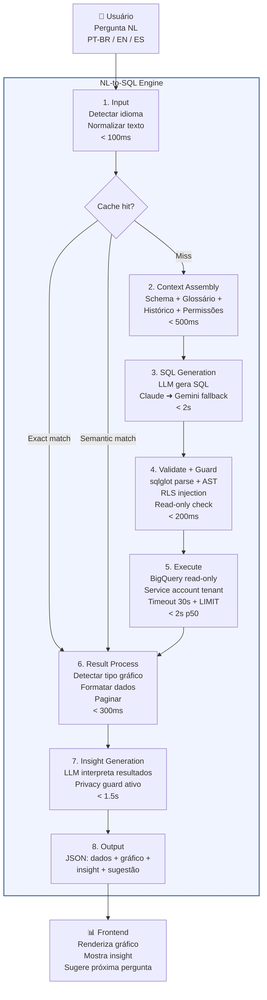
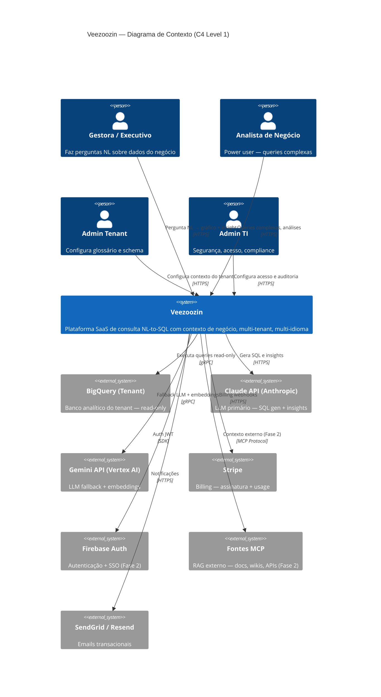
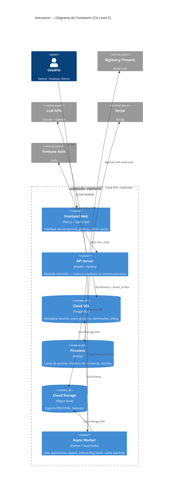
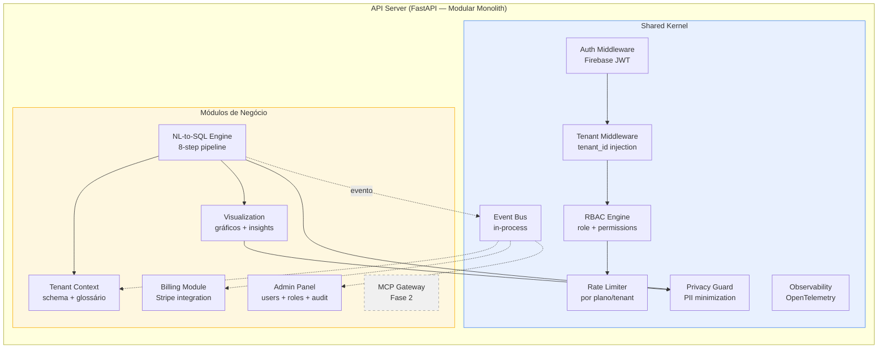

# Bloco #7 — Arquitetura Macro

> Resultado da entrevista simulada (Fase 1 — Discovery) entre Solution Architect e Customer simulado. Este bloco consolida as decisões técnicas dos 6 blocos anteriores (D1–D39) em uma arquitetura macro coerente — padrão arquitetural, decomposição em módulos, pipeline NL-to-SQL detalhado, isolamento multi-tenant, camada MCP, estratégia de cache e roadmap de escalabilidade.
>
> **Dependências diretas:** Bloco #5 (Tecnologia e Segurança — D24–D31) e Bloco #6 (Privacidade e Compliance — D32–D39). Referencia decisões de todos os blocos: D1–D39.

---

## 1. Padrão Arquitetural — Modular Monolith

> Referência: D17 (time de 6 pessoas), D22 (monorepo), D24 (row-level multi-tenancy), D18 (sprints de 1 semana). Blueprint SaaS: "microservices prematuros são antipattern #1 para times < 10 pessoas".

### Justificativa da escolha

| Abordagem | Prós | Contras | Veredicto |
|-----------|------|---------|:---------:|
| **Monolith clássico** | Simples, rápido de construir | Sem separação de concerns, difícil de escalar seletivamente, acoplamento total | ❌ Não escala com crescimento |
| **Microservices** | Isolamento, deploy independente, scaling seletivo | Complexidade operacional enorme, latência de rede, observabilidade distribuída, team per service | ❌ Inviável para time de 6 (D17) |
| **Modular Monolith** | Separação lógica de concerns, deploy único, boundary claro por módulo, evolução para microservices quando justificado | Disciplina necessária para manter boundaries, risco de acoplamento se não monitorado | ✅ **Escolhido** |

### Por que Modular Monolith?

1. **Time enxuto (D17):** 6 pessoas não conseguem operar microservices. Um deploy, um pipeline CI/CD (D19), uma instância Cloud Run para começar.
2. **Monorepo (D22):** Todos os módulos no mesmo repo. Refactoring global, compartilhamento de tipos, code review unificado.
3. **Velocidade (D18):** Sprints de 1 semana exigem deploy simples. Sem coordenação entre N serviços.
4. **Evolução natural:** Boundaries claros entre módulos permitem extrair microservices quando o time crescer (Fase 2/3 — 8-12 pessoas) e a carga justificar.
5. **Row-level multi-tenancy (D24):** Um banco, um app. Modular monolith alinha perfeitamente.

### Princípios arquiteturais

| Princípio | Aplicação |
|-----------|-----------|
| **Bounded contexts** | Cada módulo tem domain model próprio. Comunicação entre módulos via interfaces internas, não chamadas diretas a tabelas de outro módulo. |
| **Dependency inversion** | Módulos dependem de abstrações (interfaces Python), não de implementações. Ex: NL-to-SQL Engine depende de `LLMProvider` interface, não de `ClaudeClient` diretamente. |
| **Event-driven interno** | Módulos emitem eventos (ex: `QueryExecuted`, `TenantCreated`). Outros módulos reagem. No monolith, via in-process event bus. Na evolução para microservices, troca por Pub/Sub. |
| **Shared nothing entre módulos** | Cada módulo tem suas tabelas no Cloud SQL (prefixo por módulo). Sem JOINs cross-módulo. Dados compartilhados via eventos ou API interna. |
| **API-first** | Toda funcionalidade exposta via FastAPI endpoints (D25). Frontend (Next.js) consome apenas APIs, nunca acessa banco diretamente. |

---

## 2. Decomposição em Módulos

> Referência: stack definida no Bloco #5 (D25 — FastAPI + Next.js), pipeline NL-to-SQL (8 etapas), multi-tenancy (D24), billing (D27 — Stripe), LGPD (D32–D39).

### Mapa de módulos

```
┌─────────────────────────────────────────────────────────────────────────┐
│                          VEEZOOZIN — MODULAR MONOLITH                   │
│                          Deploy: Cloud Run (single container)           │
│                                                                         │
│  ┌──────────────┐  ┌──────────────┐  ┌──────────────┐  ┌────────────┐ │
│  │  NL-to-SQL   │  │   Tenant     │  │ Visualization│  │   Admin    │ │
│  │   Engine     │  │   Context    │  │   & Output   │  │   Panel    │ │
│  │              │  │              │  │              │  │            │ │
│  │ • Input      │  │ • Schema     │  │ • Chart gen  │  │ • Users    │ │
│  │ • Context    │  │   discovery  │  │ • Insight    │  │ • Roles    │ │
│  │   assembly   │  │ • Glossary   │  │   text       │  │ • Settings │ │
│  │ • SQL gen    │  │ • Embeddings │  │ • Export     │  │ • Audit    │ │
│  │ • Validate   │  │ • History    │  │   PDF/HTML   │  │   logs     │ │
│  │ • Execute    │  │ • Permissions│  │ • Suggestions│  │ • Feature  │ │
│  │ • Result     │  │ • MCP bridge │  │              │  │   flags    │ │
│  │   process    │  │              │  │              │  │            │ │
│  └──────┬───────┘  └──────┬───────┘  └──────┬───────┘  └─────┬──────┘ │
│         │                 │                 │                │        │
│  ┌──────┴─────────────────┴─────────────────┴────────────────┴──────┐ │
│  │                        SHARED KERNEL                              │ │
│  │  • Auth middleware (D28 — Firebase Auth + JWT)                    │ │
│  │  • Tenant middleware (D24 — tenant_id injection)                  │ │
│  │  • RBAC engine (D9 — campo/registro)                             │ │
│  │  • Rate limiter (D14 — por plano)                                │ │
│  │  • Event bus (in-process)                                         │ │
│  │  • Observability (D20 — Cloud Monitoring + Logging + Trace)       │ │
│  │  • Privacy guard (D35 — minimização PII para LLM)                │ │
│  └──────────────────────────────────────────────────────────────────┘ │
│                                                                         │
│  ┌──────────────┐  ┌──────────────┐                                    │
│  │  MCP Gateway │  │   Billing    │                                    │
│  │              │  │   Module     │                                    │
│  │ • Protocol   │  │              │                                    │
│  │   adapter    │  │ • Stripe     │                                    │
│  │ • Context    │  │   webhooks   │                                    │
│  │   merge      │  │ • Usage      │                                    │
│  │ • Source     │  │   metering   │                                    │
│  │   registry   │  │ • Plan       │                                    │
│  │              │  │   limits     │                                    │
│  │              │  │ • Invoicing  │                                    │
│  └──────────────┘  └──────────────┘                                    │
└─────────────────────────────────────────────────────────────────────────┘
```

### Detalhamento dos módulos

| Módulo | Responsabilidade | Tabelas (Cloud SQL) | Dependências externas | Fase |
|--------|-----------------|--------------------|-----------------------|:----:|
| **NL-to-SQL Engine** | Pipeline completo de 8 etapas (Bloco #5). Recebe pergunta NL, retorna dados + metadata de visualização. | `query_logs`, `query_cache` | Claude API (D26), Gemini API (D26), BigQuery do tenant (D1), Vertex AI Embeddings | MVP |
| **Tenant Context** | Gestão do contexto de negócio por tenant: schema discovery, glossário, embeddings, histórico de conversas, permissões de acesso (RLS). | `tenants`, `glossary_terms`, `schema_metadata`, `data_permissions`, `embeddings_index` | Vertex AI Embeddings, BigQuery (schema introspection) | MVP |
| **Visualization & Output** | Renderização de gráficos, geração de insights textuais, exportação PDF/HTML, sugestões de próximas perguntas (D10). | `exports`, `suggestions_cache` | Cloud Storage (exports) | MVP |
| **Admin Panel** | Gestão de usuários, roles (RBAC), configurações do tenant, logs de auditoria, feature flags. | `users`, `roles`, `user_roles`, `audit_logs`, `feature_flags` | Firebase Auth (D28) | MVP |
| **MCP Gateway** | Integração com fontes externas de conhecimento via Model Context Protocol. Registry de fontes, merge de contexto externo com contexto do tenant. | `mcp_sources`, `mcp_context_cache` | Fontes MCP externas | Fase 2 |
| **Billing Module** | Integração com Stripe (D27). Webhooks de provisioning, usage metering, limites por plano, invoicing. | `subscriptions`, `usage_records`, `invoices` | Stripe API (D27) | MVP |
| **Shared Kernel** | Middleware transversal: auth, tenant isolation, RBAC, rate limit, eventos, observabilidade, privacy guard. | — (usa tabelas dos módulos via interfaces) | Firebase Auth, Cloud Monitoring, Cloud Logging | MVP |

### Comunicação entre módulos

```
┌─────────────────────────────────────────────────────────────┐
│                   FLUXO DE UMA QUERY                         │
│                                                               │
│  Frontend (Next.js)                                          │
│      │                                                       │
│      │ POST /api/query { question: "Faturamento por região" }│
│      ▼                                                       │
│  Shared Kernel                                               │
│      │ → Auth middleware (JWT → user + tenant)                │
│      │ → Rate limiter (verificar limites do plano)           │
│      │ → Tenant middleware (injetar tenant_id no contexto)   │
│      ▼                                                       │
│  NL-to-SQL Engine                                            │
│      │ → Chama Tenant Context para montar contexto           │
│      │   (schema + glossário + permissões + histórico)       │
│      │ → Gera SQL via LLM                                    │
│      │ → Valida SQL (sqlglot — D29)                          │
│      │ → Injeta RLS filters (D9)                             │
│      │ → Executa no BigQuery (D1, D4 — read-only)            │
│      │ → Emite evento: QueryExecuted                         │
│      ▼                                                       │
│  Visualization & Output                                      │
│      │ → Detecta tipo de gráfico                             │
│      │ → Gera insight textual via LLM                        │
│      │ → Gera sugestões de próxima pergunta (D10)            │
│      │ → Aplica privacy guard (D35 — não enviar PII ao LLM) │
│      ▼                                                       │
│  Response → Frontend renderiza gráfico + insight + sugestão  │
│                                                               │
│  [Async] Event bus processa QueryExecuted:                   │
│      → Billing Module: incrementar usage counter             │
│      → Tenant Context: atualizar histórico                   │
│      → Admin Panel: registrar em audit log                   │
└─────────────────────────────────────────────────────────────┘
```

---

## 3. Pipeline NL-to-SQL — Detalhamento Arquitetural

> Referência: Bloco #5 seção 2 — pipeline de 8 etapas. Decisões D1 (BigQuery), D3 (APIs externas), D4 (read-only), D9 (RLS), D26 (Claude primário, Gemini fallback), D29 (sqlglot), D30 (cache 4 camadas), D35 (minimização PII).

### Diagrama do pipeline



### Detalhamento das etapas críticas

#### Etapa 2 — Context Assembly (< 500ms)

O contexto montado para o LLM é o diferencial do Veezoozin (moat principal — Bloco #1). Componentes do contexto:

| Componente | Fonte | Seleção | Impacto na qualidade |
|-----------|-------|---------|:--------------------:|
| **Schema relevante** | BigQuery schema cache → Vertex AI embeddings | Semantic search: embedding da pergunta → top-K tabelas/colunas relevantes. Não envia schema inteiro (D35 — schemas com 500+ tabelas). | 🔴 Crítico |
| **Glossário do tenant** | Cloud SQL (`glossary_terms`) | Termos que matcham com tokens da pergunta + termos frequentes do tenant. | 🔴 Crítico |
| **Histórico de conversas** | Firestore | Últimas 5 perguntas/respostas da sessão + 3 exemplos few-shot do tenant. | 🟡 Importante |
| **Permissões do usuário** | Cloud SQL (`data_permissions`) + RBAC engine | Tabelas permitidas, campos mascarados, filtros RLS. Injetados na etapa 4, mas consultados aqui para limitar schema. | 🔴 Crítico |
| **Contexto MCP** (Fase 2) | MCP Gateway → fontes externas | Merge de contexto externo (documentos, wikis) com contexto do banco. | 🟡 Fase 2 |

**Prompt template estruturado:**

```
[SYSTEM]
Você é um assistente de SQL que gera queries BigQuery.
Regras: apenas SELECT, sem DDL/DML, sem subconsultas correlacionadas.

[SCHEMA]
{schema_relevante}  ← top-K tabelas/colunas via embedding search

[GLOSSÁRIO]
{glossario_tenant}  ← termos de negócio do tenant

[EXEMPLOS]
{few_shot_examples}  ← 3-5 queries bem-sucedidas do tenant

[HISTÓRICO]
{historico_sessao}  ← últimas 5 interações da sessão

[PERGUNTA DO USUÁRIO]
{pergunta_normalizada}  ← delimitada, separada do system prompt
```

#### Etapa 4 — Validate + Guard (< 200ms)

Esta etapa é a **última linha de defesa** antes da execução. Nenhuma query chega ao BigQuery sem passar por todas as validações:

```
SQL gerado pelo LLM
    │
    ├── 1. sqlglot.parse() → AST
    │      → Se falhar: rejeitar query, retornar erro
    │
    ├── 2. Whitelist de operações
    │      → Permitido: SELECT, WITH, JOIN, GROUP BY, ORDER BY, LIMIT
    │      → Proibido: INSERT, UPDATE, DELETE, DROP, CREATE, ALTER, GRANT
    │      → Proibido: INFORMATION_SCHEMA (exceto para schema discovery)
    │
    ├── 3. Whitelist de funções SQL
    │      → Permitido: SUM, COUNT, AVG, MAX, MIN, DATE_TRUNC, etc.
    │      → Proibido: EXECUTE, CALL, SYSTEM, FILE operations
    │
    ├── 4. Verificação de tabelas/campos
    │      → Tabela está na whitelist do tenant? (D9)
    │      → Campo está acessível para o role do usuário? (D9)
    │      → Se não: rejeitar query, informar restrição
    │
    ├── 5. RLS Injection (D9)
    │      → Consultar permissões do usuário
    │      → Injetar WHERE clauses determinísticas
    │      → Ex: WHERE region = 'Sul' para gestor regional
    │      → NUNCA confiar no LLM para aplicar permissões
    │
    ├── 6. Limites de segurança
    │      → Injetar LIMIT (Free: 1.000, Pro: 10.000, Ent: 100.000)
    │      → Configurar timeout (30 segundos)
    │
    └── 7. Re-serialize SQL limpo
           → sqlglot AST → SQL string limpa
           → Esta string é o que executa no BigQuery
```

#### Etapa 7 — Insight Generation com Privacy Guard (D35)

```
Resultado da query (ex: 500 linhas)
    │
    ├── Privacy Guard verifica:
    │    → Resultado contém campos marcados como PII no glossário?
    │    → Se sim: enviar apenas agregações ao LLM, não dados individuais
    │    → Se não: enviar amostra (max 50 linhas) ao LLM
    │
    ├── Truncamento:
    │    → Máximo de tokens no prompt de insight: 2.000
    │    → Enviar: schema da resposta + estatísticas + amostra truncada
    │
    └── LLM gera:
         → Insight textual (ex: "Faturamento caiu 12% vs trimestre anterior")
         → Tendências detectadas
         → Sugestão de próxima pergunta (D10)
```

---

## 4. Isolamento Multi-tenant — Arquitetura

> Referência: D24 (row-level no MVP, database dedicado para Enterprise na Fase 2), D33 (duplo papel LGPD), D9 (controle campo/registro), D37 (exclusão em 3 fases).

### Camadas de isolamento

```
┌─────────────────────────────────────────────────────────────────┐
│                    CAMADAS DE ISOLAMENTO                         │
│                                                                  │
│  Camada 1: REDE                                                 │
│  ├── Cloud Armor (D31) — WAF, DDoS, rate limit global           │
│  └── TLS 1.3 — em trânsito, sem exceção                         │
│                                                                  │
│  Camada 2: AUTENTICAÇÃO                                         │
│  ├── Firebase Auth (D28) — JWT com tenant_id claim               │
│  └── 2FA obrigatório para Enterprise                             │
│                                                                  │
│  Camada 3: API GATEWAY (Shared Kernel)                          │
│  ├── Auth middleware — extrai tenant_id do JWT                   │
│  ├── Rate limiter — limites por plano (D14)                      │
│  └── Tenant middleware — injeta tenant_id no request context     │
│                                                                  │
│  Camada 4: APLICAÇÃO (Módulos)                                  │
│  ├── Query builder — SQLAlchemy com filter automático tenant_id  │
│  ├── RBAC engine — verificação de role antes de cada operação    │
│  └── RLS injector — filtros determinísticos na query SQL (D9)    │
│                                                                  │
│  Camada 5: BANCO DE DADOS                                       │
│  ├── Cloud SQL RLS policies — segunda camada no PostgreSQL       │
│  ├── Auditoria — queries sem tenant_id são logadas e alertadas   │
│  └── Testes automatizados — CI/CD tenta cross-tenant (D19)      │
│                                                                  │
│  Camada 6: DADOS DO TENANT (BigQuery)                           │
│  ├── Service account dedicada por tenant (read-only)            │
│  ├── Veezoozin não armazena dados do BigQuery — transiente      │
│  └── Credenciais no Secret Manager (rotação automática)          │
└─────────────────────────────────────────────────────────────────┘
```

### Isolamento por tier

| Aspecto | Free | Pro | Enterprise |
|---------|:----:|:---:|:----------:|
| **Metadata (Cloud SQL)** | Row-level (tenant_id) | Row-level (tenant_id) | Database dedicado (Fase 2) |
| **Cache (Firestore)** | Collection por tenant | Collection por tenant | Collection por tenant |
| **BigQuery** | Service account do tenant | Service account do tenant | Service account do tenant |
| **Compute (Cloud Run)** | Compartilhado | Compartilhado | Instância dedicada (Fase 3) |
| **Rede** | Compartilhada | Compartilhada | VPC dedicada (Fase 3) |
| **Criptografia** | Google-managed | Google-managed | CMEK (Customer-Managed Key — Fase 2) |

### Dados por módulo no Cloud SQL

```
Cloud SQL (PostgreSQL) — "veezoozin" database

  Módulo Tenant Context:
    tenants           (id, name, plan, config, created_at, deleted_at)
    glossary_terms    (id, tenant_id, term, definition, lang, created_at)
    schema_metadata   (id, tenant_id, source_id, table_name, column_name, ...)
    data_permissions  (id, tenant_id, role, table_name, column_name, filter_expr)
    embeddings_index  (id, tenant_id, entity_type, entity_id, vector_ref)

  Módulo Admin:
    users             (id, tenant_id, email, name, role, firebase_uid, ...)
    roles             (id, tenant_id, name, permissions_json)
    user_roles        (user_id, role_id)
    audit_logs        (id, tenant_id, user_id, action, resource, detail, ts)
    feature_flags     (id, tenant_id, flag_name, enabled, rollout_pct)

  Módulo NL-to-SQL Engine:
    query_logs        (id, tenant_id, user_id, question, sql_generated, ...)
    query_cache       (id, tenant_id, question_hash, embedding_ref, result, ttl)

  Módulo Billing:
    subscriptions     (id, tenant_id, stripe_sub_id, plan, status, ...)
    usage_records     (id, tenant_id, metric, quantity, period, stripe_ref)
    invoices          (id, tenant_id, stripe_inv_id, amount, status, issued_at)

  Módulo MCP Gateway (Fase 2):
    mcp_sources       (id, tenant_id, name, endpoint, auth_config, status)
    mcp_context_cache (id, tenant_id, source_id, content_hash, data, ttl)

  Módulo Visualization:
    exports           (id, tenant_id, user_id, format, storage_path, created_at)
    suggestions_cache (id, tenant_id, context_hash, suggestions, ttl)

  🔒 TODA tabela com tenant_id tem:
     - Índice composto (tenant_id, ...) para performance
     - RLS policy: current_setting('app.tenant_id') = tenant_id
     - Constraint: NOT NULL no tenant_id
```

---

## 5. Camada de Integração MCP

> Referência: Bloco #1 (MCP como diferencial competitivo), briefing (suporte a MCP para RAGs externos). Fase 2 no roadmap, mas arquitetura preparada no MVP.

### Posição do MCP Gateway na arquitetura

```
┌──────────────────────────────────────────────────────────┐
│                    TENANT CONTEXT MODULE                   │
│                                                            │
│  ┌─────────┐   ┌──────────┐   ┌────────────┐            │
│  │ Schema  │ + │ Glossário│ + │ Histórico  │            │
│  │ (BigQuery│   │ (Cloud   │   │ (Firestore)│            │
│  │  cache)  │   │  SQL)    │   │            │            │
│  └────┬─────┘   └────┬─────┘   └─────┬──────┘            │
│       │              │               │                    │
│       └──────────────┼───────────────┘                    │
│                      │                                    │
│              ┌───────▼────────┐                           │
│              │ Context Merger │ ◀─── MCP Gateway (Fase 2) │
│              │                │      │                    │
│              │ Combina todas  │      │  ┌──────────────┐ │
│              │ as fontes em   │      ├──│ Docs (RAG)   │ │
│              │ um contexto    │      ├──│ Wiki         │ │
│              │ unificado      │      ├──│ APIs externas│ │
│              └───────┬────────┘      └──│ Knowledge    │ │
│                      │                  │ bases        │ │
│                      ▼                  └──────────────┘ │
│              Contexto completo                            │
│              para o LLM                                   │
└──────────────────────────────────────────────────────────┘
```

### Design do MCP Gateway

| Aspecto | Definição |
|---------|-----------|
| **Protocolo** | Model Context Protocol — adaptador para cada tipo de fonte |
| **Registry** | Admin do tenant registra fontes MCP no painel Admin |
| **Autenticação** | Cada fonte MCP tem credenciais próprias no Secret Manager |
| **Cache** | Contexto MCP cacheado por tenant + source (TTL configurável) |
| **Merge** | Context Merger unifica: schema + glossário + histórico + MCP em um prompt coerente |
| **Limite** | Pro: 1 fonte MCP. Enterprise: ilimitado (Bloco #3). |
| **Fallback** | Se fonte MCP indisponível: query usa contexto sem MCP (degradação graciosa) |
| **Privacidade** | Dados do MCP seguem mesmas regras de minimização (D35). PII de fonte externa não é enviada ao LLM sem truncamento. |

### Preparação no MVP

Embora MCP seja Fase 2, o MVP prepara a arquitetura:
- Context Merger já existe como componente no Tenant Context module
- Interface `ContextSource` abstrai BigQuery schema, glossário e futuras fontes MCP
- Tabelas `mcp_sources` e `mcp_context_cache` já estão no schema (feature flag desabilitada)

---

## 6. Estratégia de Cache — 4 Camadas

> Referência: D30 (cache exact + semantic), Bloco #5 seção "Cache de queries". Meta KR5.2: custo LLM < R$ 0,08/query em 12 meses.

### Arquitetura de cache

```
┌──────────────────────────────────────────────────────────────────┐
│                     CACHE — 4 CAMADAS                             │
│                                                                    │
│  ┌─────────────────────────────────────────────────────────────┐ │
│  │ CAMADA 1: Schema Cache (in-memory)                           │ │
│  │ • Schema do BigQuery do tenant em memória na instância       │ │
│  │ • Refresh: quando schema muda (webhook ou TTL 1h)            │ │
│  │ • Economia: evita chamada BigQuery INFORMATION_SCHEMA/query  │ │
│  │ • Storage: RAM do Cloud Run instance                         │ │
│  └─────────────────────────────────────────────────────────────┘ │
│                                                                    │
│  ┌─────────────────────────────────────────────────────────────┐ │
│  │ CAMADA 2: Exact Match Cache (Firestore → Redis na Fase 2)   │ │
│  │ • Hash(pergunta_normalizada + tenant_id) → resultado         │ │
│  │ • TTL: 24h                                                    │ │
│  │ • Hit rate estimado: ~15%                                     │ │
│  │ • Economia: evita AMBAS chamadas LLM + query BigQuery         │ │
│  └─────────────────────────────────────────────────────────────┘ │
│                                                                    │
│  ┌─────────────────────────────────────────────────────────────┐ │
│  │ CAMADA 3: Semantic Match Cache (Vertex AI Vector Search)     │ │
│  │ • Embedding da pergunta → nearest neighbor no cache           │ │
│  │ • Threshold de similaridade: > 0.92                           │ │
│  │ • TTL: 24h                                                    │ │
│  │ • Hit rate estimado: ~20-25%                                  │ │
│  │ • Economia: evita chamada LLM SQL gen (usa SQL do similar)    │ │
│  │ • Insight é re-gerado (dados podem ter mudado)                │ │
│  └─────────────────────────────────────────────────────────────┘ │
│                                                                    │
│  ┌─────────────────────────────────────────────────────────────┐ │
│  │ CAMADA 4: Result Cache (Firestore → Redis na Fase 2)        │ │
│  │ • Hash(SQL_query + tenant_id) → resultado BigQuery            │ │
│  │ • TTL: 1h (configurável por tenant)                           │ │
│  │ • Economia: evita execução BigQuery (custo por bytes scanned) │ │
│  │ • Útil quando semantic cache retorna SQL similar mas não exact │ │
│  └─────────────────────────────────────────────────────────────┘ │
│                                                                    │
│  FLUXO DE LOOKUP:                                                  │
│  Pergunta → Camada 2 (exact) → miss → Camada 3 (semantic) →      │
│  miss → LLM gera SQL → Camada 4 (result) → miss → BigQuery       │
│  Camada 1 (schema) é consultada em paralelo na Context Assembly   │
└──────────────────────────────────────────────────────────────────┘
```

### Economia projetada

| Cenário | Queries/dia | Cache hit % | LLM calls/dia | Custo LLM/dia | Custo/query |
|---------|:-----------:|:-----------:|:-------------:|:-------------:|:-----------:|
| **MVP (sem cache)** | 300 | 0% | 600 (2 per query) | ~R$ 45 | R$ 0,15 |
| **MVP (com cache)** | 300 | ~35% | 390 | ~R$ 29 | R$ 0,10 |
| **6 meses** | 3.000 | ~40% | 3.600 | ~R$ 270 | R$ 0,09 |
| **12 meses (otimizado)** | 15.000 | ~45% | 16.500 | ~R$ 990 | R$ 0,07 |

> Meta KR5.2 (< R$ 0,08/query em 12 meses): atingível com cache em 45% + otimização de prompts (redução de tokens).

### Invalidação de cache

| Evento | Ação | Camadas afetadas |
|--------|------|:----------------:|
| Schema do BigQuery alterado | Invalidar schema cache + todos os caches de query do tenant | 1, 2, 3, 4 |
| Glossário atualizado | Invalidar semantic cache (embeddings mudaram) | 3 |
| Permissões alteradas | Invalidar caches do usuário afetado (RLS pode mudar resultado) | 2, 4 |
| TTL expirado | Automático (Firestore TTL / Redis TTL) | 2, 3, 4 |
| Dados do BigQuery atualizados | Tenant pode configurar refresh interval (1h default) | 4 |

---

## 7. Diagrama de Arquitetura Macro (C4 Level 1 — Context)



### Diagrama de Containers (C4 Level 2)



### Diagrama de Componentes — API Server (C4 Level 3)



---

## 8. Roadmap de Escalabilidade

> Referência: Bloco #5 seção 9 (projeção de carga), D17 (time evolução), Bloco #4 (evolução do time), Bloco #3 (cenários financeiros).

### Evolução arquitetural por fase

| Fase | Tenants | Queries/dia | Arquitetura | Mudanças |
|------|:-------:|:-----------:|-------------|----------|
| **MVP (mês 1-4)** | 12 | ~300 | Modular monolith, single Cloud Run, Cloud SQL single, Firestore | Foco em correctness, não em scale |
| **Fase 2 (mês 5-7)** | ~100 | ~3.000 | Modular monolith, Cloud Run auto-scale (5-10), Cloud SQL + read replica, Redis (Memorystore), PgBouncer | Adicionar cache Redis, connection pooling, multi-banco |
| **Fase 3 (mês 8-10)** | ~200 | ~8.000 | Modular monolith com worker separado (Cloud Run Jobs), Cloud SQL HA, Redis cluster | Separar async workers, HA para banco |
| **Escala (mês 12+)** | ~300+ | ~15.000+ | Extrair NL-to-SQL Engine como serviço separado (primeiro microservice), database dedicado para Enterprise | Primeiro "seam" do monolith extraído por necessidade de scaling independente |

### Estratégia de extração de microservices

O modular monolith é projetado com **seams** (costuras) que permitem extração futura:

```
Mês 1-7: MONOLITH
┌─────────────────────────────┐
│  NL Engine  │  Tenant Ctx   │
│  Viz        │  Admin        │
│  Billing    │  MCP Gateway  │
│  ───── Shared Kernel ────── │
└─────────────────────────────┘
         1 deploy

Mês 8-12: MONOLITH + WORKER
┌─────────────────────────────┐     ┌──────────────┐
│  NL Engine  │  Tenant Ctx   │     │ Async Worker │
│  Viz        │  Admin        │     │  • Export    │
│  Billing    │  MCP Gateway  │     │  • Batch     │
│  ───── Shared Kernel ────── │     │  • Cache     │
└─────────────────────────────┘     └──────────────┘
         1 deploy                    1 deploy (Cloud Run Jobs)

Mês 12+: PRIMEIRO MICROSERVICE (se necessário)
┌─────────────────────────────┐     ┌──────────────┐
│  Tenant Ctx │  Admin        │     │  NL-to-SQL   │
│  Viz        │  MCP Gateway  │     │  Engine      │
│  Billing    │               │     │  (scaling    │
│  ───── Shared Kernel ────── │     │   independ.) │
└─────────────────────────────┘     └──────────────┘
         1 deploy                    1 deploy (Cloud Run)
                    Pub/Sub entre os dois
```

**Critério de extração:** Extrair um módulo como microservice apenas quando:
1. O módulo precisa escalar independentemente (NL Engine com filas por tier)
2. O time tem SRE dedicado (Fase 2+) para operar serviço distribuído
3. A latência de comunicação intra-módulo é aceitável via Pub/Sub/gRPC

### Infraestrutura por fase

| Componente | MVP | Fase 2 | Fase 3 | Escala |
|-----------|:---:|:------:|:------:|:------:|
| **Cloud Run (API)** | 1-2 inst | 5-10 inst | 10-15 inst | 15-20 inst |
| **Cloud Run (Worker)** | — | 1-2 inst | 2-5 inst | 5-10 inst |
| **Cloud SQL** | 1 inst (db-f1-micro) | 1 inst (db-g1-small) + read replica | HA (db-custom) + 2 replicas | HA + N replicas + Enterprise dedicated |
| **Firestore** | Auto-scale | Auto-scale | Auto-scale | Auto-scale |
| **Redis (Memorystore)** | — | Basic (1 GB) | Standard (5 GB) | HA (10 GB) |
| **PgBouncer** | — | 1 inst (sidecar) | 1 inst (sidecar) | Dedicated pool |
| **BigQuery** | Serverless | Serverless | Serverless + reservations | Serverless + reservations |
| **Custo infra/mês** | ~R$ 4.000 | ~R$ 13.500 | ~R$ 22.000 | ~R$ 31.500 |

---

## 9. Decisões de Arquitetura — Cross-cutting

### Decisões que afetam todos os módulos

| Concern | Decisão | Referência |
|---------|---------|-----------|
| **Idioma do código** | Inglês (variáveis, funções, classes, comentários, commits) | Padrão de mercado |
| **API versioning** | Prefix `/api/v1/`. Versionamento via URL no MVP. Header-based na Fase 2. | Simplicidade para MVP |
| **Error handling** | Structured errors com `code`, `message`, `detail`. Erros de negócio vs erros técnicos separados. | FastAPI exception handlers |
| **Logging** | Structured JSON. Campos obrigatórios: tenant_id, user_id, request_id, latency_ms (D20). | Cloud Logging |
| **Tracing** | OpenTelemetry → Cloud Trace. Span por etapa do pipeline NL-to-SQL. | Latência por etapa |
| **Config management** | Environment variables via Secret Manager. Sem .env em produção. | Segurança |
| **Database migrations** | Alembic (Python). Migrações versionadas, reversíveis. | Cloud SQL PostgreSQL |
| **Testing** | pytest (backend), Vitest (frontend), Playwright (e2e). Cobertura > 80% backend. | D19 (trunk-based requer testes fortes) |
| **Serialization** | Pydantic models para request/response. JSON Schema validation. | FastAPI + TypeScript types |

---

## 10. Riscos Identificados neste Bloco

| Risco | Probabilidade | Impacto | Mitigação sugerida |
|-------|:------------:|:-------:|---------------------|
| Modular monolith degrada para big ball of mud (acoplamento entre módulos) | Média | Alto | Enforcement de boundaries: módulos só se comunicam via interfaces e eventos. Linter para detectar imports cross-módulo proibidos. Architecture Decision Records (ADRs). |
| Context Assembly excede limite de tokens do LLM | Baixa | Médio | Semantic search no schema seleciona apenas tabelas relevantes. Prompt budget: máximo 8K tokens para contexto, 2K para histórico. Schemas com 500+ tabelas tratados via embedding selection (D30). |
| Cache semantic match retorna query errada (falso positivo) | Média | Médio | Threshold conservador (> 0.92 similaridade). Validação: SQL gerado pelo cache é re-validado no step 4 (Validate + Guard). Log de cache hits para análise de qualidade. |
| Extração prematura de microservice (over-engineering) | Baixa | Médio | Critério claro: só extrair quando scaling independente é necessário E time tem SRE. Monolith modular é o padrão até que a dor justifique. |
| Latência do pipeline > 5 segundos (SLO quebrado) | Média | Alto | Monitoramento por etapa via OpenTelemetry. Budget de latência por etapa. Cache reduz 35-45% das queries. LLM provider fallback (Claude → Gemini) se latência alta. |
| MCP Gateway introduz instabilidade (fontes externas não confiáveis) | Média | Médio | Circuit breaker por fonte MCP. Timeout de 2 segundos. Fallback: usar contexto sem MCP. Não bloquear query se MCP falhar. |

---

## 11. Decisões Registradas (deste bloco)

| # | Decisão | Justificativa | Status |
|---|---------|---------------|--------|
| D40 | Modular monolith como padrão arquitetural no MVP | Time de 6 pessoas (D17), monorepo (D22), row-level tenancy (D24). Microservices é over-engineering neste estágio. Boundaries claros permitem extração futura. | ✅ Confirmada |
| D41 | 6 módulos: NL-to-SQL Engine, Tenant Context, Visualization, Admin, Billing, MCP Gateway | Decomposição por bounded context. Cada módulo com responsabilidade clara, tabelas próprias, comunicação via interfaces e eventos. | ✅ Confirmada |
| D42 | Shared Kernel com middleware transversal (auth, tenant, RBAC, rate limit, privacy guard) | Concerns cross-cutting aplicados uniformemente. Tenant isolation como concern do kernel, não de cada módulo individualmente. | ✅ Confirmada |
| D43 | Context Assembly via semantic search (embedding) — não envia schema inteiro ao LLM | Schemas com 50+ tabelas (MVP) e 500+ (Enterprise) excedem contexto útil. Embedding search seleciona top-K tabelas relevantes. Alinhado com D30 e D35 (minimização). | ✅ Confirmada |
| D44 | RLS injection como etapa determinística no pipeline (etapa 4), nunca delegada ao LLM | Segurança não pode ser probabilística. O LLM gera SQL sem considerar permissões. O Validate + Guard injeta WHERE clauses de forma determinística. Referência D9. | ✅ Confirmada |
| D45 | Privacy Guard como componente do Shared Kernel — filtra PII antes de envio ao LLM | Implementa D35 (minimização). Trunca resultados, envia apenas agregações quando campos PII detectados, respeita classificação do glossário. | ✅ Confirmada |
| D46 | Cache em 4 camadas com invalidação por evento | Schema cache (in-memory), exact match (Firestore), semantic match (Vertex AI), result cache (Firestore). Invalidação por schema change, glossário update, permissão change. Referência D30. | ✅ Confirmada |
| D47 | MCP Gateway como módulo preparado no MVP, ativado na Fase 2 | Interface `ContextSource` abstraída desde o MVP. Tabelas criadas mas feature flag desabilitada. Reduz custo de integração na Fase 2. | ✅ Confirmada |
| D48 | Extração de NL-to-SQL Engine como primeiro microservice (mês 12+) | Único módulo com necessidade de scaling independente (CPU-intensive, filas por tier). Critério: só quando SRE dedicado existir e scaling for necessário. | 🔶 Planejado (Fase 3) |
| D49 | Async Worker como deploy separado (Cloud Run Jobs) a partir da Fase 2 | Exports, batch processing, cache warmup não devem competir por CPU com queries interativas. Separação de concerns de compute. | 🔶 Planejado (Fase 2) |

---

## 12. Rastreabilidade de Decisões

> Mapa completo de como as decisões D1–D49 se materializam na arquitetura.

| Decisão | Bloco | Impacto na Arquitetura |
|---------|:-----:|----------------------|
| D1 (BigQuery no MVP) | #1 | NL-to-SQL Engine executa queries apenas no BigQuery. Módulo Tenant Context faz schema discovery via BigQuery API. |
| D3 (APIs externas LLM) | #1 | NL-to-SQL Engine depende de abstração `LLMProvider` com implementações Claude e Gemini. Sem infra de modelo. |
| D4 (read-only) | #1 | Validate + Guard (etapa 4) rejeita qualquer DDL/DML. Service account do tenant com BigQuery Data Viewer apenas. |
| D9 (RLS campo/registro) | #2 | RBAC Engine no Shared Kernel. RLS injector na etapa 4 do pipeline. Módulo Admin gerencia permissões. |
| D10 (sugestões de prompt) | #2 | Módulo Visualization gera sugestões na etapa 7-8 do pipeline. Baseado em schema + histórico + MCP. |
| D11 (pricing tiers) | #3 | Rate limiter no Shared Kernel aplica limites por plano. Billing Module sincroniza plano via Stripe webhooks. |
| D14 (fair use) | #3 | Rate limiter com 3 dimensões (dia, minuto, concurrent). Firestore counter no MVP, Redis na Fase 2. |
| D17 (time 6 pessoas) | #4 | Justifica modular monolith (D40). Sem capacity para operar microservices. |
| D19 (trunk-based + feature flags) | #4 | Módulo Admin gerencia feature flags. Deploy diário via Cloud Build. |
| D20 (observabilidade GCP) | #4 | Shared Kernel com OpenTelemetry → Cloud Trace. Structured logging → Cloud Logging. |
| D22 (monorepo) | #4 | Todos os módulos no mesmo repo GitHub. CI/CD unificado. |
| D24 (row-level tenancy) | #5 | Tenant middleware no Shared Kernel. Todas as tabelas com tenant_id + RLS policy no PostgreSQL. |
| D25 (FastAPI + Next.js) | #5 | API Server = FastAPI. Frontend = Next.js. Ambos deployados no Cloud Run. |
| D26 (Claude + Gemini) | #5 | `LLMProvider` interface com `ClaudeProvider` (primário) e `GeminiProvider` (fallback). Circuit breaker. |
| D27 (Stripe) | #5 | Billing Module integra via Stripe SDK + webhooks. Provisioning automático de tenant. |
| D28 (Firebase Auth) | #5 | Auth middleware no Shared Kernel valida JWT do Firebase. SAML na Fase 2. |
| D29 (sqlglot) | #5 | Validate + Guard (etapa 4) usa sqlglot para parse, AST validation, whitelist, re-serialize. |
| D30 (cache 4 camadas) | #5 | Implementado como D46 — schema, exact, semantic, result. |
| D31 (Cloud Armor) | #5 | Camada 1 de isolamento (rede). Rate limit global + DDoS protection. |
| D32 (LGPD modo profundo) | #6 | Privacy Guard no Shared Kernel. Classificação de dados no glossário do Tenant Context. |
| D33 (duplo papel LGPD) | #6 | Módulo Admin gerencia DPA por tenant. Audit logs rastreiam todo tratamento de dados. |
| D35 (minimização PII) | #6 | Privacy Guard filtra PII antes de envio ao LLM (etapa 7). Trunca resultados. |
| D37 (exclusão 3 fases) | #6 | Módulo Admin implementa soft-delete → anonimização → hard-delete. Job diário de limpeza. |
| D38 (residência BR) | #6 | Feature flag por tenant no Admin. Se ativo: usa apenas Gemini (Vertex AI BR), desabilita Claude. |
| D39 (DPA sub-processadores) | #6 | Pré-requisito de lançamento. Não é concern de arquitetura, mas checklist do módulo Admin. |

---

> **Bloco anterior:** #5 — Tecnologia e Segurança + #6 — Privacidade e Compliance (paralelos)
> **Próximo bloco:** #8 — Backlog e Épicos (Fase 2 — Consolidação)
