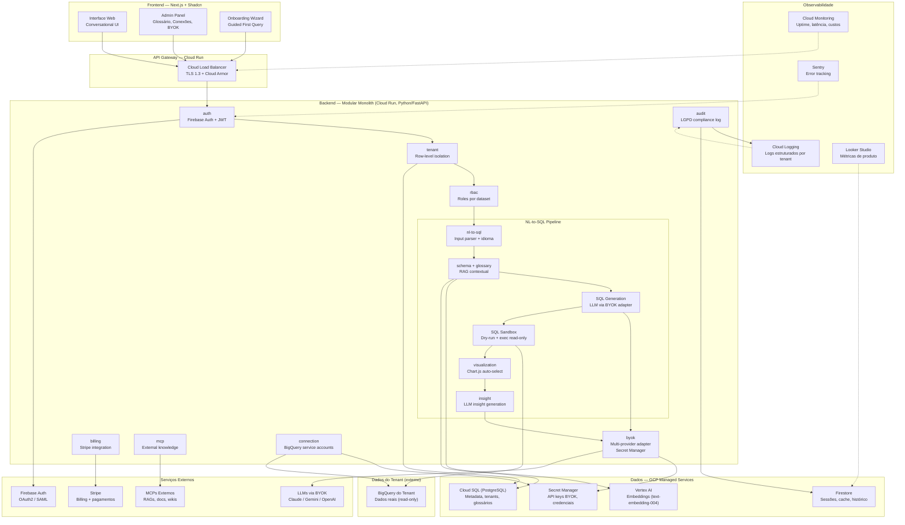
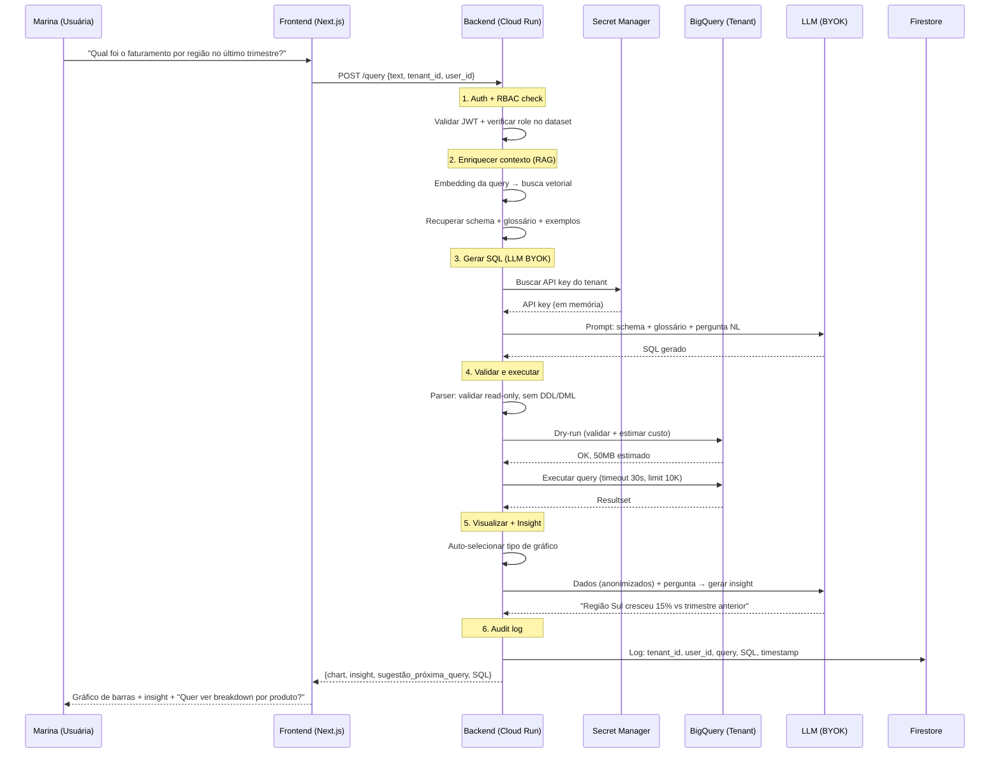
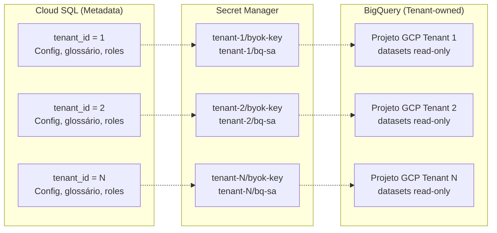

# Bloco #7 — Macro Arquitetura

> Resultado da entrevista simulada (Fase 1 — Discovery). **Consolida todas as decisões dos Blocos #1 a #6** em uma arquitetura macro coerente. Utiliza como input: stack GCP (Bloco #5), BYOK e isolamento de dados (Bloco #5), LGPD e minimização de PII (Bloco #6), pipeline NL-to-SQL (Bloco #5), modelo econômico (Blocos #1 e #3), e operação solo dev (Bloco #4).

---

## Parte 1 — Dados Coletados

### 1.1. Decisão Arquitetural: Modular Monolith

> **Referência Bloco #4 — D4.2:** Kanban pessoal, trunk-based, 1 dev + Claude Code.
> **Referência Blueprint SaaS — Componente 2:** "Monolito modular vs microsserviços? Tamanho do time, estágio do produto."

| Critério | Microsserviços | Modular Monolith | Decisão | Fonte |
|----------|:-:|:-:|:-:|-------|
| Tamanho do time | 5+ devs | 1 dev | **Monolith** | [BRIEFING] |
| Complexidade operacional | Alta (N deploys, N logs, N DBs) | Baixa (1 deploy, 1 log stream) | **Monolith** | [INFERENCE] |
| Overhead de comunicação | Network calls, serialização | Function calls in-process | **Monolith** | [INFERENCE] |
| Latência | Maior (network hops) | Menor (in-process) | **Monolith** | [INFERENCE] |
| Deploy | Complexo (orquestração) | Simples (1 container) | **Monolith** | [INFERENCE] |
| Escalabilidade | Independente por serviço | Cloud Run auto-scale (todo o app) | **Monolith** (suficiente para MVP) | [INFERENCE] |
| Migração futura | — | Módulos bem definidos → split fácil se necessário | **Monolith com fronteiras claras** | [INFERENCE] |

**Decisão: Modular Monolith** — um único serviço Cloud Run com módulos bem separados. Se no futuro (R$ 60K+ MRR, 3+ devs) for necessário, cada módulo pode ser extraído para um serviço independente.

### 1.2. Módulos do Sistema

| Módulo | Responsabilidade | Dependências | Referência |
|--------|-----------------|-------------|-----------|
| **auth** | Autenticação (Firebase), sessões, JWT | Firebase Auth | Bloco #5 — D5.5 |
| **tenant** | CRUD de tenants, isolamento row-level, configurações | Cloud SQL | Bloco #5 — D5.1 |
| **rbac** | Roles e permissões por dataset, RBAC | Cloud SQL | Bloco #2 — D2.5 |
| **connection** | Gerenciamento de conexões BigQuery, service accounts | Secret Manager, BigQuery | Bloco #5 — 1.3 |
| **byok** | Gerenciamento de API keys LLM, multi-provider adapter | Secret Manager | Bloco #5 — D5.6, Bloco #1 — D1.3 |
| **schema** | Mapeamento automático de schema, embeddings | Vertex AI, BigQuery | Bloco #5 — 1.2 |
| **glossary** | Glossário de negócio por tenant, embeddings | Cloud SQL, Vertex AI | Bloco #1 — 1.5 |
| **nl-to-sql** | Pipeline completo: NL → contexto → SQL → execução → resultado | BigQuery, LLM (via byok) | Bloco #5 — 1.2 |
| **visualization** | Seleção de gráfico, Chart.js, export PDF/HTML | — | Bloco #1 — 1.4 |
| **insight** | Geração de insights via LLM, sugestões de próxima query | LLM (via byok) | Bloco #5 — 1.2 |
| **billing** | Stripe integration, planos, trial, dunning | Stripe API | Bloco #3 — D3.8 |
| **audit** | Logging de todas as queries, compliance LGPD | Cloud Logging, Firestore | Bloco #6 — D6.1 |
| **mcp** | Integração com fontes externas via Model Context Protocol | APIs externas | Bloco #1 — 1.3 |
| **admin** | Painel administrativo do tenant (dashboard consumo, glossário, conexões) | Todos os módulos | Bloco #2 — R2 |
| **onboarding** | Wizard de setup, guided first query | schema, glossary, connection | Bloco #2 — D2.3 |

### 1.3. Diagrama de Macro Arquitetura



### 1.4. Fluxo de uma Query — End to End

> Consolida: Bloco #5 (pipeline NL-to-SQL), Bloco #6 (minimização de PII), Bloco #2 (personas).



**Latência alvo: <5 segundos** (Bloco #3 — KR1.2)

| Etapa | Latência estimada |
|:-----:|:-----------------:|
| Auth + RBAC | <50ms |
| Contexto RAG | <500ms |
| LLM (SQL generation) | <2.000ms |
| Dry-run + execução BigQuery | <1.500ms |
| Visualização + Insight LLM | <1.000ms |
| **Total** | **<5.050ms** |

### 1.5. Estratégia de Multi-Tenancy — Visão Integrada

> Consolida: Bloco #5 (D5.1), Bloco #6 (isolamento LGPD), Bloco #2 (RBAC).



**Princípios de isolamento:**

| Princípio | Implementação | Referência |
|-----------|---------------|-----------|
| Tenant A nunca vê dados de Tenant B | BigQuery é do tenant (projeto separado). Middleware obrigatório com `tenant_id`. | Bloco #5 — D5.1 |
| API key BYOK isolada por tenant | Secret Manager com path `tenants/{id}/byok-key`. IAM por secret. | Bloco #5 — D5.4 |
| Queries auditadas por tenant | Firestore com `tenant_id` em todo documento. Cloud Logging com label. | Bloco #6 — D6.1 |
| RBAC por dataset dentro do tenant | Roles (Admin/Analyst/Viewer) controlam quais datasets o usuário pode consultar. | Bloco #2 — D2.5 |
| Rate limiting por tier | Middleware verifica tier do tenant antes de cada query. | Bloco #5 — 1.3 |

### 1.6. Diagrama de Deploy e CI/CD

> **Referência Bloco #4 — D4.3:** Trunk-based development, GitHub Actions, deploy contínuo.

```mermaid
graph LR
    subgraph "Desenvolvimento"
        Dev["Fabio + Claude Code"]
        Git["GitHub (main branch)"]
    end

    subgraph "CI/CD — GitHub Actions"
        Lint["Lint + Type Check"]
        Test["Unit + Integration Tests"]
        Build["Docker Build"]
        Push["Push to Artifact Registry"]
        Deploy["Deploy to Cloud Run"]
    end

    subgraph "Ambientes"
        Staging["Cloud Run — Staging<br/>(testes E2E, smoke)"]
        Prod["Cloud Run — Production<br/>(auto-scale 1-10)"]
    end

    Dev -->|push| Git
    Git -->|trigger| Lint
    Lint --> Test
    Test --> Build
    Build --> Push
    Push --> Deploy
    Deploy --> Staging
    Staging -->|aprovação manual ou auto| Prod
```



**Regras de deploy:**

| Regra | Detalhe | Referência |
|-------|---------|-----------|
| Zero-downtime | Cloud Run rolling update (novas instâncias antes de remover antigas) | Bloco #4 — KR3.4 |
| No-deploy Friday | Nenhum deploy após 14h de sexta-feira | Bloco #4 — R2 |
| Rollback instantâneo | Cloud Run mantém revisão anterior, rollback em 1 clique | Bloco #4 — 1.3 |
| Testes obrigatórios | Pipeline falha se testes não passam | Bloco #4 — D4.3 |
| Staging antes de prod | Smoke test em staging antes de promover | [INFERENCE] |

### 1.7. Disaster Recovery e Backup

| Componente | Backup | RTO | RPO | Fonte |
|-----------|--------|:---:|:---:|-------|
| Cloud SQL (metadata) | Backup automático diário + HA failover | <5 min (failover) | <24h (backup) | [INFERENCE] |
| Firestore (histórico) | Backup automático diário | <1h (restore) | <24h | [INFERENCE] |
| Secret Manager | Versionamento nativo (sem backup necessário) | Instantâneo | Zero | [INFERENCE] |
| BigQuery (dados do tenant) | Responsabilidade do tenant | N/A | N/A | [INFERENCE] |
| Cloud Run (código) | Docker image no Artifact Registry + GitHub | <5 min (redeploy) | Zero (código no Git) | [INFERENCE] |
| Vertex AI (embeddings) | Re-gerar a partir dos dados fonte | <1h (re-embed) | Zero (dados fonte no Cloud SQL) | [INFERENCE] |

### 1.8. Decisões Arquiteturais Consolidadas (ADRs)

| ADR | Decisão | Alternativa rejeitada | Razão | Blocos de origem |
|:---:|---------|----------------------|-------|:----------------:|
| ADR-001 | Modular Monolith | Microsserviços | 1 dev, complexidade operacional, latência | #4, #5 |
| ADR-002 | Row-level tenancy (metadata) + dataset isolation (dados) | Database-per-tenant | Custo (1 Cloud SQL vs N), simplicidade | #5 |
| ADR-003 | RAG contextual (sem fine-tuning) | Fine-tuning de LLM | BYOK multi-provider, contexto dinâmico por tenant, zero custo de treino | #1, #5 |
| ADR-004 | BYOK com adapter pattern | LLM absorvido pela plataforma | Elimina maior custo variável, margem 80-90% | #1, #3, #5 |
| ADR-005 | Firebase Auth (não custom) | Auth from scratch | Build vs Buy, 1 dev não pode gastar semanas em auth | #5 |
| ADR-006 | Stripe (não custom billing) | Billing custom | Build vs Buy, Stripe resolve 90% no MVP | #3 |
| ADR-007 | Schema abstrato nos prompts LLM | Sample data nos prompts | Minimização de PII (LGPD), reduz tokens | #6 |
| ADR-008 | SQL dry-run antes de toda execução | Executar diretamente | Previne custo surpresa BigQuery, valida SQL | #5 |
| ADR-009 | Monitoramento GCP-nativo + Sentry | Datadog / New Relic | Zero custo, suficiente para solo dev | #4, #5 |
| ADR-010 | Cache de queries no Firestore | Sem cache | Economia 30-50% em LLM e BigQuery | #5 |
| ADR-011 | Retenção diferenciada por tier | Retenção única | Feature de plano + minimização LGPD | #3, #6 |
| ADR-012 | DPA obrigatório para Pro/Enterprise | Sem DPA | LGPD, exigência do Gatekeeper (Carla) | #6 |

### 1.9. Mapa de Dependências Externas

| Dependência | Criticidade | Fallback | SLA do provider | Risco | Fonte |
|-------------|:----------:|---------|:-:|-------|-------|
| **GCP Cloud Run** | Crítica | N/A (core do sistema) | 99.95% | Baixo | [BRIEFING] |
| **GCP BigQuery** | Crítica | N/A (core — banco dos tenants) | 99.99% | Muito baixo | [BRIEFING] |
| **GCP Cloud SQL** | Crítica | HA failover automático | 99.95% (com HA) | Baixo | [INFERENCE] |
| **GCP Firestore** | Alta | Degradação graceful (sem cache/histórico) | 99.999% | Muito baixo | [INFERENCE] |
| **Firebase Auth** | Crítica | N/A (sem auth = sem acesso) | 99.95% | Baixo | [INFERENCE] |
| **Anthropic API (Claude)** | Alta (BYOK) | Fallback para outro provider do tenant | 99.5%+ | Médio | [INFERENCE] |
| **Google AI (Gemini)** | Alta (pool Free + BYOK) | Fallback para outro provider | 99.5%+ | Médio | [INFERENCE] |
| **OpenAI API** | Média (BYOK) | Fallback para outro provider | 99.5%+ | Médio | [INFERENCE] |
| **Stripe** | Alta | Modo leitura (existentes continuam, novos aguardam) | 99.99% | Muito baixo | [INFERENCE] |
| **Vertex AI** | Média | Embeddings pré-computados servem consultas | 99.9% | Baixo | [INFERENCE] |

---

## Parte 2 — Análise do Especialista

### A Arquitetura está Coerente com as Restrições

A arquitetura proposta respeita todas as restrições identificadas nos blocos anteriores:

1. **1 dev + Claude Code (Bloco #4)** → Modular Monolith, não microsserviços. Correto. Com 1 pessoa, cada serviço adicional é mais um pipeline de CI/CD, mais um log para monitorar, mais um ponto de falha. O monolith modular é o padrão de ouro para startups solo.

2. **BYOK (Bloco #1)** → Adapter pattern isolando providers. Correto. O adapter permite trocar Claude por Gemini por OpenAI sem mudar o core. Cada tenant configura seu provider, o sistema é agnóstico.

3. **Pay-per-use (Bloco #1)** → Cloud Run + BigQuery + Firestore. Correto. A tríade serverless do GCP é genuinamente pay-per-use. Sem tráfego, custo ~R$ 250/mês (apenas Cloud SQL fixo).

4. **LGPD (Bloco #6)** → Schema abstrato nos prompts, audit log, retenção por tier. Correto. A arquitetura minimiza PII em trânsito e garante rastreabilidade.

5. **Break-even ~27 Pro (Bloco #3)** → Custo variável ~R$ 70/tenant. Correto. A arquitetura serverless mantém o custo variável baixo, e BYOK elimina o custo de LLM.

### Ponto de Evolução: Quando Migrar para Microsserviços?

O modular monolith tem um **ponto de ruptura**. Sinais de que é hora de extrair serviços:

| Sinal | Threshold | Ação |
|-------|:---------:|------|
| Deploy leva >10 minutos | Build muito grande | Extrair frontend para CDN/Vercel |
| NL-to-SQL precisa de GPU | Modelo custom local | Extrair pipeline para Cloud Run com GPU |
| Billing precisa de webhook 24/7 | Volume de eventos | Extrair billing para Cloud Function |
| 3+ devs trabalhando no mesmo repo | Conflitos de merge | Extrair módulos com mais conflitos |

**Previsão:** Isso não acontece antes de R$ 60K MRR e 3 devs (Bloco #4, milestone de contratação).

### Análise de Latência

O budget de latência (<5s total) é **apertado mas viável**:

- **Gargalo principal:** Chamada LLM (~2s). Mitigações: cache de queries frequentes (Bloco #5 — R2), prompt otimizado (menos tokens = menos latência).
- **Segundo gargalo:** BigQuery query (~1.5s). Mitigações: dry-run + queries simples first, cache de resultados.
- **Risco:** Queries complexas (JOINs múltiplos, subqueries) podem estourar 5s. Solução: indicador de progresso + streaming de resultado parcial.

### Consistência com Todos os Blocos

| Bloco | Decisão-chave | Como a arquitetura reflete |
|:-----:|---------------|---------------------------|
| #1 | BYOK, Free/Pro/Enterprise | Módulo `byok` com adapter, módulo `billing` com Stripe, rate limiting por tier |
| #2 | 4 personas, RBAC, guided first query | Módulos `rbac`, `onboarding`, painel admin |
| #3 | R$ 497/Pro, break-even 27+3 | Custo variável ~R$ 70/tenant (serverless), margem 80-90% |
| #4 | 1 dev, Kanban, trunk-based | Modular Monolith, 1 container, CI/CD simples |
| #5 | Stack GCP, pipeline NL-to-SQL, Secret Manager | Todos os serviços GCP mapeados, pipeline detalhado |
| #6 | LGPD, DPA, retenção por tier | Módulo `audit`, schema abstrato, purge automático |

---

## Parte 3 — Recomendações

### R1. Implementar "Feature Flags" desde o MVP

**Problema:** Com 1 container e todos os módulos juntos, como lançar features progressivamente? Como dar funcionalidades Enterprise apenas para Enterprise?

**Recomendação:** Feature flags simples (sem LaunchDarkly — overhead para 1 dev):

```python
# Config por tenant no Cloud SQL
feature_flags = {
    "mcp_integration": {"enabled": True, "tiers": ["pro", "enterprise"]},
    "column_masking": {"enabled": False, "tiers": ["enterprise"]},
    "export_pdf": {"enabled": True, "tiers": ["pro", "enterprise"]},
}
```

- Flags armazenadas no Cloud SQL, por tenant e por tier
- Middleware FastAPI verifica flag antes de cada endpoint
- Permite beta testing com tenants específicos
- Zero custo (dados no Cloud SQL existente)

### R2. Separar frontend em deploy independente desde o início

**Problema:** Next.js no mesmo container que FastAPI é possível mas complica o build e aumenta o tempo de deploy.

**Recomendação:**
- **Backend:** Cloud Run (Python/FastAPI) — API pura
- **Frontend:** Vercel (free tier) ou Cloud Run separado — Next.js SSR
- **Benefício:** Deploys independentes. Mudança de UI não afeta backend. CDN global gratuito no Vercel.
- **Custo:** R$ 0 (Vercel free tier cobre MVP)

### R3. Implementar "Circuit Breaker" para dependências externas

**Problema:** Se Anthropic API cair, as queries de todos os tenants com Claude param. Se BigQuery de um tenant estiver lento, não deve afetar outros.

**Recomendação:**
- Circuit breaker por provider de LLM (Claude, Gemini, OpenAI)
- Circuit breaker por conexão BigQuery (por tenant)
- Implementação: biblioteca `tenacity` (Python) ou custom com Redis/Firestore
- Fallback: se provider primário do tenant falhar, sugerir trocar para outro (se tiver key configurada)

### R4. Projetar para observabilidade por tenant desde o dia 1

**Problema:** Com row-level tenancy, é fácil perder a visão "por tenant" nos logs e métricas.

**Recomendação:**
- Toda request inclui `tenant_id` no contexto (middleware obrigatório)
- Todos os logs têm label `tenant_id` (Cloud Logging)
- Métricas customizadas por tenant: queries/dia, latência média, errors
- Dashboard de "saúde por tenant" — útil para debugging e customer success

### R5. Documentar ADRs desde o primeiro dia

**Problema:** Bus factor = 1 (Bloco #4). Se Fabio ficar indisponível, ninguém sabe por que as decisões arquiteturais foram tomadas.

**Recomendação:**
- Um ADR por decisão significativa (os 12 ADRs da seção 1.8 são o início)
- Formato simples: Contexto, Decisão, Consequências
- Armazenados no repositório (`docs/adr/`)
- Claude Code pode ajudar a escrever e manter os ADRs atualizados

---

## Decisões Registradas

| # | Decisão | Justificativa | Status |
|---|---------|---------------|--------|
| D7.1 | Modular Monolith (não microsserviços) | 1 dev, complexidade operacional, latência, deploy simples | Confirmada |
| D7.2 | 15 módulos definidos com fronteiras claras | Facilita split futuro, separação de concerns | Confirmada |
| D7.3 | Frontend separado (Vercel ou Cloud Run independente) | Deploy independente, CDN gratuito, build mais rápido | Recomendada |
| D7.4 | Feature flags por tenant/tier no Cloud SQL | Lançamento progressivo sem overhead de ferramenta externa | Recomendada |
| D7.5 | Circuit breaker por provider LLM e por conexão BigQuery | Resiliência, isolamento de falhas entre tenants | Recomendada |
| D7.6 | Observabilidade com `tenant_id` em todo log e métrica | Debugging por tenant, customer success, compliance | Confirmada |
| D7.7 | 12 ADRs documentados (seção 1.8) | Bus factor mitigation, rastreabilidade de decisões | Confirmada |
| D7.8 | RTO <5 min para componentes críticos (Cloud SQL HA, Cloud Run redeploy) | SLA 99.5% Pro, 99.9% Enterprise | Confirmada |

---

> **Próximo bloco:** #8 — TCO e Build vs Buy (usa arquitetura deste bloco para calcular custos detalhados)
