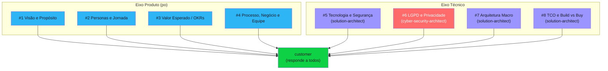
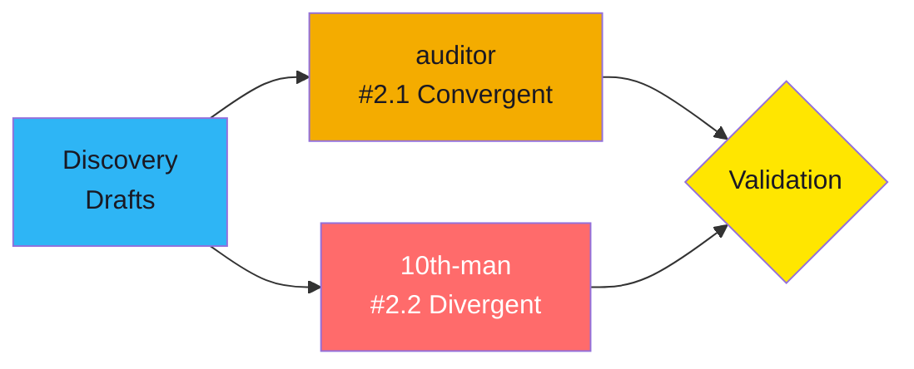
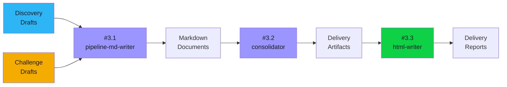

# Discovery Pipeline v0.5

Guia completo que explica passo a passo como o pipeline de discovery conduz o levantamento de requisitos — desde o briefing inicial até o delivery report final.

> [!info] Sobre este documento
> Este é um **how-to** (guia operacional). As regras formais estão em `dtg-artifacts/rules/`. Os templates estão em `dtg-artifacts/templates/`. As skills dos agentes estão em `dtg-artifacts/skills/` (locais) e `.claude/skills/` (globais).

---

## 📋 Visão Geral

O pipeline opera em **3 fases sequenciais**, cada uma com um **Human Review** entre elas. O humano sempre tem a palavra final.


| Fase | Nome | Agentes | Output |
|------|------|---------|--------|
| Setup | Preparação | orchestrator | scaffold, knowledge base, config.md |
| 1 | Discovery | customer, po, solution-architect, cyber-security-architect, custom-specialist | 8 result files + interview log |
| — | Human Review | humano | Decisão: re-executar, avançar ou abortar |
| 2 | Challenge | auditor, 10th-man (em paralelo) | 2.1-convergent-validation + 2.2-divergent-validation |
| — | Human Review | humano | Decisão: re-executar, avançar ou abortar |
| 3 | Delivery | pipeline-md-writer, consolidator, html-writer | final-report.md + .html |
| — | Human Review | humano | Decisão: re-executar, avançar ou abortar |

---

## 🚀 Setup

**Gatilho:** Humano fornece um `briefing.md` e solicita início do pipeline.

### O que o orchestrator faz

1. **Cria o scaffold** da run em `runs/run-{n}/`
2. **Detecta o knowledge pack** a partir de sinais no briefing (ex: "SaaS multi-tenant" → pack `saas`)
3. **Copia o knowledge pack** de `base-artifacts/context-templates/{pack}/` para `{run}/setup/customization/current-context/`
4. **Copia os defaults de customization** de `dtg-artifacts/templates/customization/` para `{run}/setup/customization/` (sub-folders: `report-templates/`, `rules/`)
5. **Cria o config.md** em `{run}/setup/` com plano de execução
6. **Cria o pipeline-state.md** (state tracker mantido ao longo de toda a run, append-only)

### Scaffold criado

```
runs/run-{n}/
├── pipeline-state.md                         ← estado + snapshots (append-only)
├── setup/
│   ├── briefing.md                           ← input do humano
│   ├── config.md                             ← configuração da run
│   └── customization/
│       ├── current-context/                  ← knowledge pack copiado
│       │   ├── {pack}.md
│       │   └── {pack}-specialists.md
│       ├── report-templates/                 ← templates de output
│       │   ├── final-report-template.md
│       │   └── human-review-template.md
│       └── rules/                            ← políticas da run
│           ├── iteration-policy.md
│           └── scoring-thresholds.md
├── iterations/
│   └── iteration-1/
│       ├── logs/
│       └── results/
│           ├── 1-discovery/
│           ├── 2-challenge/
│           └── 3-delivery/
└── delivery/
```

> [!tip] Customização por cliente
> Se o cliente tem overrides específicos em `custom-artifacts/{client}/`, o orchestrator usa esses ao invés dos defaults de `dtg-artifacts/templates/customization/`.

---

## 🔵 Fase 1 — Discovery (Reunião Conjunta Temática)

**Objetivo:** Levantar requisitos completos do projeto através de uma reunião simulada com 8 blocos temáticos.

### Agentes envolvidos

| Agente | Papel | Blocos |
|--------|-------|--------|
| **customer** | Simula o cliente, responde perguntas | Todos (interlocutor) |
| **po** | Product Owner — visão, personas, valor, organização | #1, #2, #3, #4 |
| **solution-architect** | Arquitetura, tecnologia, TCO | #5, #7, #8 |
| **cyber-security-architect** | Privacidade, segurança, compliance | #6 |
| **custom-specialist** | Especialista de domínio sob demanda | Quando solicitado |

### 8 Blocos Temáticos



| Bloco | Tema | Dono | O que levanta |
|-------|------|------|---------------|
| #1 | Visão e Propósito | po | Problema, público-alvo, proposta de valor |
| #2 | Personas e Jornada | po | Perfis de uso, jornadas, dores |
| #3 | Valor Esperado / OKRs | po | Métricas, ROI, critérios de sucesso |
| #4 | Processo, Negócio e Equipe | po | Organização, stakeholders, equipe |
| #5 | Tecnologia e Segurança | solution-architect | Stack, integrações, segurança |
| #6 | LGPD e Privacidade | cyber-security-architect | Dados pessoais, compliance, DPO |
| #7 | Arquitetura Macro | solution-architect | Padrões, camadas, escalabilidade |
| #8 | TCO e Build vs Buy | solution-architect | Custo total, alternativas, viabilidade |

### Dinâmica da reunião

- Formato de **reunião síncrona** — todos presentes, falam na ordem dos blocos
- Qualquer agente pode pedir a voz para **apartes curtos** relevantes
- O **customer** responde baseado no briefing + knowledge pack
- Se um agente precisa de profundidade em domínio específico, pede **help** e o orchestrator invoca o **custom-specialist**
- Dados marcados como `[BRIEFING]`, `[RAG]` ou `[INFERENCE]` para rastreabilidade

### Outputs da Fase 1

| Arquivo | Autor | Descrição |
|---------|-------|-----------|
| `iterations/iteration-{i}/results/1-discovery/1.1-purpose-and-vision.md` | po | Visão e propósito |
| `iterations/iteration-{i}/results/1-discovery/1.2-personas-and-journey.md` | po | Personas e jornadas |
| `iterations/iteration-{i}/results/1-discovery/1.3-value-and-okrs.md` | po | Valor esperado, OKRs |
| `iterations/iteration-{i}/results/1-discovery/1.4-process-business-and-team.md` | po | Processo, negócio, equipe |
| `iterations/iteration-{i}/results/1-discovery/1.5-technology-and-security.md` | solution-architect | Stack, segurança, integrações |
| `iterations/iteration-{i}/results/1-discovery/1.6-privacy-and-compliance.md` | cyber-security-architect | LGPD, dados pessoais, compliance |
| `iterations/iteration-{i}/results/1-discovery/1.7-macro-architecture.md` | solution-architect | Arquitetura macro |
| `iterations/iteration-{i}/results/1-discovery/1.8-tco-and-build-vs-buy.md` | solution-architect | TCO, Build vs Buy |
| `iterations/iteration-{i}/logs/interview.md` | orchestrator | Transcrição completa da reunião |

### State Snapshot

Ao concluir a Fase 1, o orchestrator appenda um snapshot em `pipeline-state.md` — registro imutável com resumo de decisões, pendências e próxima ação.

---

## 👤 Human Review

Após cada fase, o pipeline **pausa** e apresenta o material ao humano para revisão. O humano preenche:

1. **Observações gerais** — anotações livres sobre o material
2. **Perguntas em aberto** — no formato:

```
❓ 1) Qual é o stack tecnológico preferido?
   R. {resposta do humano}

❓ 2) O projeto terá integração com sistemas legados?
   R. {resposta do humano}
```

3. **Correções pontuais** — erros específicos com referência exata
4. **Decisão** — uma das 4 opções:

```
- [ ] Re-executar desde a 1ª fase.
- [ ] Re-executar a última fase.
- [ ] Avançar para a próxima fase.
- [ ] Abortar — use '@' ao invés de 'X' para confirmar.
```

> [!info] Em todos os cenários a memória persiste o que foi feito até agora. Se nenhuma opção for marcada, o orchestrator assume **re-executar desde a 1ª fase**.

### Como o orchestrator processa cada decisão

| Decisão | Ação |
|---------|------|
| **Re-executar desde a 1ª fase** | Incorpora comentários, cria nova iteração (`iteration-{i+1}`), reinicia desde a Fase 1 mantendo histórico |
| **Re-executar a última fase** | Incorpora comentários, re-executa apenas a última fase dentro do mesmo round (nova passagem) |
| **Avançar para a próxima fase** | Finaliza o round, gera memory file, avança para a próxima fase |
| **Abortar** | Verifica se marcado com `@`. Se sim, encerra pipeline. Se não, pede confirmação novamente |

### Registro

Cada passagem do HR Loop é registrada em `iteration-{i}/logs/hr-loop-round{N}-pass{M}.md`.

---

## 🟡 Fase 2 — Challenge (Validação Convergente + Divergente)

**Objetivo:** Validar a qualidade e robustez dos drafts produzidos na Fase 1.

### Agentes envolvidos (em paralelo)



| Agente | Tipo | O que faz |
|--------|------|-----------|
| **auditor** | Convergente (#2.1) | Valida qualidade dos drafts contra 5 dimensões com pisos mínimos |
| **10th-man** | Divergente (#2.2) | Desafia premissas, busca pontos cegos. Pergunta-chave: "O que NÃO foi feito é aceitável?" |

> [!warning] Paralelo e independente
> Auditor e 10th-man rodam **ao mesmo tempo**, sem dependência entre si. Ambos recebem os mesmos drafts e produzem relatórios independentes.

### Outputs da Fase 2

| Arquivo | Autor |
|---------|-------|
| `iterations/iteration-{i}/results/2-challenge/2.1-convergent-validation.md` | auditor |
| `iterations/iteration-{i}/results/2-challenge/2.2-divergent-validation.md` | 10th-man |

### State Snapshot

Ao concluir, o orchestrator appenda um snapshot em `pipeline-state.md` com verdicts dos gates, notas por dimensão e decisão consolidada.

---

## 🟢 Fase 3 — Delivery (Documentação + Consolidação + Reports)

**Objetivo:** Transformar os drafts aprovados em documentos finais polidos e report HTML.

### Sub-fases



| # | Sub-fase | Agente | Input | Output |
|---|----------|--------|-------|--------|
| 3.1 | Documents creation | pipeline-md-writer | Drafts aprovados | Markdown polido |
| 3.2 | Consolidation | consolidator | Markdown documents | final-report.md |
| 3.3 | Reports | html-writer | final-report.md | final-report.html |

### Outputs da Fase 3

| Arquivo | Descrição |
|---------|-----------|
| `delivery/final-report.md` | Relatório consolidado final |
| `delivery/final-report.html` | Versão HTML auto-contida |

### State Snapshot

Snapshot final appendado em `pipeline-state.md` — resumo de token consumption e sign-off.

---

## 🔄 Iterações

Quando o humano escolhe **re-executar desde a 1ª fase**, o orchestrator cria uma nova iteração:

```
runs/run-{n}/
├── iterations/
│   ├── iteration-1/     ← primeira tentativa (histórico preservado)
│   │   ├── logs/
│   │   └── results/
│   │       ├── 1-discovery/
│   │       ├── 2-challenge/
│   │       └── 3-delivery/
│   ├── iteration-2/     ← segunda tentativa (herda results da anterior)
│   │   ├── logs/
│   │   └── results/
│   └── iteration-3/     ← terceira tentativa
```

### Regras de iteração

- Results **não-afetados** são herdados da iteração anterior (cópia direta)
- Results **afetados** pelos comentários do humano são regenerados
- Snapshots no `pipeline-state.md` são **imutáveis** — append-only, nunca editados
- Cada iteração tem seus próprios `logs/` e `results/`
- O `pipeline-state.md` é atualizado continuamente com tracking de tokens por fase/iteração

### Limites

Os limites de iterações são configuráveis em `setup/customization/rules/iteration-policy.md`:
- Máximo de iterações por run
- Threshold de estagnação (se notas não melhoram entre iterações)
- Política de auto-restart após abortar

---

## 📊 Token Tracking

O orchestrator mantém um tracking contínuo de consumo de tokens:

| Onde | O que rastreia |
|------|----------------|
| `pipeline-state.md` | Tabela de tokens por fase por iteração + snapshots após cada fase |

---

## 📦 Knowledge Packs

O pipeline usa knowledge packs (em `base-artifacts/context-templates/`):

| Pack | Quando usar |
|------|-------------|
| `saas` | Projetos SaaS multi-tenant |
| `datalake-ingestion` | Pipelines de dados / ETL |
| `process-documentation` | Documentação de processos existentes |
| `web-microservices` | Aplicações web com microserviços |

Cada pack tem:
- `context.md` — concerns, perguntas recomendadas, checklist por bloco temático
- `specialists.md` — catálogo de custom-specialists disponíveis para o domínio

O orchestrator auto-detecta o pack a partir de sinais no briefing. Se ambíguo, roda em modo genérico.

---

## 🛠️ Skills do Pipeline

### Locais (em `dtg-artifacts/skills/`)

| Skill | Fase | Papel |
|-------|------|-------|
| orchestrator | Todas | Orquestra, cria scaffold, gerencia estado |
| customer | 1 | Simula o cliente |
| auditor | 2 | Validação convergente (5 dimensões) |
| pipeline-md-writer | 3 | Formata drafts em markdown polido |
| consolidator | 3 | Consolida tudo no delivery report |

### Globais (em `.claude/skills/`)

| Skill | Fase | Papel |
|-------|------|-------|
| po | 1 | Product analysis — visão, personas, valor |
| solution-architect | 1 | Technical analysis — arquitetura, TCO |
| cyber-security-architect | 1 | Privacy/security — LGPD, compliance |
| custom-specialist | 1 | Domain expertise sob demanda |
| 10th-man | 2 | Validação divergente (devil's advocate) |
| html-writer | 3 | Gera HTML a partir do delivery report |

---

## 📏 Regras do Pipeline

| Regra | O que governa |
|-------|---------------|
| `dtg-artifacts/rules/discovery/` | Fases, blocos temáticos, critérios de conclusão |
| `dtg-artifacts/rules/iteration-loop/` | Iterações, limites, critérios de convergência |
| `dtg-artifacts/rules/analyst-discovery-log/` | Log cronológico obrigatório |
| `dtg-artifacts/rules/audit-log/` | Log de auditoria |
| `dtg-artifacts/rules/requirement-priority/` | Classificação de requisitos |
| `dtg-artifacts/rules/token-tracking/` | Rastreamento de tokens |

---

## 🔗 Documentos Relacionados

- `docs/quick-start.md` — Como iniciar uma run rapidamente
- `docs/logging-process.md` — Como funciona o logging
- `dtg-artifacts/templates/` — Templates de todos os artefatos
- `dtg-artifacts/templates/customization/human-review-template.md` — Template do Human Review

## 📜 Histórico de Alterações

| Versão | Data | Descrição |
|--------|------|-----------|
| 01.00.000 | 2026-04-10 | Reescrita completa para Pipeline v0.5. Substitui documento do Pipeline v2 (3 sub-etapas com mini-ciclos) pelo novo formato de 3 fases (Discovery com reunião conjunta, Challenge com auditor + 10th-man em paralelo, Delivery com md-writer + consolidator + html-writer). Novas opções de Human Review (Re-executar, Refazer, Avançar, Abortar). Scaffold de runs. Knowledge packs globais. |
