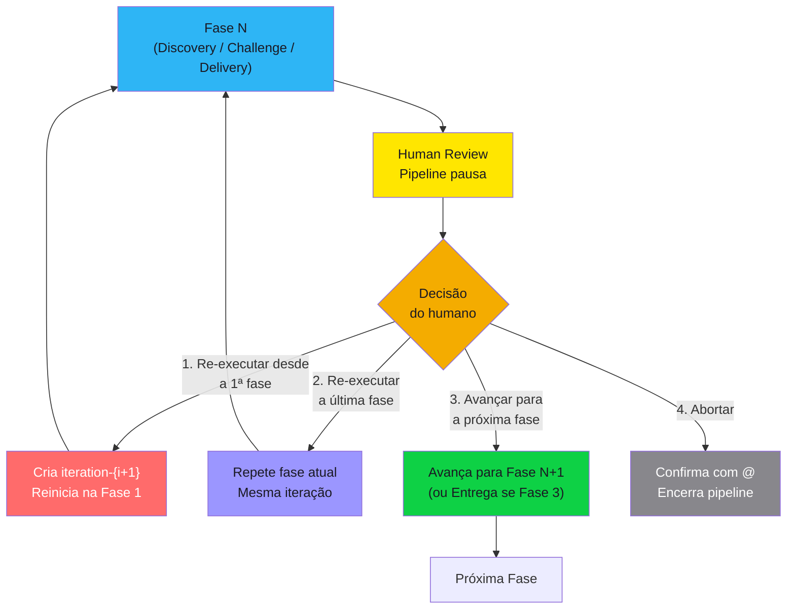

# Iteration Loop

Regra que define o **ciclo de iteração entre fases** do Discovery Pipeline v0.5. O pipeline opera em 3 fases sequenciais (Discovery, Challenge, Delivery), cada uma seguida de um **Human Review** que pausa a execução. O humano decide se o pipeline avança, repete ou reinicia. Iterações são criadas quando o humano escolhe **re-executar desde a 1a fase**.

> [!danger] Regra inviolável
> O pipeline **nunca avança sem decisão explícita do humano**. Após cada fase, o HR Loop apresenta o material e aguarda uma das 4 opções. Documentos existentes são **atualizados incrementalmente** — nunca reescritos do zero.

> [!danger] Memória persiste em todos os cenários
> Independente da decisão do humano (re-executar, refazer, avançar ou abortar), a memória acumulada até aquele ponto é **preservada e acessível** para todas as fases subsequentes.

> [!danger] Iterações são criadas apenas por decisão humana
> Uma nova iteração (`iteration-{i+1}`) só é criada quando o humano escolhe "Re-executar desde a 1a fase". Todas as outras opções operam dentro da iteração corrente.

---

## Fluxo de Iteração por Fase



> [!info] Escopo da iteração
> Uma iteração percorre as 3 fases do pipeline (Discovery → Challenge → Delivery). Re-executar desde a 1a fase cria uma nova iteração inteira. Re-executar a última fase é uma **passagem adicional** dentro da mesma iteração.

---

## As 4 Decisões do Human Review

| # | Decisão | Iteração | Escopo | Comportamento |
|---|---------|----------|--------|---------------|
| 1 | **Re-executar desde a 1a fase** (default) | Cria `iteration-{i+1}` | Pipeline inteiro | Incorpora comentários, herda drafts não-afetados, reinicia na Fase 1 |
| 2 | **Re-executar a última fase** | Mesma iteração | Fase atual | Nova passagem (pass P+1) — repete apenas a fase que acabou de rodar |
| 3 | **Avançar para a próxima fase** | Mesma iteração | Próxima fase | Gera memory file, avança para Fase N+1 (ou Entrega se Fase 3) |
| 4 | **Abortar** | N/A | Pipeline encerra | Requer confirmação com `@`. Gera change request formal |

> [!info] Default conservador
> Se nenhuma opção for marcada, o orchestrator assume **Re-executar desde a 1a fase**. Esse default é configurável em `setup/customization/rules/iteration-policy.md` (`hr-loop-default-answer`).

---

## Scaffold de Iterações

Cada iteração vive em sua própria pasta dentro da run:

```
runs/run-{n}/
├── pipeline-state.md                         ← estado + snapshots (append-only)
├── setup/
│   ├── briefing.md
│   ├── config.md
│   └── customization/
│       ├── current-context/
│       ├── report-templates/
│       │   ├── final-report-template.md
│       │   └── human-review-template.md
│       └── rules/
│           ├── iteration-policy.md
│           └── scoring-thresholds.md
├── iterations/
│   ├── iteration-1/              ← primeira tentativa
│   │   ├── logs/
│   │   │   ├── interview.md
│   │   │   ├── hr-loop-round1-pass1.md
│   │   │   └── ...
│   │   └── results/
│   │       ├── 1-discovery/
│   │       ├── 2-challenge/
│   │       └── 3-delivery/
│   ├── iteration-2/              ← criada por decisão 1 do HR
│   │   ├── logs/
│   │   └── results/
│   └── iteration-3/              ← criada por decisão 1 do HR
│       └── ...
└── delivery/
```

### Regras do scaffold

| Regra | Descrição |
|-------|-----------|
| **Herança de results** | Results não-afetados pelos comentários do humano são copiados da iteração anterior |
| **Results afetados** | São regenerados na nova iteração, incorporando observações, respostas e correções |
| **Snapshots imutáveis** | Snapshots appendados no `pipeline-state.md` nunca são editados |
| **Logs por iteração** | Cada iteração tem seus próprios `logs/` independentes |
| **Pipeline-state contínuo** | O `pipeline-state.md` é único por run e atualizado (append-only) ao longo de todas as iterações |

---

## Seções de Iteração nos Documentos

A partir da **iteração 2**, cada documento afetado recebe uma seção de iteração no formato padronizado. Essa seção é **adicionada** ao documento existente, nunca substitui o conteúdo original.

### Formato obrigatório

```markdown
## Iteracao N — YYYY-MM-DD HH:mm

### Contexto da iteracao

> (O que motivou esta iteração — observações do humano, perguntas respondidas, correções solicitadas)

### O que mudou

| Item | Antes | Depois | Motivo |
| ---- | ----- | ------ | ------ |
| (aspecto alterado) | (valor/texto anterior) | (valor/texto novo) | (por que mudou) |

### Novas analises

> (Análises adicionais realizadas nesta iteração que não existiam antes)

### Mudancas de direcao

> (Decisões que foram revertidas ou significativamente alteradas. Se nenhuma, explicitar: "Nenhuma mudança de direção nesta iteração.")
```

> [!warning] Append-only
> A seção de iteração é **append-only**. Cada nova iteração adiciona uma nova seção `Iteracao N`. Seções de iterações anteriores **nunca são editadas**.

---

## Critérios de Convergência

| Cenario | Condicao | Acao |
|---------|----------|------|
| **Convergiu** | Humano marca "Avançar para a próxima fase" | Pipeline avança para fase seguinte (ou Entrega se Fase 3) |
| **Ajuste parcial** | Humano marca "Re-executar a última fase" | Nova passagem da mesma fase, mesma iteração |
| **Revisão ampla** | Humano marca "Re-executar desde a 1a fase" | Nova iteração completa (`iteration-{i+1}`) |
| **Estagnação** | Crescimento de contexto < threshold por N iterações consecutivas | Orchestrator emite alerta — decisão humana obrigatória |
| **Limite máximo** | `max-iterations` atingido (se configurado) | Pipeline para — decisão humana obrigatória |
| **Abortar** | Humano marca "Abortar" com `@` | Pipeline encerra formalmente |

### Estagnação

O orchestrator monitora a evolução entre iterações. Se o crescimento de contexto for menor que o `stagnation-threshold` (default: 10%) por `stagnation-consecutive` iterações seguidas (default: 2), emite alerta:

```
⚠️ ALERTA DE ESTAGNAÇÃO
Iterações {i-1} e {i} apresentaram crescimento de contexto < 10%.
O material não está evoluindo significativamente.
Recomendação: revisar o briefing ou fornecer informações adicionais.
```

> [!danger] Estagnação não bloqueia — alerta
> O alerta é informativo. A decisão final continua sendo do humano via HR Loop. Os parâmetros de estagnação são configuráveis em `setup/customization/rules/iteration-policy.md`.

---

## Iteration Policy (Customização)

Os limites e comportamentos de iteração são configuráveis no arquivo `setup/customization/rules/iteration-policy.md` copiado para cada run. Parâmetros principais:

| Parâmetro | Default | Efeito |
|-----------|---------|--------|
| `max-iterations` | `0` (sem limite) | Cap numérico de iterações por run |
| `stagnation-threshold` | `10%` | Mínimo de crescimento de contexto entre iterações |
| `stagnation-consecutive` | `2` | Iterações consecutivas abaixo do threshold antes do alerta |
| `hr-loop-default-answer` | `Re-executar desde a 1ª fase` | O que acontece quando nenhuma opção é marcada |
| `hr-loop-max-passes` | `0` (sem limite) | Max passagens do HR Loop em um mesmo round |
| `abort-requires-confirmation` | `true` | Exige `@` para confirmar abort |

> [!tip] Combinações típicas
> Consulte `setup/customization/rules/iteration-policy.md` para exemplos de configurações conservadoras (cliente exigente) e rápidas (POC/spike).

---

## Tipos de Entrada no Log

| Tipo | Quando usar |
|------|-------------|
| **Início de iteração** | Quando uma nova iteração (`iteration-{i+1}`) é criada |
| **Human Review** | Quando o HR Loop apresenta material ao humano |
| **Decisão registrada** | Quando o humano devolve o HR Loop com decisão marcada |
| **Nova passagem** | Quando a mesma fase é re-executada (opção 2) |
| **Fase concluída** | Quando o humano autoriza avanço para próxima fase |
| **Estagnação** | Quando o alerta de estagnação é emitido |
| **Abort** | Quando o pipeline é encerrado por decisão humana |

---

## Token Tracking

Cada iteração e fase tem seu consumo de tokens rastreado:

| Onde | O que rastreia |
|------|----------------|
| `pipeline-state.md` | Tabela de tokens por fase por iteração + snapshots após cada fase |

> [!warning] Custo por iteração
> Cada nova iteração (opção 1) re-executa o pipeline desde a Fase 1. O custo é **cumulativo**. A iteration policy (`max-iterations`, `stagnation-threshold`) controla o consumo total. Re-executar a última fase (opção 2) tem custo menor — apenas uma fase é repetida.

---

## Documentos Relacionados

- [[docs/discovery-pipeline]] — Guia completo do Pipeline v0.5 com 3 fases
- [[templates/customization/human-review-template]] — Template do Human Review que pausa o pipeline entre fases
- [[templates/customization/iteration-policy]] — Política de iteração configurável (limites, estagnação, defaults) — copiada para `setup/customization/rules/`
- [[rules/audit-log/audit-log]] — Regra de registro de auditoria
- [[rules/discovery/discovery]] — Processo de discovery com 3 fases
- [[rules/token-tracking/token-tracking]] — Rastreamento de tokens por fase e iteração

## Histórico de Alterações

| Versão | Data | Descrição |
|--------|------|-----------|
| 01.00.000 | 2026-04-04 | Criação do documento |
| 01.01.000 | 2026-04-05 | Status alterado para rascunho — regra nunca testada em cenário real |
| 02.00.000 | 2026-04-05 | Pipeline v2: iterações agora são mini-iterações por sub-etapa (não pipeline inteiro). Max 3 mini-iterações por sub-etapa. Critério: nota challenger da sub-etapa >= 90%. Artefatos de audit e challenge dentro de cada sub-etapa. Status alterado para ativo |
| 02.01.000 | 2026-04-05 | Adição de seção "Regressão entre Sub-etapas" — fluxo para quando sub-etapa posterior invalida anterior. Regras de regressão, formato de seção e critérios |
| 03.00.000 | 2026-04-11 | Rewrite for Pipeline v0.5: phases replace sub-steps, Human Review replaces challenger gates, 4 decision options, runs/run-{n}/iteration-{i}/ scaffold. Removed: mini-ciclo, sub-etapa, challenger score >= 90%, PO -> Arquiteto -> Auditor -> Challenger flow, old folder structure, regression between sub-steps. Added: HR Loop 4 options, stagnation detection, iteration policy reference, memory persistence across all scenarios |
